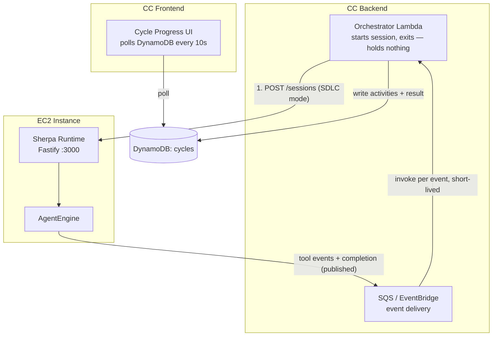
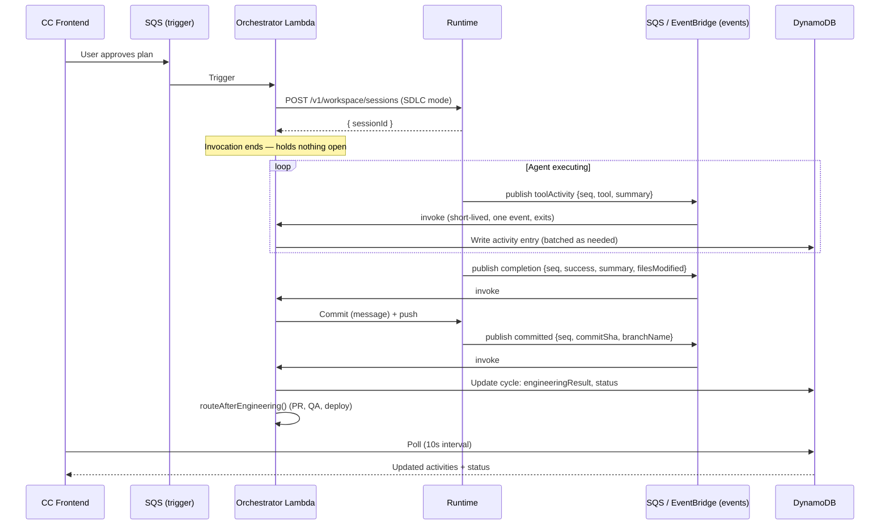

# Runtime-Native SDLC Sessions

**Status:** Partially superseded by [`sdlc-execution-architecture.md`](sdlc-execution-architecture.md) — read that doc first for current direction. Two things changed there:

1. **Scope broadens beyond Engineering.** This doc was written for the engineering execution step alone. The session mechanics below (session mode fields, `reportCompletion`, `pauseReason`, tool allowlist principle) apply unchanged to every SDLC role (QA, Documentation, DevOps, Compliance) — only the "Context," "Why Migrate," and code samples below still talk Engineering-only.
2. **The event-delivery mechanism is superseded.** The SDLC WS channel design here has the orchestrator connect and hold a WebSocket open, with an SQS-self-message-and-replay workaround for Lambda's timeout (Architecture diagram, Sequence diagram, "Listening for Events," and Decision #2 below). That's replaced by an async-push design — the orchestrator starts a session and exits; the runtime publishes events to a queue that triggers short, per-event invocations. See `sdlc-execution-architecture.md`'s "Layer 1: Execution backend" section for the corrected diagrams and rationale. The event *payload shapes* below (`toolActivity`, `completion`, `committed`, `failed`) are unaffected — only how they're delivered changes.

Also: "Starting a Session" below shows a bare `fetch()` call. Dispatch should go through `agentDrivenOrchestrator/agentRouter.js` / `agentInterface.js` — the live seam already used for `nevado | cursor | copilot` — not through `backend/common/codingAgentAdapter.js`, which has zero callers anywhere in the codebase despite defining a pluggable-backend interface. Register the runtime there as a new backend option instead of building fresh dispatch logic.

## Context

SDLC (automated coding cycles) in Command Center originally used a bespoke execution path:

```
CC Orchestrator Lambda → Engineering Agent Lambda → SSM SendCommand → EC2
```

The Engineering Agent runs a 40-turn agentic loop (file ops, shell commands, tool calling) via SSM. The Sherpa runtime, which evolved later, provides these same capabilities natively — concurrent sessions, workspace management, real-time streaming, and a shared tool surface — all on the same EC2 instance, already exposed via CloudFront → ALB.

This design migrates SDLC execution to the runtime, enabling:

1. **CC SDLC cycles execute on the runtime** — eliminating the bespoke SSM agentic loop in favor of the shared AgentEngine
2. **Any surface can initiate a managed cycle** (future) — the architecture doesn't preclude IDE, TUI, or Web from starting sessions that feed into CC's pipeline, but the mechanism for how a surface-initiated session connects back to CC (authentication, cycle record creation, pipeline triggering) is not yet designed

## Goals

- Single execution layer — SDLC uses the same AgentEngine as interactive sessions
- Clear completion semantics — structured success/failure with metadata
- Clean boundary — runtime emits events, consumers decide what to do with them
- Minimal runtime additions — extend the existing session model, don't build SDLC-specific logic

## Non-Goals

- Multi-tenant isolation (same trust boundary as today)

## Why Migrate

| SSM Path (current) | Runtime Path (proposed) |
|---|---|
| Polls SSM every 2s for command results | Direct process execution, no polling |
| 5 bespoke tools reimplemented in Lambda | Shared AgentEngine tool surface (shell, files, MCP, sub-agents) |
| Manual git clone/branch/push scripting | Built-in workspace management |
| No observability during execution | Real-time event streaming |
| One session at a time per invocation | Concurrent sessions with queue |
| Ephemeral — workspace deleted after each run | Session persistence (S3 sync, resume) |

## Architecture

**Superseded — see `sdlc-execution-architecture.md`'s Layer 1 diagrams for the current version.** Kept here for history; the "Connect to SDLC WS channel" / held-connection step below is what changed.



### Sequence



## Runtime Changes

### SDLC Session Mode

`POST /v1/workspace/sessions` accepts new fields for SDLC:

```typescript
interface CreateSessionRequest {
  // ... existing fields ...
  systemPrompt?: string;  // overrides S3-loaded prompt when provided
  sdlc?: {
    autoApprove: boolean;            // all tool calls auto-approved
    includeCompletionTool: boolean;  // add reportCompletion to tool set
  };
}
```

When `sdlc` is present:
- Approval callback always returns `true`
- `reportCompletion` tool is registered
- Interactive tools are excluded (`askQuestion`, `switchMode`, `updateTaskTracker`) — there's no human to answer or observe these
- Session is tagged for the SDLC WS channel

**Note:** The exact tool allowlist/blocklist for SDLC sessions needs to be defined during implementation. The principle is: include execution tools (file ops, shell, search, sub-agents) + `reportCompletion`, exclude anything that expects human interaction or is only meaningful in an interactive context.

### SDLC event vocabulary

**Delivery mechanism superseded — payload shapes below still apply.** Originally specified as a dedicated WS endpoint the orchestrator connects to and holds open. Superseded by async push: the runtime publishes these same event shapes to a queue (SQS/EventBridge), which triggers a short-lived consumer per event. See `sdlc-execution-architecture.md`. This is also the contract-at-boundary described there — the runtime only ever emits this generic vocabulary, with no knowledge of CC's cycle/activity table shape.

```typescript
// Tool activity event
{
  seq: number;           // monotonically increasing, for ordering/dedup under at-least-once delivery
  type: 'toolActivity';
  sessionId: string;
  tool: string;          // 'writeFile', 'editFile', 'runCommand', etc.
  summary: string;       // 'src/billing/index.ts', 'npm test', etc.
  status: 'started' | 'completed' | 'error';
  detail?: string;       // exit code, error message, etc.
  timestamp: string;
}

// Completion event
{
  seq: number;
  type: 'completion';
  sessionId: string;
  success: boolean;
  summary: string;
  filesModified: string[];
  metadata?: Record<string, unknown>;
  timestamp: string;
}

// Committed event (after orchestrator triggers commit)
{
  seq: number;
  type: 'committed';
  sessionId: string;
  commitSha: string;
  branchName: string;
  timestamp: string;
}

// Failure event (agent didn't call reportCompletion)
{
  seq: number;
  type: 'failed';
  sessionId: string;
  reason: SessionPauseReason;
  error?: string;
  timestamp: string;
}
```

The runtime emits these events. It doesn't know or care what the consumer does with them.

### `reportCompletion` Tool

```typescript
{
  name: 'reportCompletion',
  description: 'Signal that the implementation task is complete. Call when all code changes are ready.',
  inputSchema: {
    type: 'object',
    properties: {
      success: { type: 'boolean', description: 'Whether the task completed successfully' },
      summary: { type: 'string', description: 'What was implemented and verified' },
      metadata: { type: 'object', description: 'Optional structured data (test output, etc.)' }
    },
    required: ['success', 'summary']
  }
}
```

When called in SDLC mode:
1. Engine loop exits
2. Runtime stages `session.filesModified`, holds workspace open
3. `session.pauseReason` is set to `'completion_reported'`
4. Runtime emits `completion` event on SDLC WS channel (includes `filesModified`, `summary`)
5. Orchestrator receives completion, constructs commit message (using cycle context + agent summary)
6. Orchestrator tells runtime to commit (with the message) and push
7. Runtime commits, pushes, sets `commitSha`/`branchName`, cleans up workspace
8. Runtime emits `committed` event with final `commitSha` and `branchName`

The agent does not need to commit or push. The orchestrator controls the commit message (it has cycle context the runtime doesn't). The runtime executes the commit deterministically using the tracked `filesModified` list.

**Implementation detail:** Whether the orchestrator sends the commit command via the SDLC WS channel (bidirectional) or via a REST endpoint (e.g., `POST /sessions/:id/commit`) is left to implementation. The existing interactive WS is read-only (all input via REST), so either pattern has precedent.

### `pauseReason` Field

Every exit path in `AgentEngine.run()` sets a `pauseReason` on the session:

| Exit condition | `pauseReason` |
|---|---|
| Agent calls `reportCompletion` | `'completion_reported'` |
| `signal.aborted` (cancel) | `'user_cancel'` |
| `stopReason === 'end_turn'` | `'natural_stop'` |
| Context window full | `'context_exhausted'` |
| LLM inactivity timeout | `'llm_timeout'` |
| LLM error | `'llm_error'` |
| Tool rejection | `'tool_rejected'` |
| Max turns reached | `'max_turns'` |

If the agent finishes without calling `reportCompletion` and a session has `sdlc` config, the runtime emits a `failed` event with the `pauseReason`.

## Orchestrator Changes (CC)

### Starting a Session

```javascript
const response = await fetch('http://localhost:3000/v1/workspace/sessions', {
  method: 'POST',
  headers: { 'Content-Type': 'application/json' },
  body: JSON.stringify({
    prompt: buildEngineeringPrompt(task, plan),
    mode: 'do',
    repoUrl: application.repoUrl,
    branch: `cycle/${cycleNumber}`,
    sdlc: {
      autoApprove: true,
      includeCompletionTool: true,
    },
  }),
});
const { sessionId } = await response.json();
```

### Listening for Events

**Superseded mechanism — see note at top of doc.** The orchestrator no longer connects to a WS channel; a short-lived invocation is triggered per event delivered via the queue, and:
- Receives `toolActivity` events → decides how to batch/summarize → writes `activities[]` to DynamoDB
- Receives `completion` event → maps to `engineeringResult` → proceeds to next stage
- Receives `failed` event → sets cycle status to FAILED

The orchestrator decides the chunking strategy (every event, every N events, every 3 turns — whatever makes sense for the UI). The runtime doesn't care.

### Completion Mapping

```javascript
// After receiving 'completion' + 'committed' events:
const engineeringResult = {
  success: completionEvent.success,
  branchName: committedEvent.branchName,
  commitSha: committedEvent.commitSha,
  changes: { files: completionEvent.filesModified.map(f => ({ path: f })) },
  message: completionEvent.summary,
};
// Then: routeAfterEngineering() — existing logic unchanged
```

### Feature Flag

```javascript
// application.agentConfig in DynamoDB
{ "buildMode": "runtime" }  // 'ssm' (default) | 'runtime' (new)
```

Both paths coexist. Per-application switch. SSM path remains until fully deprecated.

## Interactive Flow (Any Surface → Managed Cycle)

A user on IDE/TUI/Web can also initiate a managed cycle by starting a session with `sdlc` config and a callback mechanism. The surface itself acts as the WebSocket consumer (showing progress), and on completion, notifies CC that a cycle completed.

This is a future extension — the core architecture supports it because the runtime doesn't distinguish who connected to the SDLC WS channel.

## Decisions

1. **SDLC WS endpoint** — Separate path (`/v1/workspace/ws/sdlc`). The interactive WS streams everything (token-by-token text, all events). SDLC consumers need a fundamentally different event set. Separate path keeps the contract clean.

2. **~~SDLC WS events include a sequence number... reconnect via SQS self-message~~ — superseded.** Original decision: hold a WS connection open, and when Lambda approaches its timeout, send itself an SQS message with `{ sessionId, cycleId, lastSeq }` to reconnect and replay. Replaced: events are published to a queue (SQS/EventBridge) and delivered to short, per-event invocations — no invocation ever holds a connection long enough to approach the timeout, so there's nothing to reconnect. The `seq` number is kept, but now for ordering/dedup under at-least-once delivery rather than replay-on-reconnect. See `sdlc-execution-architecture.md`, "Layer 1: Execution backend," for the full comparison and the reasoning for keeping SQS as an event-delivery transport rather than removing it.

3. **Concurrency** — Runtime caps concurrent sessions at 5 (env `MAX_CONCURRENT_SESSIONS`; deployed config currently allows more — verify actual value before relying on either number). When hit, new sessions queue (FIFO wait, no rejection). Was "not a limitation at current scale" when this only covered Engineering; re-check once QA/Documentation/DevOps/Compliance sessions add load under the broadened scope (`sdlc-execution-architecture.md` open question 3). If contention arises: bump cap, priority queue, or reserve slots.

4. **Runaway prevention** — `AgentEngine` has a 200 LLM roundtrip cap per `engine.run()` invocation. For SDLC (one prompt, one run), this is the effective session limit. Hasn't been a problem (SSM runner only used 40), but should be configurable via session creation so SDLC can raise or remove it if needed.

5. **Token tracking** — Not needed per-session. Current SSM runner logs usage to console (Lambda → CloudWatch) but doesn't persist it on the cycle record. The runtime doesn't ship logs to CloudWatch today — token usage would only be visible via Bedrock billing. Acceptable for now; if per-cycle cost attribution is needed later, the runtime can log or persist usage.

6. **Post-engineering pipeline** — Remains as-is. The orchestrator creates the draft PR (GitHub API) after receiving the engineering result, then build verification (EventBridge poller), QA (Lambda + Bedrock), and deploy monitoring (EventBridge poller) proceed. All just need the same `{ success, branchName, commitSha, files }` result shape. Only the engineering execution stage changes.

7. **Real-time CC frontend** — Not needed. The Lambda writes activities to DynamoDB, the frontend polls every 10s.

8. **System prompt** — Lambda passes it via `systemPrompt` field on session creation. Overrides the runtime's S3-loaded prompt.

9. **Git commit/push** — Handled by the runtime after `reportCompletion`, triggered by the orchestrator (which provides the commit message). The agent does not commit or push.

## Repos Affected

| Repo | Changes |
|---|---|
| `sherpa-sdk` | Protocol types: `pauseReason`, `completionResult`, `sdlc` config on session. `reportCompletion` tool spec. SDLC WS event types. |
| `sherpa-sdk` (core) | `AgentEngine`: set `pauseReason` at each exit. Handle `reportCompletion` tool (set result, exit loop). |
| `agent-workflow` | Runtime: SDLC WS channel. Accept `sdlc` config in `POST /sessions`. Auto-approve for SDLC sessions. Emit tool events + completion on SDLC channel. |
| `command-center` | Orchestrator: `POST /sessions` to start. WS client for SDLC channel. Write activities to DynamoDB. Handle completion/failure. Feature flag. |
