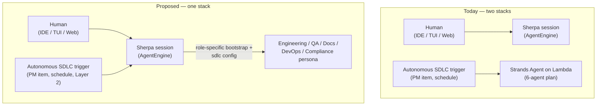
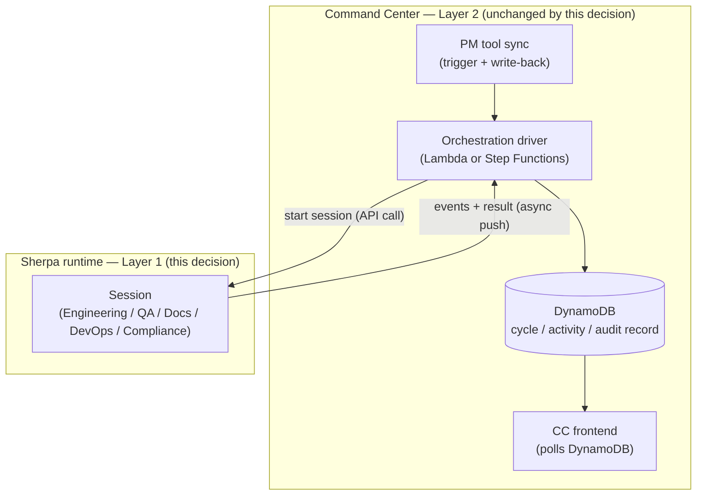
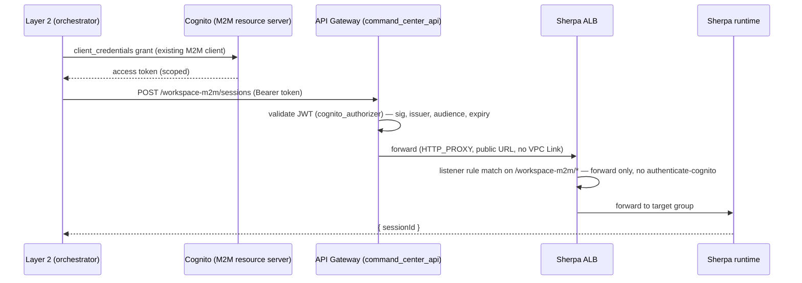
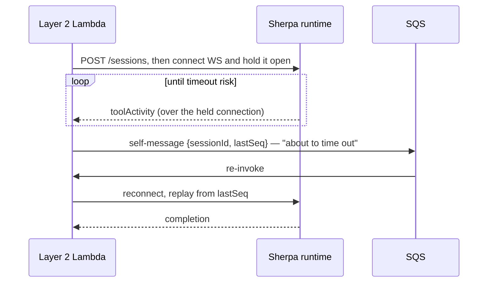
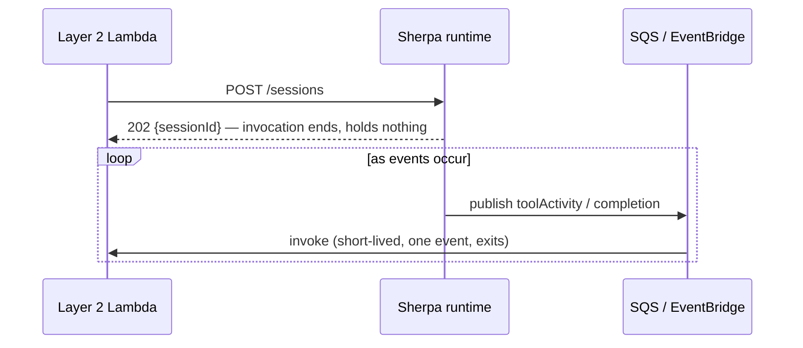

# SDLC Execution Architecture — One Execution Model

**Status:** Jeff's proposed direction, not yet aligned with Tyler. The core call — one execution architecture, not two — reverses assumptions baked into `agent-architecture-plan.md` and epics #34/#36/#37, all of which Tyler owns or authored. This doc is the artifact for that conversation, not a unilateral decision. It has gone through several substantial revisions as claims got checked against real repo state and corrected; treat every specific claim below as worth re-verifying before it's relied on, not as settled just because it's written down.

## Contents

| Section | What it covers | Status |
|---|---|---|
| [The decision](#the-decision) | One execution architecture for all SDLC roles, replacing the two-stack plan | Proposed |
| [Design principle: contracts at boundaries](#design-principle-contracts-at-boundaries-not-shared-schemas) | The versioned-contract rule applied at three boundaries in this design | Framing, not a decision point |
| [Integration boundary: sessions plug into CC](#integration-boundary-sessions-plug-into-cc-they-dont-replace-it) | What Command Center keeps owning; what changes underneath it | Proposed |
| [Layer 1: Execution backend](#layer-1-execution-backend) | Session-based execution, event delivery, machine-callable ingress | Design settled; ingress recommended, not built |
| [Layer 2: Pipeline orchestration](#layer-2-pipeline-orchestration) | Lambda-evolves vs. Step Functions as the sequencing driver | Open — driver choice undecided |
| [Gates: converging approval mechanisms](#gates-converging-the-sdlc-pipelines-approval-mechanisms) | One shared `PendingGate` primitive instead of three bespoke ones | Recommended |
| [What this means for the epics](#what-this-means-for-the-epics) | Concrete rescoping of #34/#36/#37/#39 if this direction is accepted | Consequence of the decision |
| [Open questions](#open-questions) | What's still unresolved, implementation-level not architectural | Tracking |

## The decision

**One execution architecture, not two.** The Sherpa session — `AgentEngine`, running on the Sherpa runtime EC2 instance — is the single primitive for all AI-driven engineering work at Nevado, whether started by a human (IDE/TUI/Web) or started autonomously (a PM item, a schedule, another agent). There is no separate "SDLC agent" execution stack.

Concretely: **an SDLC agent is a session.** "The Engineering Agent runs a task" means "a session starts with an engineering-role system prompt, `sdlc` config, and no human attached." Same for QA, Documentation, DevOps, Compliance. The distinction between "interactive Sherpa surface" and "autonomous SDLC agent" is *who or what started the session and whether a human is watching it live* — not two different engines.

This supersedes the execution-mechanism half of `agent-architecture-plan.md` (Strands Agent on Lambda, `CodingAgentAdapter`'s 8 pluggable backends, task-scoped-per-invocation Lambda agents). It does **not** necessarily supersede the parts of that plan that aren't about *how code executes*:

| From `agent-architecture-plan.md` | Superseded? | Why |
|---|---|---|
| Strands Agent on Lambda as the execution mechanism | **Yes** | Replaced by Sherpa sessions on the runtime. |
| `CodingAgentAdapter` pluggable-backend interface | **Yes** | Already dead code (zero callers); the multi-backend idea (let a customer choose their coding engine) can still exist later as a session-config option, not a parallel execution stack. |
| Task-scoped, stateless-per-invocation model (`docs/agent-architecture-plan.md:131,223`) | **Yes** | Directly contradicted — sessions are persistent (Session Handoff, #1). This is the one piece that needs an explicit "we're reversing this" conversation with Tyler, not just a rescope. |
| 6-role taxonomy (Engineering, QA, DevOps, Documentation, Compliance, Director) | **No** | Still the right decomposition of *what* agents do. Survives as session personas/bootstrap configs. |
| Per-agent S3 bootstrap/memory/skills pattern | **No, but needs re-homing** | The idea (persistent, curated, per-role knowledge) is sound and matches Session Handoff's direction. Needs to attach to session config/system-prompt loading instead of a Strands-Lambda-specific loader. |
| Agent Director / dynamic routing intent ("Strands Graph pattern") | **Superseded as stated** | The routing problem is real (this is Layer 2), but the mechanism doesn't need to be Strands-specific once the thing being routed is sessions, not Lambda invocations. |

So: keep the taxonomy and the memory/skills idea, replace the execution mechanism, and treat "dynamic routing" as the Layer 2 orchestration question below rather than a Strands-specific commitment.

## Design principle: contracts at boundaries, not shared schemas

Wherever two independently-evolving pieces of this system meet — different repos, different teams, different release cadences — the boundary should be an explicit, minimal, versioned contract, not one side reaching into the other's internal data model. Each side can then change its own internals freely as long as it still speaks the contract; a schema change on one side no longer forces a coordinated deploy on the other. This same idea shows up three times in this design, and is called out once here rather than re-derived at each spot:

- **Runtime → Layer 2 (session events, below):** the runtime emits a generic vocabulary — `sessionId`, `type`, `tool`, `summary`, `status`, `seq` — with no knowledge of CC's cycle/activity table shape. Layer 2 owns translating that into whatever its own record looks like today.
- **Layer 2 → Layer 1 (step dispatch, below):** the step list's `sessionConfig` is the same idea one level up — Layer 2 doesn't need to know session internals, just how to start one and read its result.
- **Step → step (pipeline data):** the same idea applies one level further down, between individual pipeline steps — each step should only need to honor a shared input/output contract, not know how its neighbors are implemented. That contract's concrete field-level shape is now sketched in [`sdlc-step-contract.md`](sdlc-step-contract.md) — step list, session-event enrichment, and gate state as they'd be written into CC's existing cycle record. Sketch, not decided; still likely worth its own issue under #36/#37 once it's reviewed.

## Integration boundary: sessions plug into CC, they don't replace it

"One execution architecture" means Layer 1 (how a step actually runs) is unified. It does not mean the Sherpa runtime becomes a rival system to Command Center. CC keeps everything it owns today:

- **System of record** — DynamoDB stays the cycle/activity/audit store. A session-driven step writes into the same cycle record shape a legacy SSM-driven step does; downstream consumers (frontend polling, compliance, audit trail) don't change.
- **Layer 2 orchestration, PM integration, write-back, notifications** — all CC-side, all unchanged by this decision. Layer 2 (whichever driver — Lambda or Step Functions) is what calls into a session for Layer 1 work and maps the result back into CC's existing shapes (`engineeringResult`, `activities[]`, etc.), exactly as #39's original design already specified for the engineering step alone. This decision just extends that same integration pattern to every role instead of one.
- **Compliance/audit boundary** — session activity needs to land in CC's existing audit trail (relevant to #9), not live only in runtime-side session storage. That's an integration requirement on the Layer 1 → Layer 2 handoff, not a new system.

So the practical ask for #39 (and whichever epic ends up owning the Layer 2 step-list work) is: every SDLC-role session's events and results must map cleanly into CC's existing DynamoDB cycle/activity model — the same contract the engineering-only design already committed to, just generalized. Nothing about "one architecture" should require CC to treat runtime-executed steps differently from how it treats today's SSM-executed ones downstream of Layer 1.

## Layer 1: Execution backend

**Prerequisite: machine-callable ingress.** "Orchestrator starts a session via a runtime API call" (below) has no working path in production today — not for the reason it looks like at first. Network reachability isn't the problem: the Sherpa runtime's ALB is directly internet-facing (`sherpa.{customer_subdomain}`, security group explicitly allows "HTTPS from anywhere"), and `command-center/infrastructure/frontend.tf` additionally proxies `/v1/workspace/*` through CC's own CloudFront distribution (`workspace-runtime` origin) so the Web surface can call it same-origin. Neither route needs a VPC-attached Lambda; both are reachable today.

The actual blocker: both routes terminate at the same ALB listener rule (`authenticate-cognito`), and CloudFront doesn't change that — its behavior for this path forwards all headers and cookies straight through with no caching and no auth of its own (`command-center/infrastructure/frontend.tf`). ALB's built-in Cognito integration is a browser-only mechanism — hosted-UI OAuth2 redirect, session cookie — with no bearer-token or service-credential variant *at that specific listener action*. A Lambda can reach the endpoint; it has no way to satisfy that listener rule, by design, not by accident. (A service-credential mechanism does exist elsewhere in this account's Cognito setup, just not wired to this ALB — see below.)

So this is narrower than "solve networking" — it's specifically "add a machine-callable ingress that isn't gated by the browser-only Cognito listener." Today the only thing that actually works end-to-end is the SSM port-forward tunnel meant for a developer's laptop, which is why #39's original code sample uses `fetch('http://localhost:3000/...')` — that only works over a manually-opened tunnel, not from any deployed Lambda.

### Machine-callable ingress: recommended solution

No new auth system, and nothing new for the runtime app to own. Two pieces of infrastructure already exist in this account for a different purpose and can be reused as-is:

- **Token issuance:** `command_center_api`'s Cognito user pool already has an M2M resource server (`commandcenter`, `command-center/infrastructure/cognito.tf:390-419`) issuing `client_credentials`-grant access tokens with scopes (`applications.read/write`, `cycles.read/write`, `full_access`). This is live infrastructure with no runtime-path consumer yet — not something to build.
- **Token validation:** reuse the existing `cognito_authorizer` JWT authorizer on `command_center_api` (`command-center/infrastructure/main.tf:209-236`) instead of writing verification into the runtime app. Its audience list is already dynamically managed by the `apiCredentialManager` Lambda for M2M client create/delete, and it already fronts `/sherpa/chat`, `/sherpa/conversations`, and the devops routes — a proven pattern, not a new mechanism.
- **No VPC Link needed.** The Sherpa ALB is already internet-facing; API Gateway can reach it with a plain `HTTP_PROXY` integration (`connection_type = "INTERNET"`) at its public URL. VPC Links exist to bridge to *private* resources, which doesn't apply here.
- **The runtime app does no auth work.** It only ever receives requests API Gateway has already authenticated. If it needs caller identity, it reads the claims API Gateway forwards — reading, not verifying.

New infrastructure: one route + integration on the existing `command_center_api`, and one new ALB listener rule (path-matched, forward-only — the existing Cognito-gated `sherpa_workspace_auth`/`sherpa_workspace_api` rules on `/v1/workspace/*` are untouched). If network-level isolation beyond "only API Gateway knows the path" is wanted, add an ALB rule `http_header` condition on a shared secret only the API Gateway integration sends — still an infra-level check, not app code. Not yet built or agreed with Tyler; this is the recommended shape, not a decision.

Every SDLC step that does agentic work (Engineering, QA, Documentation, DevOps, Compliance) executes as a Sherpa session:

- Orchestrator (whatever drives Layer 2) starts a session via a runtime API call — replaces both the legacy SSM path and the never-implemented `CodingAgentAdapter`/Strands-Lambda path.
- Session gets a role-specific system prompt and `sdlc` config (auto-approve, no interactive tools, `reportCompletion`). Memory/bootstrap loading (`MEMORY.md`, daily notes) already exists as a shared, parameterized function — `sherpa-sdk`'s `loadSystemPrompt(config)` — used by both the runtime (`worker.ts`) and TUI local mode. It isn't new infrastructure to build; see the memory note below.
- Results come back over an async push WS channel — no blocking connection held by the caller, no polling, no `lastSeq`-replay-on-reconnect. This replaces the SQS-reconnect design in [#39's original write-up](runtime-native-sdlc.md) (now annotated there as superseded, pointing back here), which existed only to work around a Lambda holding a blocking connection open; that problem doesn't exist once nothing blocks. The event payload itself is the contract described above — generic session vocabulary, no knowledge of CC's table shape.

Lambda's execution cap (15 min) doesn't go away — something durable still has to sit between "the runtime emits an event" and "a Lambda invocation processes it," since Lambda can't hold a socket open and just listen. The fix isn't removing that durable layer, it's what SQS gets used *for*. These are two alternative designs, not two steps of one flow:

**Superseded — SQS used for Lambda to reconnect itself** (#39's original write-up). One invocation tries to span the whole session. When it's about to hit the 15-minute cap, it messages itself to resume where it left off:

**Recommended — SQS used to deliver events, not to rescue a stuck connection.** The starting invocation exits immediately; each event later triggers its own short, separate invocation:

Every Lambda invocation in the second design is short regardless of how long the session runs, because no single invocation is trying to span the session's whole lifetime — that's what removes the timeout risk, not the absence of a queue.

**This entire question is specific to keeping Lambda as the Layer 2 driver.** If Layer 2 moves to Step Functions instead (see below), it doesn't apply at all: `.waitForTaskToken` waits on an async callback natively — no queue-relay, no self-reconnect, no invocation-per-event plumbing to design. That's a real point in Step Functions' favor for Layer 2, independent of the human-gate argument already made below.

The runtime's current limits (single instance, opt-in per customer) are build-out scope now that it's the standing execution substrate for *all* SDLC work, not just interactive sessions and one pipeline step — capacity planning gets more important, not less, since QA/Docs/DevOps/Compliance sessions add load that didn't exist in this model before.

## Layer 2: Pipeline orchestration

With execution unified, Layer 2's job shrinks to: sequence sessions, hold gates, persist state, expose status. It doesn't need to know anything role-specific — every step is "start a session with config X, wait for its result, decide what's next."

Two viable drivers, independent of Layer 1:

- **Lambda**, evolving the existing `agentDrivenOrchestrator`, extracting its ~4,000-line imperative logic into a declarative step list stored per-tenant, satisfying #36/#37's "no engine change to add a step" requirement. `{stepId, sessionConfig, gate?, onFail}` is now sketched at field level in [`sdlc-step-contract.md`](sdlc-step-contract.md), applying the same contract-at-boundary idea.
- **Step Functions Standard**, replacing the Lambda driver entirely — native `.waitForTaskToken` for human-review gates (zero cost while waiting, no held connection, same async-callback shape as Layer 1) *and* for session results, which also removes the need to design a queue-relay pattern for event delivery (see the Layer 1 diagram above); durable execution history as an audit trail; already deployed elsewhere in this infra (a Standard state machine already runs in production), so this isn't introducing an unfamiliar AWS service.

Both call the same Layer 1 session API the same way — this choice doesn't ripple back into Layer 1 at all, which is exactly why it was worth separating.

## Gates: converging the SDLC pipeline's approval mechanisms

There are at least two distinct SDLC-adjacent flows in this system, easy to conflate: the **existing orchestrated cycle system** (`agentDrivenOrchestrator`'s state machine, human-gated at `planning_review`/`pending_approval`, CC-UI-driven) and **#36's not-yet-built PM-triggered pipeline** (Linear-triggered, meant to minimize human context-switching, with a Clarify step that posts questions to Linear/Slack directly rather than via an in-session agent tool call).

Real evidence on how this class of integration tends to go wrong, within these two SDLC-scoped systems specifically:

- **The existing cycle-approval write has a race** — the status check is read-then-check, not part of the conditional write itself, so concurrent approvals could both succeed.
- **The one webhook-driven cycle transition that exists today is broken.** The generated repos' CI workflow posts test results without the required signature header; the handler correctly rejects it (401), and the failure is silently swallowed. The 5-minute poller is the actual mechanism — not a fallback, the only one.
- **Slack inbound genuinely works** — `POST /slack/sherpa` verifies Slack's signature properly via Bolt. #36's "clarifying Q&A works both ways in Slack" has real infrastructure to build on. (A different route, `POST /slack/notify`, has no auth or signature verification at all — worth fixing on its own, same bug class, but a separate issue.)

**Out of this doc's scope, but worth a pointer:** #34 (DevOps Agent) has its own separate human-approval mechanism, and its code shows the same failure mode this section is trying to avoid — a properly-built token-based gate that got silently lost in a later rewrite. Whether #34's gate should eventually converge onto whatever gets built here is a cross-epic question for whoever owns #34, not something this doc should decide or sequence around.

**Recommendation: one shared `PendingGate` primitive for the SDLC pipeline's gates, thin channel-specific adapters.** Every gate here — CC-UI approval, Slack, Linear — needs the same four things: pause and persist state, a way for an external signal to resume that specific paused thing, an auth check appropriate to the channel, and a timeout/escalation path. None of that core logic needs to know which channel triggered it. The primitive owns token issuance, idempotent resume (exactly-once, not the existing race), and stale/timed-out-resume handling. Each channel gets a thin adapter whose only job is translating its native shape (post the question, verify its own signature scheme, parse its own payload) into a normalized `resume(gateId, answer)` call — none of them touch the primitive's internals.

### Gotchas, and where each gets answered

1. **Ship it as a real shared dependency, not a convention.** A pattern that lives as copy-pasted logic instead of an enforced shared package gets lost the next time someone rewrites a handler — a demonstrated failure mode elsewhere in this codebase (see the #34 aside above), not a hypothetical. *Answered at the primitive's initial build.*
2. **Signature verification proves the channel, not the responder's authority.** CC has no unified cross-channel identity mapping today (a verified Slack or Linear webhook doesn't establish that the sender is allowed to resolve *this* gate). *Answered per adapter, individually* — can't be solved generically once.
3. **Idempotent resume must be designed in, not bolted on** — the existing cycle-approval race condition guarantees duplicate-resume isn't an edge case once webhook retries are in play. *Answered at the primitive's build*, once.
4. **Stale resumes after timeout/escalation need explicit rejection**, not an error or a double-apply. *Answered at the primitive's build.*
5. **This codebase's track record on this integration class is weak** — a broken webhook and an unauthenticated Slack route are two real, found instances within SDLC-adjacent code. *Answered per adapter, against a fixed checklist* (signature verification, authz mapping, idempotency) derived from the primitive's contract.
6. **Migration of the existing cycle gates could itself get deprioritized**, leaving the Linear gate built as a fast bespoke second thing instead of an actual convergence. *Answered by epic/issue planning* — the migration needs to be its own explicitly scoped, prioritized work item, not a footnote inside the Linear-trigger issue.
7. **A single task token models one request/response, not a multi-turn conversation.** If Clarify ever needs real back-and-forth, that's a loop of gate steps, not new primitive capability. *Answered at step-contract design* (Layer 2, above) — decided explicitly as gates staying single-round-trip, with conversation modeled via the pipeline's own `maxIterations` looping.

## What this means for the epics

- **#39 (Runtime-Native SDLC Sessions)** — scope grows from "the engineering step" to "the execution substrate for every SDLC role." Still Jeff's epic; the design-doc updates from v2 (async push, drop `CodingAgentAdapter`) still apply.
- **#34 (DevOps Agent)** — rescope from "enhance `selfHealingAgent`" (a Strands Lambda) to "a DevOps-role session persona." The monitoring/detection logic can stay wherever it lives (CloudWatch, EventBridge rules); what changes is that *remediation* work dispatches as a session, not a Lambda invocation.
- **#36 (PM-Triggered Autonomous SDLC)** — its 11 steps become session-config entries in the Layer 2 step list. Two currently-filed sub-issues (#557 QA step, #561 docs step) were scoped against the old imperative shape and should be re-checked once the step contract exists.
- **#37 (Configurable SDLC)** — becomes materially easier: since every step is structurally the same (start a session, wait, branch on result), customer-level reordering/gating is a data change to the step list, not new engine logic.
- **`agent-architecture-plan.md`** — needs a follow-up doc (Tyler, or jointly) that re-expresses the 6-role taxonomy and bootstrap/memory pattern on top of sessions. Worth being explicit that this is a reversal of its stated stateless-per-invocation decision, not just an implementation swap — that's the part that needs to be said out loud to Tyler, not discovered later.

## Open questions

1. **Sequencing:** does #39 (make sessions the substrate for all roles) need to land before #36/#37's step-list work starts, or can the step list be built against today's SSM path and cut over later?
2. **Layer 2 driver:** Lambda-evolves vs. Step Functions — what would tip this either way? (Team's Step Functions familiarity, migration cost of the existing DynamoDB cycle records, how soon #37's human-gate requirement needs to ship.)
3. **Runtime capacity:** with QA/Docs/DevOps/Compliance sessions added to Engineering's load, what does the runtime need (instance sizing, concurrency cap, HA) before this can carry production SDLC volume, not just interactive sessions?
4. ~~**Bootstrap/memory portability:** does the existing S3 bootstrap/memory/skills loader get adapted to sessions, or rebuilt?~~ **Resolved, smaller than framed.** Memory loading isn't missing from the runtime and doesn't need adapting — `sherpa-sdk/packages/core/src/prompt-loader.ts`'s `loadSystemPrompt(config)` already reads `MEMORY.md` + daily notes from S3, and both the EC2 runtime (`worker.ts`) and TUI local mode already call it. The function takes a `prefix` per call; it isn't instance-scoped by design. The actual gap: `worker.ts` always passes the single instance-global `KB_PREFIX` env value instead of a per-session, role-derived prefix — a small fix to one call site, not a new subsystem. This gap is independent of the SDLC work — it's a general runtime limitation (no session, interactive or autonomous, can select its own knowledge context today), just one SDLC's per-role sessions happen to need fixed. Separately, `nevado-sherpa-ide` has its own duplicated implementation of the same MEMORY.md pattern rather than using the shared `sherpa-sdk` function — a minor consistency gap, not urgent, worth a note but not its own epic.
5. **The Tyler conversation itself:** this doc proposes reversing a decision `agent-architecture-plan.md` made explicitly six months ago. That needs to be raised as exactly that — a reversal to agree on — not folded silently into epic rescoping.
6. ~~**Machine-callable ingress (the Layer 1 prerequisite, above):** there's currently no working path for a Lambda (or any non-browser caller) to authenticate to the runtime — the ALB's Cognito listener is browser-only by design, and nothing else is wired. This blocks the "orchestrator starts a session via a runtime API call" step directly. A real solution needs to be chosen.~~ **Recommended, not yet built.** See "Machine-callable ingress: recommended solution" above — reuse `command_center_api`'s existing M2M resource server + `cognito_authorizer`, a new forward-only ALB rule, no VPC Link, no auth logic in the runtime app. Still needs the route/rule/M2M-client actually provisioned and wired end-to-end, and still needs Tyler's eyes along with everything else here.
