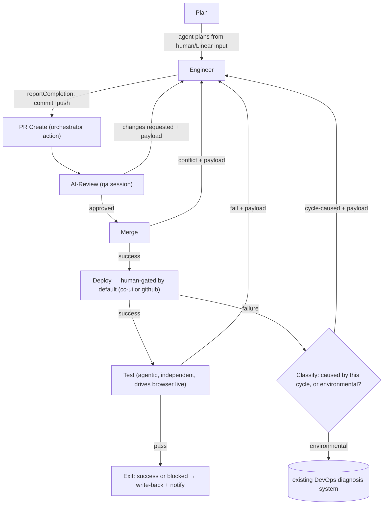

# SDLC Step Contract — Cycle Record, Events, and Gates

**Status:** Direction confirmed with Tyler (2026-09-01) — a dynamic, executor-driven step list is the agreed model; this contract can be refined further, but needs to actually support what [`sdlc-ux.html`](sdlc-ux.html) shows (Tyler's directive — the sketch is now a concrete check on this contract's sufficiency, not purely illustrative). Fleshes out the field-level contract that [`sdlc-execution-architecture.md`](sdlc-execution-architecture.md) flags as undrafted (see "Design principle: contracts at boundaries" and the Layer 2 step-list note). Data/API contract only — no UI is specified here.

## Scope

What Layer 2 writes into Command Center's existing DynamoDB cycle record, so any consumer — today's frontend, a redesigned one, `sdlc-ux.html`'s mockup — can show role/step/gate state without hardcoding a pipeline shape or reaching into session internals. Follows the same contracts-at-boundaries split as the rest of the design: the runtime emits a generic vocabulary with no knowledge of CC's table shape; Layer 2 is the only thing that translates and enriches.

## Today, for comparison

- `cycle.currentStage` — a numeric index into a hardcoded `PIPELINE_STAGES` array (`command-center/frontend/src/components/CycleProgress.jsx:17-58`). Engineering-only, fixed shape, can't represent five roles or a per-tenant step list.
- `cycle.activityLog` / `cycle.activities` — flat `{timestamp, message}` (`CycleProgress.jsx:75-76`). No role attribution, no tool-level detail.
- Two separate, bespoke gate-resolution endpoints: `POST /v1/applications/{id}/cycles/{cycleId}/approve-plan` (`ApplicationDetail.jsx:355-364`) and `PUT /v1/applications/{id}/cycles/{cycleId}` with `approvalStatus` (`ApplicationDetail.jsx:286-310`).

## 1. Step graph

Confirmed as a directed graph, not a flat list — worked out against a real workflow sketch with three independent loop-backs into `engineer` (from `ai-review`, and from `test`), not one generic "iterate the whole pipeline" concept. A flat `StepConfig[]` array — this doc's earlier draft, and the real, already-deployed `Phase[]` shape in `command-center/backend/go/internal/sdlc/handler.go` — can't represent that; both need to grow edges.

Per-tenant config (owned by Layer 2, the thing #37 needs to make editable):

```
GraphNode {
  id: string                    // "plan" | "engineer" | "pr-create" | "ai-review" | "merge" | "deploy" | "test" | ...
  type: "session" | "action"    // session = runs a Sherpa session; action = a discrete orchestrator-performed operation, no session
  role?: Role                   // required when type === "session" — "director" | "engineering" | "qa" | "documentation" | "devops" | "compliance"
  sessionConfig?: object        // opaque to Layer 2 beyond pass-through, only for type === "session"
  actionType?: string           // required when type === "action", e.g. "github.createPR" | "github.merge" | "deploy.trigger"
}

GraphEdge {
  from: string | "external"      // "external" starts a new cycle — entry is just re-entry with no prior node; same mechanism, not a separate concept
  to: string
  on: string                     // outcome or trigger that fires this edge: "success" | "changesRequested" | "approved" | "fail" | "conflict" | "linear-ready" | "human-start" | "schedule"
  mode: "agentic" | "human"      // per-tenant configurable, independently per edge — not fixed per node. A Linear-triggered start is agentic; a human clicking "start" is trivially human.
  channel?: Array<"cc-ui" | "slack" | "linear" | "github">   // which surface(s) can resolve/originate this edge; first response wins
  payload?: {                    // what the entered node receives beyond its normal config — same shape whether this is a fresh start or a loop-back
    summary: string              // synthesized description of the task/what needs attention — not a raw dump of review/CI/ticket output
    sourceRefs: string[]         // links/IDs into the raw material (PR review thread, CI log, Linear ticket, original plan) if the summary underspecifies something
  }
}
```

The confirmed default shape for the standard SDLC pipeline — every edge defaults to `agentic` except the two marked, and even those are config, not hardcoded:



Notes on this specific instantiation, not the general schema:
- **`ai-review` is the QA role** — there's no separate QA step; QA's session *is* the automated review.
- **`merge` defaults to human-gated, resolvable from either `cc-ui` or `github` directly** — a human can click merge in Command Center or in GitHub's own PR UI; either resolves the same gate. This is exactly as configurable as any other edge — nothing structurally prevents auto-merge once `ai-review` approves, for a tenant configured that way.
- **`merge` conflict loops back to `engineer`** — same shape as the other two loop-backs, with the same `payload` contract (what's conflicting, which files).
- **`deploy` also defaults to human-gated** — currently the one edge always assumed to keep a deliberate checkpoint, though structurally it's config like everything else, not a special case.
- **`deploy` failure splits into two cases — it's not one thing.** If this cycle's own change broke the deploy (bad config, a failed migration, the app doesn't start with what `engineer` just shipped), that's the same "the work isn't finished" shape as a merge conflict or a failed test — loops back to `engineer` with the same `payload` contract. If it's environmental (infra capacity, credentials, something unrelated to what this cycle changed), `engineer` can't fix it by writing more code — that case hands off to the existing DevOps diagnosis system instead (`command-center/backend/go/internal/devops/devops.go:107,133` already has a formal `"deployment-failure"` diagnosis type feeding `devops-diagnosis-api`/`devops-auto-fix`/`devops-rollback`). **The classification mechanism itself isn't specified yet** — it may be able to reuse causal classification the DevOps diagnosis system already does for its own purposes, or need a lighter dedicated check; unconfirmed either way, and worth checking before assuming either.
- **`pr-create` is an orchestrator action, not a session** — Layer 2 opens the PR from the structured summary `engineer`'s `reportCompletion` call returns (see `sdlc-execution-architecture.md`'s git/PR ownership section). Same for `merge` and `deploy` — GitHub/deploy API calls, no working tree, no session needed.
- **`test` writes and runs its own verification, independently of `engineer`'s own tests** — same principle as `ai-review` existing separately from `engineer`: a check only means something if the checker didn't also build what it's checking. `test`'s session works from `plan`'s original output, not from `engineer`'s code or commit — so the `deploy → test` edge's payload is the plan/task spec, not just the deploy URL.
- **`test` drives a browser live (agent-driven), not a pre-written Playwright script** — chosen over scripting because a script authored without ever seeing the rendered page is more likely to guess selectors/flows wrong. Mechanism: reuse `nevado-sherpa-ide/src/browser/cdpToolProvider.ts` (already built, direct CDP connection, no MCP-server child process) rather than spawning `@playwright/mcp` — same "agent calls browser actions as tools, turn by turn" outcome, less new infrastructure. **Real, unbuilt prerequisite:** the runtime has zero MCP or CDP tool support today (checked `agent-workflow/apps/runtime` directly — confirmed absent; `useMcpTool`'s `@playwright/mcp` mention in `sherpa-sdk/packages/core/src/tool-specs.ts:396` is illustrative text, not a wired capability). Needs: headless Chrome available on the runtime instance, `CdpToolProvider` moved into shared code (`sherpa-sdk`, not IDE-only), and runtime-side registration glue equivalent to `nevado-sherpa-ide/src/config/mcpManager.ts`.
- **`test`'s role is assumed `qa`** — not confirmed; worth checking whether this is genuinely QA again or a distinct role.
- **Entry is re-entry — no separate concept.** A new cycle starts the same way a loop-back re-enters `engineer`: an edge with `from: "external"` into `plan`, carrying the same `{summary, sourceRefs}` payload. Known triggers: Linear ticket reaching "ready" (`on: "linear-ready"`, agentic, `channel: ["linear"]`, `sourceRefs` includes the ticket) and a human starting a cycle directly in CC-UI (`on: "human-start"`, trivially `mode: "human"`, `channel: ["cc-ui"]`, matching today's `cycle.task`/`cycle.prompt` field). A scheduled trigger (`on: "schedule"`) is named in `sdlc-execution-architecture.md`'s "started autonomously" list but not fleshed out here. Whether another agent (e.g. DevOps) can hand off *into* this graph rather than staying fully external is still open — not confirmed either way.
- **Exit conditions still need "blocked" defined.** `Test` passing clearly exits to write-back + notify (Linear update, Slack message — per #36's spec, both `type: "action"` orchestrator steps, no session). But #36 also specifies notify firing on a **blocked** exit, and nothing in this graph yet defines what makes a run blocked — exceeding `maxIterations`? A human cancel? An unrecoverable DevOps diagnosis? Open.

Per-cycle runtime instance, written into the cycle record as `cycle.steps[]` — this replaces `currentStage`, and now tracks a position in a graph rather than an index into a flat array:

```
StepState {
  stepId: string             // matches a GraphNode.id
  role?: Role                // only for type === "session" nodes
  status: "queued" | "active" | "blocked" | "complete" | "failed"
  sessionId?: string         // set once the session for this step starts; absent for "action" nodes
  startedAt?: string
  completedAt?: string
}
```

`cycle.currentStepId` can be stored explicitly or derived client-side as the last entry in `steps[]` still active.

### Persistent cycle context

Not every node's context fits the edge `payload` shape — the plan is stable for the cycle's lifetime, not something re-transmitted on each edge that happens to lead to a node that needs it:

```
cycle.plan: {
  summary: string
  sourceRefs: string[]        // the original ticket/prompt this plan was generated from
}
```

Set once by `plan`, read by any node whose session needs to know what's actually being built — `engineer` (every entry *and* every re-entry, not just the first), `ai-review` (checking the PR against what was asked for, not just against `engineer`'s own code), `test` (independent verification, per the note above), and the write-back action. The mechanical action nodes (`pr-create`, `merge`, `deploy`, the deploy-failure classifier) don't need it.

**Iteration history isn't a separate mechanism.** A node re-entering on, say, the third loop-back doesn't need a new field for "what happened in iterations 1 and 2" — it reads further back into `cycle.activities[]` (§2, below), the same log that already exists for the activity feed. A fresh entry's session only reads the tail of that log (its own triggering payload); a re-entered session can read as much of the history as its bootstrap is configured to include. No new field — just a different read depth into something that already exists for another reason.

## 2. Session events → activity record

Layer 1's generic event vocabulary is unchanged from what's already specified in `sdlc-execution-architecture.md`: `sessionId`, `type`, `tool`, `summary`, `status`, `seq`. Layer 2 enriches each event with role/step context it already has — it started the session, so it knows what role and step it belongs to — before writing it into `cycle.activities[]`:

```
ActivityEntry {
  seq: number
  timestamp: string
  role: Role
  stepId: string
  sessionId: string
  type: "toolActivity" | "completion" | "committed" | "failed"
  tool?: string
  summary: string
}
```

The runtime never needs to know about roles, steps, or CC's table shape — it only ever emits the generic event. Layer 2 is the sole place `role` and `stepId` get attached.

## 3. Gates

Generic read, embedded on the cycle record rather than a separate polled endpoint — the frontend already polls the cycle record every 10s (`ApplicationDetail.jsx:209-211`), so a second poll loop isn't needed:

```
GateState {
  gateId: string
  stepId: string
  question: string
  channel: "cc-ui" | "slack" | "linear" | "github"
  openedAt: string
  timeoutAt?: string
  status: "open" | "resolved" | "timed_out"
}
```

One resume call, replacing both of today's bespoke endpoints:

```
POST /v1/gates/{gateId}/resume
{ answer: "approve" | "reject" | string, actor: string }
```

Each channel adapter (CC-UI, Slack, Linear, GitHub) calls this the same way after its own channel-specific auth check. The primitive itself doesn't know or care which channel called it — matching the adapter model already described in the Gates section of `sdlc-execution-architecture.md`.

**GitHub as a channel needs the same reliability treatment already flagged elsewhere in this design, not a fresh assumption.** `sdlc-execution-architecture.md`'s Gates section already found the one existing webhook-driven cycle transition in this codebase is broken (missing signature header, silently rejected, a 5-minute poller is the actual mechanism) — a GitHub adapter resolving `merge` gates from a native GitHub merge should assume the same: don't trust a webhook alone, back it with polling or verify on next read.

## What this doesn't specify

No UI — `sdlc-ux.html` is one exercise of this contract, not a requirement derived from it. Also out of scope here: the exact DynamoDB item/partition-key layout (existing cycle-table conventions apply, this only adds fields) and the internal shape of `sessionConfig` (owned by session bootstrap, opaque at this layer).
